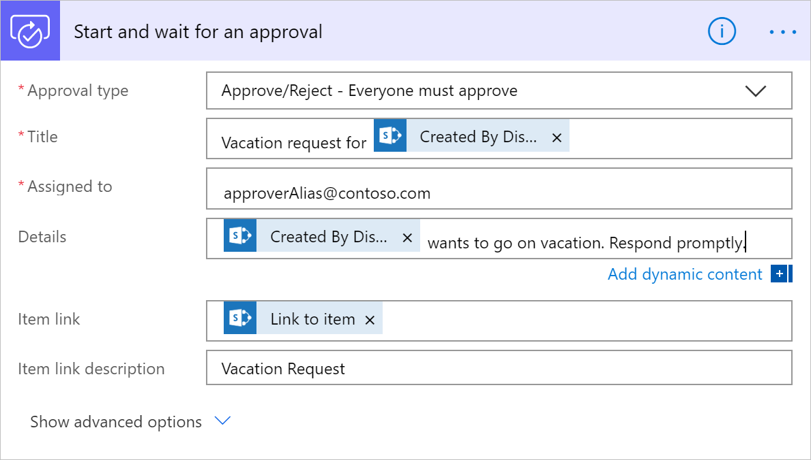
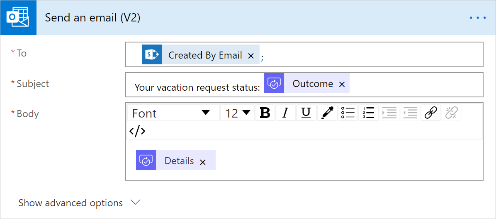
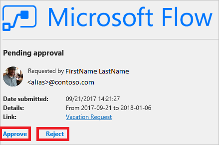
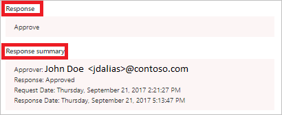

# Create an approval flow that requires everyone to approve

This walkthrough shows you how to create an approval workflow that requires everyone (all assigned approvers) to agree for a vacation request to be approved, but any approver can reject the entire request.

This type of approval workflow is useful in an organization that requires a person's manager and the manager's manager, to both agree to a vacation request for it to be approved. However, either manager can decline the request without the other person's input.

> [!NOTE]
> While this walkthrough highlights a vacation approval scenario, you can use this type of approval flow in any situation where multiple approvers are required to approve a request.
>
>

## Prerequisites

* Access to [Power Automate](https://flow.microsoft.com), Microsoft Office 365 Outlook, and Microsoft Office 365 Users.
* A SharePoint [list](https://support.office.com/article/SharePoint-lists-I-An-introduction-f11cd5fe-bc87-4f9e-9bfe-bbd87a22a194).

    This walkthrough assumes you've created a SharePoint list that's used to request vacations. See the [parallel approvals](parallel-modern-approvals.md) walkthrough for an in-depth example that details what your SharePoint list might look like.
* Familiarity with the basics of creating flows.

    You can review how to add [actions, triggers](multi-step-logic-flow.md#add-another-action), and [conditions](add-condition.md). The following steps assume that you know how to perform these actions.

> [!NOTE]
> While we use SharePoint and Office 365 Outlook in this walkthrough, you can use other services such as Zendesk, Salesforce, Gmail, or any of the more than [200 services](https://flow.microsoft.com/connectors/) that Power Automate supports.
>
>

## Create the flow

> [!NOTE]
> If you haven't created a connection to SharePoint or Office 365 previously, follow the instructions when you're prompted to sign in.
>
>

This walkthrough uses tokens. To display the list of tokens, tap or click any input control, and then search for the token in the **Dynamic content** list that opens.

Sign into [Power Automate](https://flow.microsoft.com), and then perform the following steps to create your flow.

1. Select **My flows** > **Create from blank**, in the top right of the screen.
1. Add the **SharePoint - When an item is created or modified** trigger.
1. Enter the **Site Address** for the SharePoint site that hosts your vacation request list, and then select the list **List Name**.
1. Add the **Office 365 Users - Get manager V2** action, select the **User (UPN)** box, and then add the **Created By Email** token to it.

    The **Created By Email** token is located under the **When an item is created or modified** category of the **Dynamic content** list. This token dynamically provides access to data about the manager for the person who created the item in SharePoint.

1. Add another **Office 365 Users - Get manager V2** action, and then add the **Mail** token to the **User (UPN)** box.

    The **Mail** token is located under the **Get manager V2 2** category of the **Dynamic content** list. This token dynamically provides access to the email address for the manager's manager.

    You can also rename the **Get manager V2 2** card to something meaningful like "Skip level manager".
1. Add the **Start an approval** action, and then select **Everyone from the assigned list** from the **Approval type** list.

   > [!IMPORTANT]
   > If any approver rejects, the approval request is considered rejected for all approvers.
   >
   >
1. Use the following table as a guide to complete the **Start an approval** card.

   | Field | Description |
   | --- | --- |
   |  Approval type |Use **Anyone from the assigned list** to indicate that any one of the approvers can approve or reject the request. 
Use **Everyone from the assigned list** to indicate that a request is only approved if everyone agrees, and the request is denied if a single person rejects it. |
   |  Title |The title of the approval request. |
   |  Assigned to |The email addresses of the approvers. |
   |  Details |Any additional information that you want sent to the approvers listed in the **Assigned to** field. |
   |  Item link |A URL to the approval item. In this example, this is a link to the item in SharePoint. |
   |  Item link description |A text description for the **Item link**. |

   > [!TIP]
   > The **Start an approval** action provides several tokens, including **Response** and **Response summary**. Use these tokens in your flow to provide rich reporting of the results from a run of an approval request flow.
   >
   >

    The **Start an approval** card is a template for the approval request that's sent to approvers. Configure it in a way that's useful for your organization. Here's an example.

    

1. Add the **Office 365 Outlook - Send an email** action, and then configure it to send an email with the results of the request.

    Here's an example of what the **Send an email** card might look like.

    

> [!NOTE]
> Any action that follows the **Start an approval** action runs based on your selection in the **Approval type** list on the **Start an approval** card. The following table lists the behavior based on your selection.
>
>

| Approval type | Behavior |
| --- | --- |
| Anyone from the assigned list |Actions that follow the **Start an approval** action run after any one of the approvers decides. |
| Everyone from the assigned list |Actions that follow the **Start an approval** action run after an approver declines or everyone approves the request. |

At the top of the screen, enter a name for your flow in the **Flow name** box, and then select **Create flow** to save it.

Congratulations, your flow is complete! If you followed along, your flow resembles this image.

Now, whenever an item is added to your SharePoint list, or if an item changes, your flow triggers and sends approval requests to all approvers whom are listed in the **Assigned to** box of the **Start an approval** card. Your flow sends approval requests via the Power Automate mobile app and via email. The person who creates the item in SharePoint gets an email that summarizes the results, clearly indicating if the request was approved or rejected.

Here's an example of the approval request that's sent to each approver.

Here's an example of what a response and a response summary may look like after your flow runs.

## Learn more about approvals

* [Single approver modern approvals](modern-approvals.md)
* [Sequential modern approvals](sequential-modern-approvals.md)
* [Parallel modern approvals](parallel-modern-approvals.md)
* [Approvals and the Microsoft Common Data Service](common-data-model-approve.md)
* [Approve requests on the go](mobile-approvals.md)
