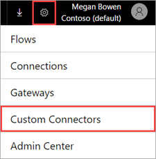
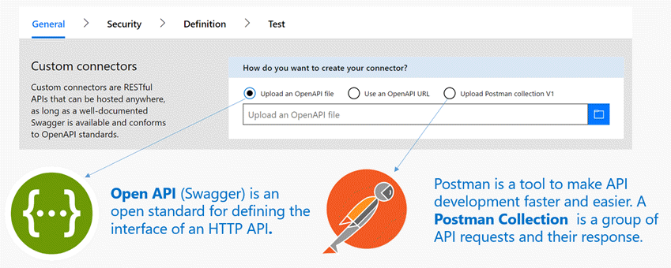
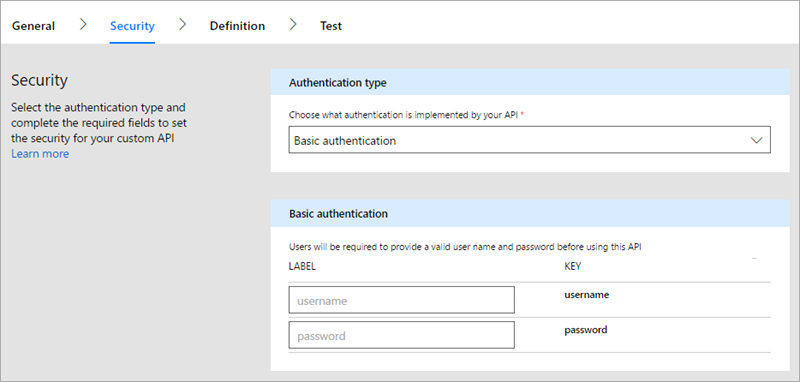
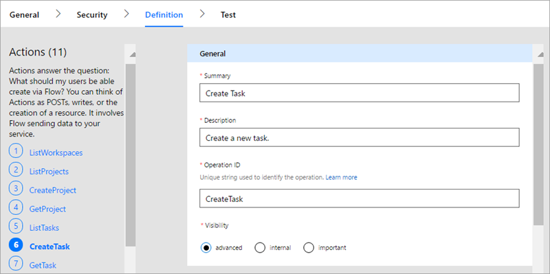

<properties
    pageTitle="Develop custom connectors for certification | Microsoft Flow"
    description="Describe your API, specify authentication type, build triggers and actions, and test."
    services=""
    suite="flow"
    documentationCenter="na"
    authors="asavaritayal"
    manager="anneta"
    editor=""
    tags=""/>

<tags
   ms.service="flow"
   ms.devlang="na"
   ms.topic="article"
   ms.tgt_pltfrm="na"
   ms.workload="na"
   ms.date="05/06/2017"
   ms.author="astay"/>

# Develop custom connectors for certification in Microsoft Flow

Building a connector involves multiple steps. This topic provides an overview; for more information, see [Register and use a custom connector](register-custom-api.md).

To get started - in [Microsoft Flow](https://flow.microsoft.com/), click or tap the **Settings** button (the gear icon) at the upper right of the page. Then click or tap **Custom Connector**.

## Describe your API

Custom connectors are described using the [OpenAPI standard](https://swagger.io/) for defining the interface of an HTTP API. You can start building with an existing OpenAPI file, or you can import a [Postman Collection](https://www.getpostman.com/docs/collections), which auto-generates the OpenAPI file for you. 

If you start from either of these API descriptions, the metadata fields in the wizard are auto-populated. You can edit these at any time.  

## Specify the authentication type and security details

Pick the authentication type supported by your service, and provide additional details to enable identity to flow appropriately between your service and any clients. 

[Learn more](register-custom-api.md) about the connector security.

## Build triggers and actions

1. To build the triggers and actions for your connector, switch to the **Definition** tab. 

    

2. Using the wizard, you can add new operations or edit the schema and response for existing ones. The **General** properties for each operation enable you to control the end-user experience for your connector. Learn more about the different types of operations using the links below:

    - [Triggers for Microsoft Flow](customapi-webhooks.md)
    - [Actions for Microsoft Flow and PowerApps](register-custom-api.md)

    To implement advanced functionality for Microsoft Flow, refer to the [OpenAPI extensions for custom connectors](https://flow.microsoft.com/documentation/customapi-how-to-swagger/). 

3. Finally, click or tap **Create connector** to register the custom connector.

For additional features not available in the wizard, please contact [condevhelp@microsoft.com](mailto:condevhelp@microsoft.com).

## Test the connector

Prior to submission, test your custom connector in one or more ways: 

- Using the custom connector [Testing wizard](https://flow.microsoft.com/blog/new-updates-custom-api/), you can call each operation to verify its functionality and the response schema.
- In the designer for Microsoft Flow, you can visually build flows using your custom connector. This method of testing gives you visibility into the user interface functionality and features of your connector.
- In the PowerApps Studio, you can call each operation using the formula bar, and bind the response to controls on your screen.
