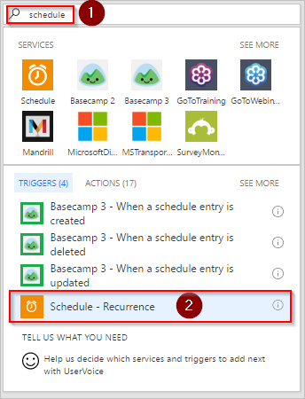
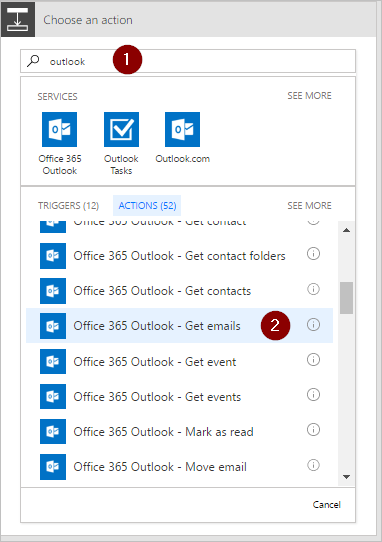
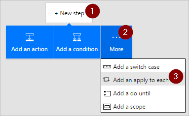
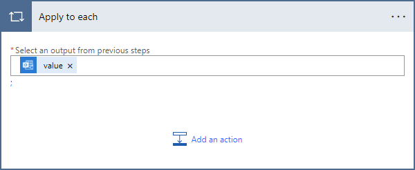

<properties
    pageTitle="Learn how to parse an array of items and take an action based on a condition by using the apply to each action.| Microsoft Flow"
    description="Use Microsoft Flow to loop through an array of items to check multiple conditions and take actions based on those conditions."
    services=""
    suite="flow"
    documentationCenter="na"
    authors="msftman"
    manager="anneta"
    editor=""
    tags=""/>

<tags
   ms.service="flow"
   ms.devlang="na"
   ms.topic="article"
   ms.tgt_pltfrm="na"
   ms.workload="na"
   ms.date="03/06/2017"
   ms.author="deonhe"/>

# Using the apply to each action in Microsoft Flow

Many triggers can immediately start a flow based on an event such as when a new email arrives in your inbox. These triggers are great, but sometimes you want to run a flow that queries a data source on a predefined schedule, taking certain actions based on the properties of items in the data source. To do this, your flow can be started on a schedule (such as once per day) and use a loop action such as **Apply to each** to iterate thru a given list of items.

In this walk-through, we'll create a flow that runs every fifteen minutes and does the following:

1. Gets the last 10 unread messages in your Office 365 Outlook email Inbox.
1. Checks each of the 10 messages to confirm if it has **meet now** in the subject.
1. Checks if the email is from your boss or if the email was sent with high importance.
1. Sends a push notification if the email has **meet now** in the subject and is either from your boss or was sent with high importance.
1. Marks the email as *read* if a push notification was sent for it.

## Prerequisites

Here are the requirements that must be met to perform the steps in this walk-through:

     - To use the **apply to each** action, your flow must provide an array of items.
     - You will also need to configure connections to Office 365 Outlook and the push notification service.

## Use the apply to each action

After you have signed into the [Microsoft Flow portal](https://flow.microsoft.com):

1. Select the **My flows** tab and then create a flow from a blank template:

     

1. Enter "schedule" into the search box to search for all services and triggers that are related to scheduling.
1. Select the **Schedule - Recurrence** trigger to indicate that your flow will run on a schedule that you will provide next:

     

1. Set the schedule to run every 15 minutes:

     

1. Select **+ New step**, **Add an action** and then type **outlook** into the search box to search for all actions related to Microsoft Outlook.

1. Select the **Office 365 Outlook - Get emails** action:

     

1. This will open the **Get emails** card. Configure the **Get emails** card to select the top 10 unread emails from the Inbox folder. Do not include attachments because they won't be used in the flow:

     

   >[AZURE.NOTE] So far, you have created a simple flow that gets some emails from your inbox. These emails will be returned in an array; the **apply to each** action requires an array, so this is exactly what is needed.

1. Select **+ New step**, **More** and then **Add an apply to each** action:

     

1. Insert the **Body** token into the **Select an output from previous steps** control on the **Apply to each** card. This pulls in the body of the emails to be used in the **apply to each** action:

     

1. Select **Add a condition**:

     

1. Configure the **Condition** card to search the subject of each email for the words "meet now":

     - Insert the **Subject** token into the **Object Name** control.
     - Select **Contains** in the **Relationship** drop down list box.
     - Enter **meet now** into the **Value** control.

          

1. Select **... More** and then select **Add a condition** from the **IF YES, DO NOTHING** branch. This opens the **Condition 2** card; configure that card like this:

     - Insert the **Importance** token into the **Object Name** control.
     - Select **is equal to** in the **Relationship** drop down list box.
     - Enter **High** into the **Value** control.

          

1. Select **Add an action** under the **IF YES, DO NOTHING** section. This will open the **Choose an action** card, where you'll define what should happen if the search condition (the email was sent with high importance) is true:

     

1. Search for **notification** and then select the **Notifications - Send me a mobile notification** action:

     
1. On the **Send me a mobile notification** card, provide the details for the push notification that will be sent if the subject of an email contains "meet now":

     
1. Select **Add an action**, enter **read** as the search term and then select the **Office 365 Outlook - Mark as read** action. This will mark each email as read after the push notification is sent:

     
1. Add the **Message id** token to the **Mark as read** card. This indicates the Id of the message that will be marked as read:

     
1. Going back to the **Condition 2** card, on the **IF NO, DO NOTHING** branch:
     - Select **Add an action** and then type **get manager** into the search box.
     - Select the **Office 365 Users - Get manager** action from the search results list.
     - Enter your *full* email address into the **User** control of the **Get Manager** card.

          

1. Select **... More** and then select **Add a condition** from the **IF NO** branch. This opens the **Condition 3** card; configure the card to check if the email sender's email address (the From token) is the same as your boss' email address (the Email token):
     - Insert the **From** token into the **Object Name** control.
     - Select **contains** in the **Relationship** drop down list box.
     - Enter **Email** token into the **Value** control.

     

1. Select **Add an action** under the **IF YES, DO NOTHING** section of the **Condition 3** card. This will open the **IF YES** card, where you'll define what should happen if the search condition (the email was sent from your boss) is true:

     

1. Search for **notification** and then select the **Notifications - Send me a mobile notification** action:

     
1. On the **Send me a mobile notification 2** card, provide the details for the push notification that will be sent if the email is from your boss:

     
1. Add the **Office 365 Outlook - Mark as read** action. This will mark each email as read after the push notification is sent:

     
1. Add the **Message id** token to the **Mark as read 2** card. This indicates the Id of the message that will be marked as read:

     

1. Name your flow and then create it:

     

## Run the flow

1. Send an email to yourself or have someone in your organization send you an email with **meet now** in the subject of the email.
1. Confirm the email is in your inbox and it is unread.
1. Run the flow you just created from the **My flows** tab of the Microsoft Flow portal by selecting **Run now**:

     
1. Select **Run flow** to confirm you really want to run the flow:

     
1. After a few moments you should see the results of the successful run:

     

## View results

Now that you've run the flow successfully, you should receive the push notification on your mobile device.

1. Open your Microsoft Flow app on your mobile device and then select the **Activity** tab. You will see the push notification about the meeting:

     
1. To see the full contents of the notification, you may have to select the notification. You will see the full notification, similar to this:

     

>[AZURE.NOTE] If you don't receive the push notification, confirm that your mobile device has a working data connection.
