# Microsoft Teams approvals with custom connectors

You can use the approvals hub in Microsoft Teams to quickly integrate approvals workflows into exising line of business apps that do not have their own approvals system. You achieve this by using a custom connector to 'connect' to the existing line of business apps. 

>[!TIP]
>When you use the approvals hub, you get to manage all your approvals in a central location. 

This article shows you how to:

- Create a custom connector.
- Add a trigger and actions to a custom connector.
- Create an approval flow.
- Use the approvals hub in Teams to manage approvals that you created with the flow.

## Prerequisites

-  One of the following subscriptions:

    -  [Power Automate](https://docs.microsoft.com/flow/sign-up-sign-in)

    -  [Power Apps](https://docs.microsoft.com/powerapps/signup-for-powerapps)

-  Basic experience building [flows](https://docs.microsoft.com/flow/get-started-logic-flow) and [custom connectors](https://docs.microsoft.com/connectors/custom-connectors/define-openapi-definition).

## Create a custom connector

1. Sign into [Power Automate](https://flow.microsoft.com/).

1. Expand **Data**, and then select **Custom connectors**.

   

1. Select **New custom connector**.

   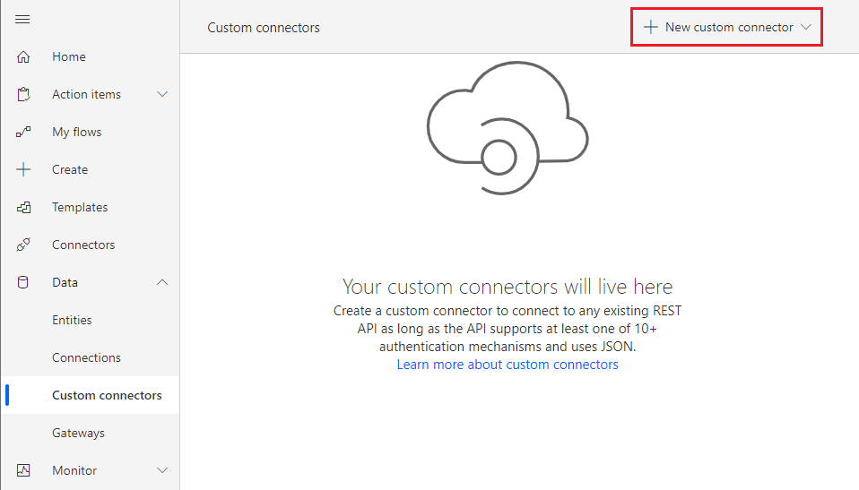

1. Select **Create from blank** from the dropdown list.

   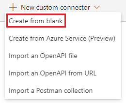

1. In the **Connector name** field, enter a name for the custom connector.

   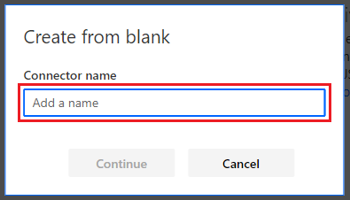

1. In **General Information**, enter a **Description** and a **Host**.

   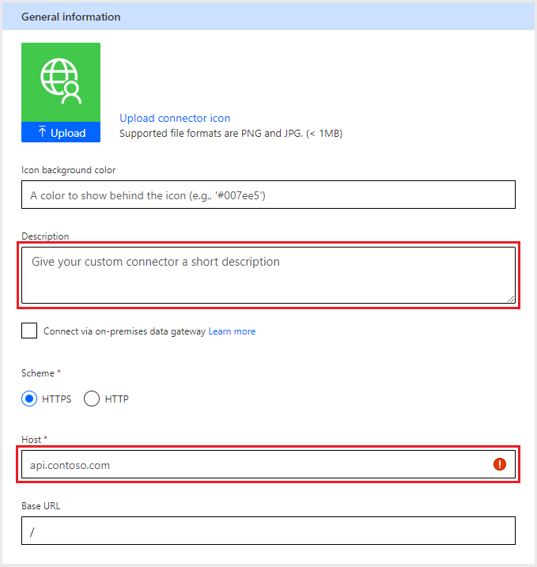

1. Select the **Security** tab, and then select the authentication type that your API uses.

   

## Add a trigger

You need a trigger to serve as the first step in the approval flow that you'll create. 

Some common approval triggers are:

- When a new record is created.
- Wen a record is updated. 

>[!TIP]
>Both Webhook and polling triggers work with approval flows.

1. Continuing from the earlier steps, select the **Definition** tab.

1. Select **New Trigger** in the Triggers list.

   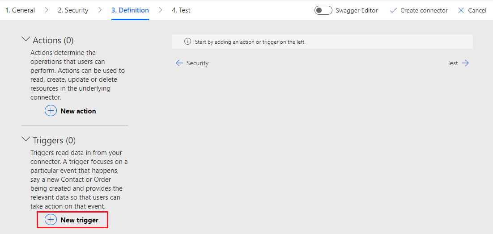

1. Enter a **Summary**, **Description**, **Operation ID**, and select a **Trigger type**.

   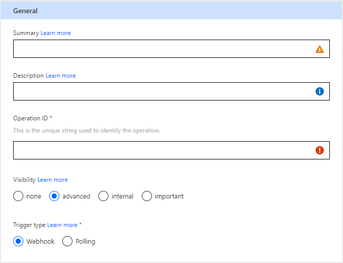

   >[!NOTE]
   >Select either **important** or **advanced** for the **visibility** the trigger to make the trigger available when you create the approval flow.

1. Select **Import from sample.**

   

1. Define the **Verb**, **URL**, **Headers**, and **Body** for your trigger.

   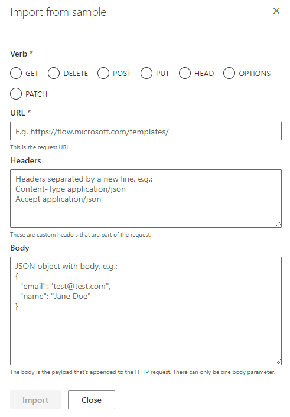

1. Add a Response.

   The response configuration depends on your trigger type (Webhook or polling). Webhook triggers require a callback URL parameter and a location header that contains a value that's used to delete the Webhook registration.

1. Configure the **Webhook Response** and Trigger configuration

   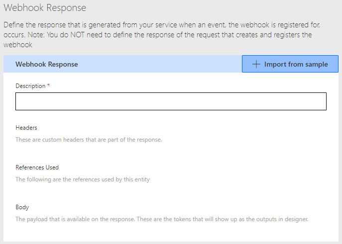

   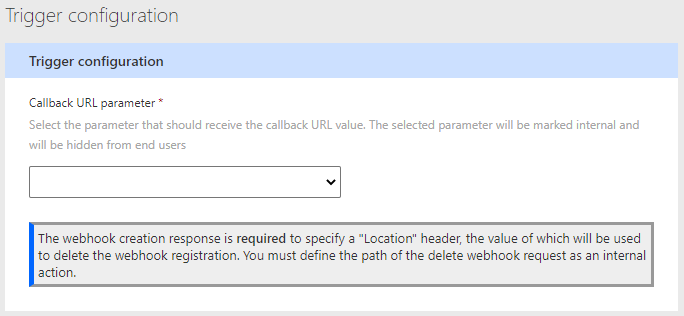

1. Configure the **polling response** to meet your needs. 

   

1. Configure the trigger to meet your needs.

   

## Create an approval flow

Now that you've created your custom connector, it's time to create your approval flow that uses the custom connector.

1. Sign into [Power Automate](https://flow.microsoft.com).

1. Select **My flows**.

1. Select **New flow**, and then select **Automated cloud flow**.

1. Select **Skip** on the **Build an automated cloud flow** screen.

1. Select the **Custom** tab, and then select your new custom connector.

   

1. Select a trigger from your custom connector.

1. Select **New step**.

1. Search for "approvals", and then select **Start and wait for an approval**.

   

1. Select the **Approval type**, and then populate the required fields on the **Start and wait for an approval** card.

   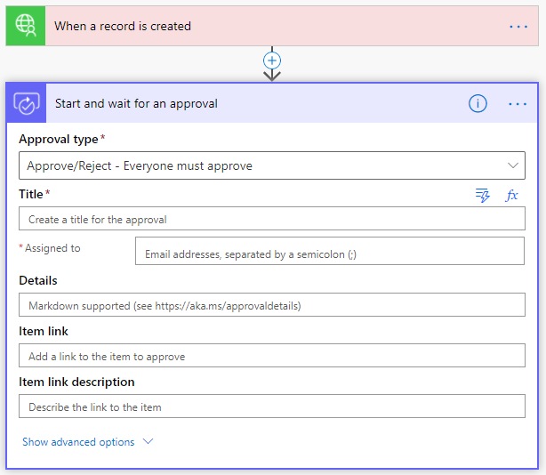

1. Select **New step** > **Control** > **Condition**.

   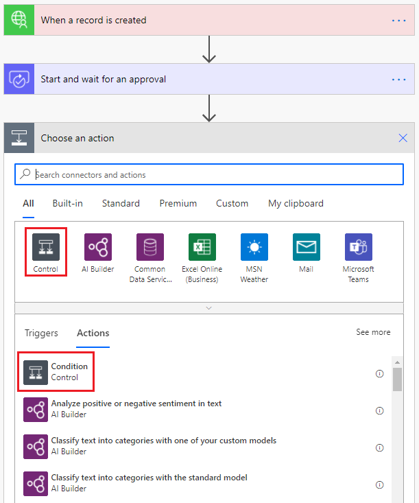

1. Select the **Choose a value** text box, and then search the dynamic content for "Responses Approver response".

   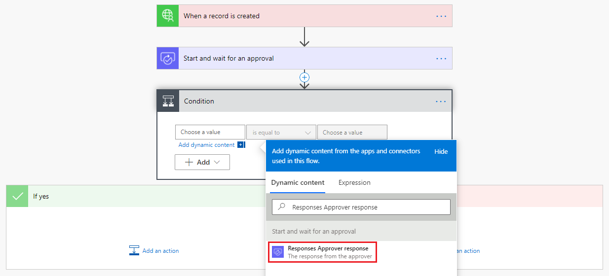

1. Update the condition with the desired result.

   >[!IMPORTANT]
   >The "Approve" or "Reject" approval responses are case sensitive.

   

1. Add an action in both condition result sections.

   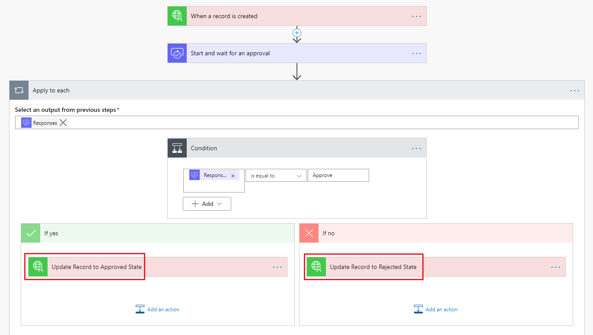

## Manage approvals generated by the approval flow

1. Sign into [Microsoft Teams](https://teams.microsoft.com).

1. Search for the **approvals** app, and then select it.

   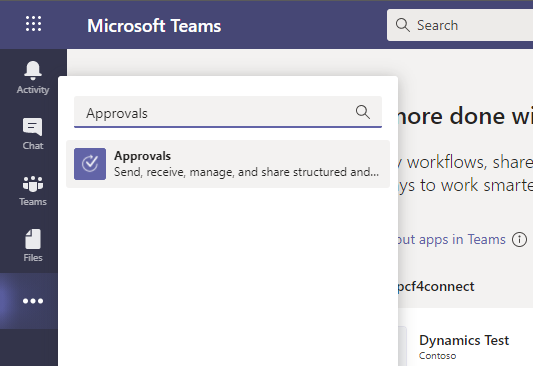

1. View your received and sent approvals.

    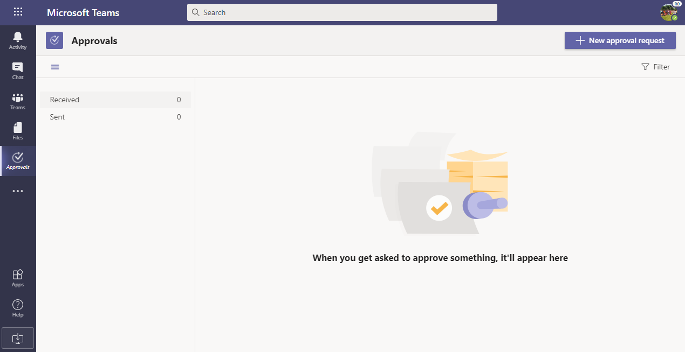

1. Take an action that activates your custom connector’s trigger.

1. View the new approval request in flow run history.

   

1. View the new approval request in the approvals app.

   

1. Select the approval request, review the details, and then select **Reject** or **Approve**.

   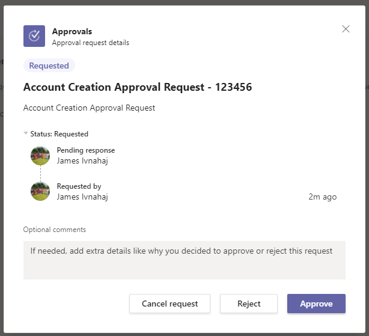

1. View the completed approval request in flow run history.

   

1. View the completed approval request in approvals app.

   

1. Confirm in the target system the approval completion update steps were executed successfully.

## More info

- [Create a custom connector from scratch](https://docs.microsoft.com/connectors/custom-connectors/define-blank)

- Webhook triggers: [Use a Webhook as a trigger for Azure Logic Apps and Power Automate](https://docs.microsoft.com/connectors/custom-connectors/create-webhook-trigger)

- Polling triggers: [Use a polling trigger for Microsoft Power Automate](https://docs.microsoft.com/connectors/custom-connectors/create-polling-trigger)
