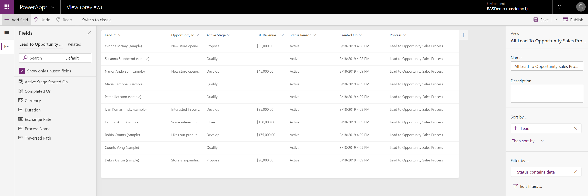

# Best practices in using business process flow columns

Legacy process-related columns in tables is deprecated. Here are some best practices for using the *Active Stage* (activestageid) column on the business process flow table. 

## Reporting on the active stage of a business process flow

Let’s say that you’d like to get a view of your sales pipeline by reporting on the active stage that the **Lead to Opportunity Sales Process** is on.

Previously, to report on business processes by stage, one might define a view on each related table of the business process flow and then report on the *Active Stage* (activestageid) column.

With the deprecation of the *Active Stage*  (activestageid) column on related tables, there are two ways to report on business process flows.

### Option 1: Views and charts on business process flow table**(Recommended)**

In versions 9.0 and higher, each business process flow creates its own Dataverse table, usually with the same name as the business process flow. To report on the business process flow, select the table for the business process flow you want to report on, and then create views and charts, just as you did before.

In our example, follow these steps to go to the **Lead to Opportunity Sales Process** table:
1. Go to [https://make.powerapps.com](https://make.powerapps.com).
1. Select the **Data**.
1. Select the **Tables**.
1. Set the filter to **All**.
1. Search for, and then select the **Lead to Opportunity Sales Process** table.

   

Here, you can define views and charts just as you do on any other table.

An advantage of this approach is that you can use a single view or chart to report on business process flows that span multiple tables.

Further, as the business process flow table is no different from any other custom table in Dataverse, you can add custom columns to the table to track any additional information you need.

### Option 2: copy active stage to a related table

Alternatively, to continue reporting off the related table, create a cloud flow to copy the *Active Stage* (activestageid) column from the business process flow table into a custom column on the related Dataverse tables.

Here are a few things to keep in mind when you use this approach:

1.  It's possible to have more than one business process flow running on a single table. With this approach, it's best to have one custom column that stores the active stage for each business process flow that runs on the table. This approach ensures the integrity of the reporting.

1.  As reporting is driven from the related table, it's not possible to create a single view that reports on business process flows that span multiple tables.

## Using the active stage to run logic

Here are some cases in which you might want to run logic that's based on the active stage:

### Using the active stage to run client-side logic

As you use the business process, there are many things that you might want to do automatically. For instance:

-   Change the active business process flow based on newly available information on the form or business process flow.

-   Move the active stage to the next or previous stage, based on values the users entered for steps or form columns.

-   Hide or show form tabs and columns based on the selected stage.

-   Show informative messages and run calculations based on the active business process flows, the active or selected stage, or events such as moving the active stage.

> [!TIP]
> For scenarios like these, use the supported set of [client APIs](/dynamics365/customer-engagement/developer/clientapi/reference/formcontext-data-process) for business process flows.
>

### Using the active stage to run server-side logic

There might be cases where automation based on the business process flow needs to be done server side. For instance:

-   Send an email to a user if the **Qualify** the stage of the **Opportunity Sales Process** is active for longer than 15 days.

-   Automatically create a set of activities relevant to the active stage of the **Opportunity Sales Process** each time it changes.

-   Automatically finish the **Opportunity Sales Process** when the phone call activity for closing  completes.

> [!TIP]
> Use classic Dataverse workflows or flows you define on the table for the business process flow.
> 

To build a classic Dataverse workflow that creates activities for internal solution reviews and to follow up with the customer in the **Propose** stage of the **Opportunity Sales Process**:

1. Create it on the **Opportunity Sales Process** table and set it to run each time the **Active Stage** column of the table changes. 
1. Define a condition to check if the **Active Stage** column equals **Propose**. 
1. Create an appointment and phone call row for the internal review of the solution and the customer call to review the solution respectively.

   

[!INCLUDE[footer-include](includes/footer-banner.md)]