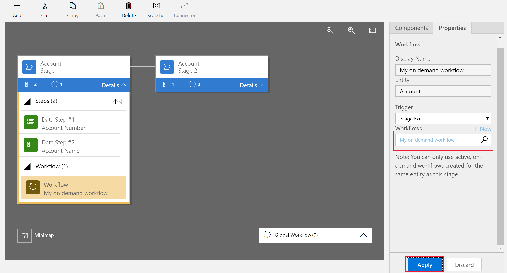
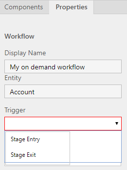

# Add an on-demand workflow to a business process flow
[!INCLUDE [view-pending-approvals](includes/cc-rebrand.md)]

You can trigger on-demand workflows from inside a business process flow. For example, you can add an on-demand workflow to a business process flow so that an activity, such as a task or email, is created whenever a stage is completed. 

A workflow becomes activated based on where you drop the workflow onto the business process flow designer.
- On-demand stage processes. When the workflow is dropped onto a business process flow stage, the workflow is triggered on entry or  exit of the stage. 
- On-demand global processes. When the workflow is dropped  onto the **Global Workflows** area, the workflow is triggered on process activation or process archival (when the status transitions to an applied, completed, reactivated, or abandoned state). 

Notice the following requirements when you add a workflow to a business process flow.
- For workflows added to a stage: You can only use active, on-demand workflows created for the same entity of the stage where you add the workflow.  
- For global workflows: You can only use active, on-demand workflows created for the primary entity of the business process flow.

## Add an on-demand workflow to a business process flow stage

You add an on-demand  workflow from the business process flow designer by dragging the workflow component to a process stage or to the global workflows section. 

On the [PowerApps](https://make.powerapps.com) site, select **Model-driven** (lower left of the navigation pane). 

Open the business process flow designer. You can do this in one of two ways.
- If the business process flow is already added to an app, go to **Apps**, next to the app you want select **…**, and then select **Edit**. In the app designer, select the business process flow, and then select .  
- Otherwise, open [solution explorer](/powerapps/maker/model-driven-apps/advanced-navigation.md#solution-explorer), in the left navigation pane select **Processes**, and then select the business process flow that you want. 

Decide whether you want the on-demand workflow to be triggered by one of the following business process flow events. 
- On-demand stage processes. Triggers the workflow on entry or on exit of the stage. 
- On-demand global processes. Triggers the workflow either on process activation or process archival (when the status transitions to an applied, completed, reactivated, or abandoned state). 

In the example below, an on-demand workflow named **My on demand workflow** is added to **Stage 1** of the business process flow. 

1. Expand stage 1 to reveal the **Triggered Process** section. 
2. Select the **Components** tab and drag **Workflow** to the **Triggered Process** section.
    
Alternatively, you can drag **Workflow** to the **Global Workflows** section, which triggers the workflow either on process activation or process archival.
    
3. In the search box of the **Properties** tab, enter and search the name of the on-demand workflow you want to add to the business process flow stage, and then select **Apply**.
    
4. On the **Properties** tab under **Trigger** select either **Stage Entry** or **Stage Exit**.  
    
   
    Alternatively, when you drop the workflow onto the **Global Workflows** section, the trigger options are **Process applied**, **Process reactivated**, **Process abandoned**, and **Process completed**.

5. Select **Update** on the business process flow designer toolbar.
 
## Next steps
[Use Workflow processes to automate processes that don't require user interaction](workflow-processes.md)  
[Tutorial: Create a business process flow to standardize processes](create-business-process-flow.md)  
[Business process flow automation in Dynamics 365](https://blogs.msdn.microsoft.com/crm/2017/03/28/business-process-flow-automation-in-dynamics-365/)
