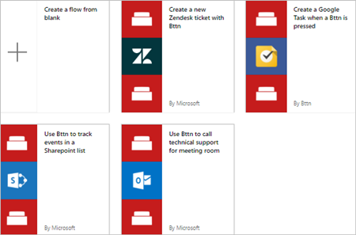
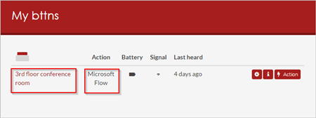
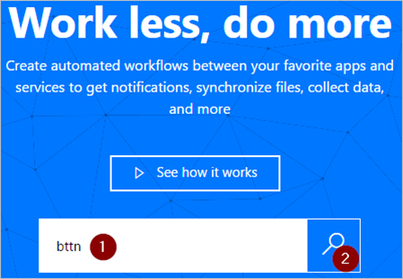
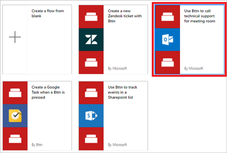
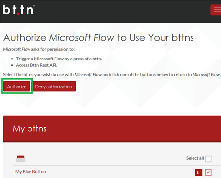
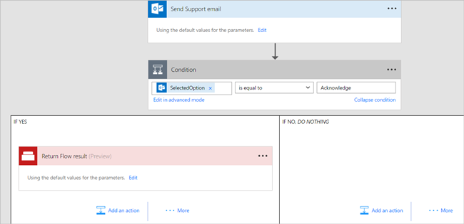
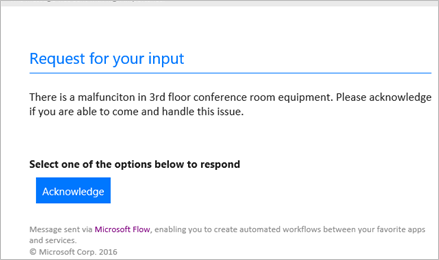

<properties
    pageTitle="Start your flows with a bttn|Microsoft Flow"
    description="Learn how to start your flows with a bttn"
    services=""
    suite="flow"
    documentationCenter="na"
    authors="msftman"
    manager="anneta"
    editor=""
    tags=""/>

<tags
   ms.service="flow"
   ms.devlang="na"
   ms.topic="article"
   ms.tgt_pltfrm="na"
   ms.workload="na"
   ms.date="04/30/2017"
   ms.author="deonhe"/>

# Run your flows with physical buttons (bttns) from The Button Corporation (Preview)

Microsoft Flow has partnered with [The Button Corporation](https://my.bt.tn/), one of the leading physical button manufacturers. This partnership enables you to trigger flows by touching a bttn (a physical button made by The Button Corporation). For example, you can press a bttn that triggers a flow that contacts your helpdesk with location information, sends an email to your team, blocks your calendar, or reorders supplies.

>[AZURE.IMPORTANT]You must [register](https://my.bt.tn/) your bttns before you can use them in flows.

Configure all bttn properties, including name, location, email address, and so on, on the [bttn website](https://my.bt.tn/) before you create your flow.

Microsoft Flow also partners with Shortcut Labs, another leading physical button manufacturer that allows you to trigger your flows with a Flic (physical button).

## Prerequisites

To use bttns with Microsoft Flow, you must have:

- Access to [Microsoft Flow](https://flow.microsoft.com).

- Access to [bttn](https://my.bt.tn/).

- [Registered](https://my.bt.tn/) one or more bttns.

## Create a flow that's triggered from a bttn

In this walk-through, we use a helpdesk template to create a flow that you can trigger with a single touch of a [bttn](https://my.bt.tn/). When the flow triggers, it generates a support request, and then sends it to the helpdesk. The support request provides the helpdesk with location information about the room where help is needed. While we use a preconfigured template in this walk-through, you're free to use the blank template, which gives you full control over all aspects of your flow.

Here are some of the bttn templates available for you to quickly create flows for your bttn. Notice that bttn templates are available to connect to Zendesk, Google, and SharePoint, among others:

Tip: For the purposes of this walk-through, give your bttn a name that represents a conference room in a typical office building.

The settings for your bttn should resemble this screenshot (from the bttn website):

Now that you've registered and configured your bttn, let's get started creating our flow.

### Sign in and select a template

1. Go to [Microsoft Flow](https://flow.microsoft.com), select **Sign in**, and then follow the steps to sign into Microsoft Flow.

     

     Note: Alternatively, you can create flows from the Microsoft Flow [Android](https://aka.ms/flowmobiledocsandroid) or [iOS](https://aka.ms/flowmobiledocsios) mobile app.

1. Enter **bttn** into the search box, and then select the search icon.

   After you select the search icon, you will see all templates that you can use with bttns.

   

1. Select a template.

   Here, I've selected the **Use Bttn to call technical support for meeting room** template.

   

### Authorize Microsoft Flow to connect to your bttn

1. Provide your credentials for the services that your selected template requires.

   The **Use Bttn to call technical support for meeting room** template uses the bttn and the Office 365 Outlook services. The **Continue** button becomes enabled after you sign into both services.

     

1. Be sure to authorize Microsoft Flow to use your bttns when you sign into the bttn service.

   This step is crtical. If you don't authorize Microsoft Flow to use your bttns, you will not be able to see, or connect to your bttns from Microsoft Flow.

     

1. Select **Continue** after you've signed into the services your flow uses.

     

### Select the bttn that triggers the flow

1. Select the **bttn ID** box, and then select the bttn you want to use from the **When a bttn is pressed** card.

     

1. Your flow should now resemble this screenshot.

     

1. Give your flow a name, and then select **Create flow** to save it.

     

## Test your flow and confirm results

1. Press the button on your bttn.

1. View your flow's run history to confirm that it ran successfully. You can check run history on the Microsoft Flow website, or on your mobile device.

   Note: The run status will be **running** until someone selects the **Acknowledge** button in the support request email.

1. You can also confirm that the email was sent to the support team. If you've followed along, the support email looks similar to this one:

     

## Troubleshooting

- If your flow did not get triggered, log into The Button Corporation's site and confirm if the button activity (presses) are being recorded.
- You can also drill into the run activity on the Microsoft Flow site to see if there are any clues from the run.

## More information

- [Share button flows](./share-buttons.md).
- Learn to use [button trigger tokens](./introduction-to-button-trigger-tokens.md) to send current data when your button flows are executed.
- [Install the Flow app for Android](https://aka.ms/flowmobiledocsandroid)
- [Install the Flow app for iOS](https://aka.ms/flowmobiledocsios)
