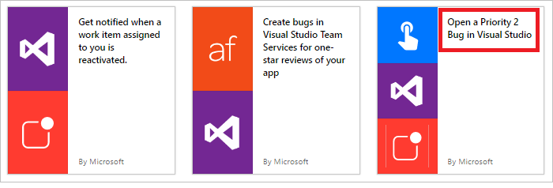
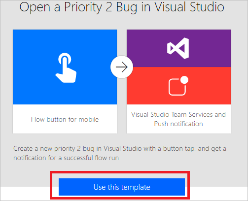
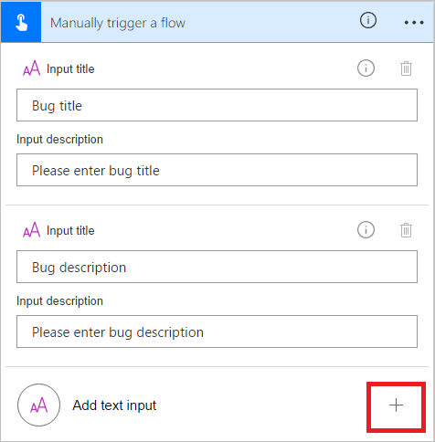
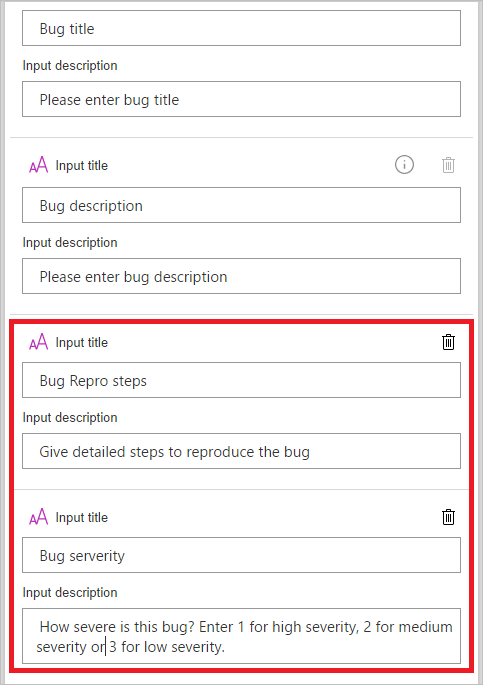
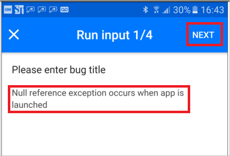
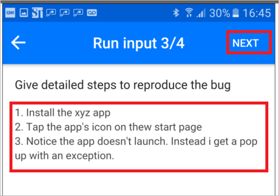

<properties
    pageTitle="Learn how to automate repetitive tasks with button flows that take user input | Microsoft Flow"
    description="Microsoft Flow makes it easy automate repetitive tasks. Your flows can even take user input when running a repetitive task."
    services=""
    suite="flow"
    documentationCenter="na"
    authors="msftman"
    manager="anneta"
    editor=""
    tags=""/>

<tags
   ms.service="flow"
   ms.devlang="na"
   ms.topic="article"
   ms.tgt_pltfrm="na"
   ms.workload="na"
   ms.date="02/15/2017"
   ms.author="deonhe"/>

# Introducing button flows with user input

Button flows are used to run routine tasks by simply tapping a button. Sometimes, you may want to customize a button flow by allowing the user to provide specific details that will be used when the button flow executes. This document walks you through the creation of a button flow that takes input from the user and then the execution of the button flow, highlighting how to provide the user input at run time.  

## Create a button flow with user input

Here, we'll use the Microsoft Flow portal to create a button flow app, however, you can also perform these steps using the Microsoft Flow mobile app.

### Prerequisites
You need to have an account on [Microsoft Flow portal](https://flow.microsoft.com) in order to create or execute flows.  

1. After you've signed into the Microsoft Flow portal, enter **Visual Studio** in the search box and then tap the search icon to find all templates related to Visual Studio:  
	  

2. Select the **Open a Priority 2 Bug in Visual Studio** template:  
	  

3. Select the **Use this template** button:  
	  

4. This template uses the Visual Studio Team Services (VSTS) and the Push notification services. You'll need to sign into these services if aren't any existing connections to any of them. The **Sign in** button will appear only if you need to sign into a service. After you've confirmed you're signed into all required services, select the **Continue** button:  
	  

5. Optionally, you can change the name of the flow by typing a name of your choice into the menu at the top of the portal:  
	  

6. Select **Edit**:  
	  

7. Select the **+** icon to expand the page so you can add your custom input fields:  
	  

8. Enter the **Input title** and **Input description** for each of the custom fields you wish to make available when someone uses your flow to report a bug.  

	In this example, I've created two custom input fields (**Bug repro steps** and **Bug severity**) so that anyone who uses this flow can enter the steps to reproduce the bug and rate the bug's severity:  

	  

9. Tap the **Create a new work item** card's title bar:  
	  

10. Make the selections that are appropriate for your VSTS environment and then select **Edit**:  
	  

11. Select **Show advanced options** to reveal the other fields for this card:  
	  

12. Place the cursor before the **Bug title** token and then enter "Severity: " into the **Title** text field.  
13. With the cursor still in the title text field, select the **Bug severity** token and then enter " -- ".  
14. In the **Description** text field, place your cursor just after the **Bug description** token and press the **Enter** key to start a new line. Place your cursor on the new line and then select the **Bug Repro steps** token:  
	  

15. Tap the title bar on the **Send a push notification** card to expand it and then place the **Description** token into the **Link** text field.  
15. Place the **Bug title** token into the **Link label** text field:  
	  

16. Tap **Create flow** on the menu to create your flow:  
	  

## Run a button flow with user input
In this walk-through, you will use the Microsoft Flow mobile app to execute the button flow you just created. You will provide all the user input that's needed to create a bug with a title, description, repro steps and severity.  

After launching the Microsoft Flow mobile app:  

1. Tap the **Buttons** tab.  
2. Tap the **Create bug report with steps** button.  
	  

3. Enter the title for the bug you are reporting and then tap **Next**. For example:  
	  

4. Enter the description of the bug you are reporting and then tap **Next**. For example:  
	  

5. Enter the steps to reproduce the bug you are reporting and then tap **Next**. For example:  
	  

6. Enter the severity of the bug you are reporting and then tap **Done**:  
	  

7. The flow runs. You can see the results on the **Activity** tab.  
	  

8. See the detailed results of the flow's run on the **Activity** tab by tapping the **Create a new work item** step.  
	  

## Next steps

- [Learn about button flows](./introduction-to-button-flows.md)  
- [Learn about button flows with trigger tokens](./introduction-to-button-trigger-tokens.md)  
- [Learn about flows](./guided-learning/learning-introducing-flow.md)  
