<properties
    pageTitle="Learn how to automate repetitive tasks with button flows that take user input | Microsoft Flow"
    description="Microsoft Flow makes it easy automate repetitive tasks. Your flows can even take user input when running a repetitive task."
    services=""
    suite="flow"
    documentationCenter="na"
    authors="msftman"
    manager="anneta"
    editor=""
    tags=""/>

<tags
   ms.service="flow"
   ms.devlang="na"
   ms.topic="article"
   ms.tgt_pltfrm="na"
   ms.workload="na"
   ms.date="01/24/2017"
   ms.author="deonhe"/>

# Introducing button flows with user input 

Button flows are used to run routine tasks by simply tapping a button. Sometimes, you may want to customize a button flow by allowing the user to provide specific details that will be used when the button flow executes. This document walks you through the creation and execution of a button flow that takes user input at run time. 

## Create a button flow with user input  

**Note:** All screenshots in this document are taken from an Android mobile device, however, you can use an iOS device as well. Your experience will be similar on either device.  

1. Launch the flow app on your mobile device and tap **Browse**.  

	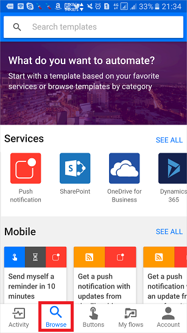  
2. Tap **+ Create a flow from scratch**.  

	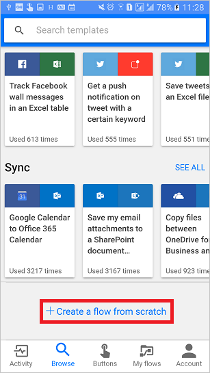  
3. Tap the white space below **Flow name**  and enter a name for your flow. In this example, I've given my flow the name **Create bug report with steps**. You can name yours anything that you prefer.  

	  
4. Tap the **Manually trigger a flow** trigger.  

	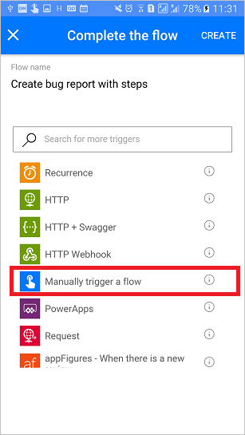  
5. Tap **Add text input**.  

	  
6. Enter **Title of bug** in the **Label for text input** field  
7. Enter **BugTitle** into the **Enter token label** field.  

	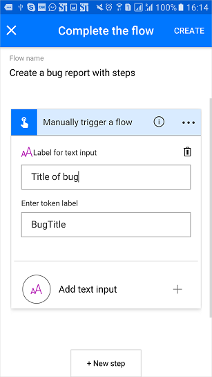  
8. Tap **Add text input**.  

	  
9. Enter **Give detailed steps to reproduce** in the **Label for text input** field.  

	  
10. Enter **ReproSteps** into the **Enter token label** field.  

	  
11. Tap **+ New step**.  

	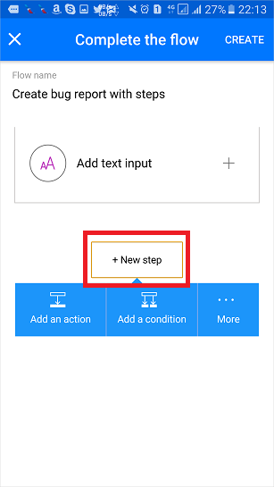  
12. Tap **Add an action**.  

	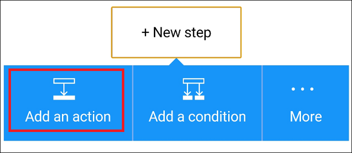  
13. Type **work item** into the search box to filter the actions list to display only actions that contain **work item** in the name.  

	  
14. Tap **Visual Studio Team Services - Create a new work item**.  

	  
15. Select an **Account name**, **Project name**, **Type** and select the **BugTitle** token as the **Title**.  
**Note:** Your options will vary based on what's available for the logged in account.  

	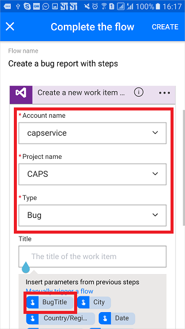  
16. Tap in the **Description** field.  

	  
17. Select the **ReproSteps** token  

	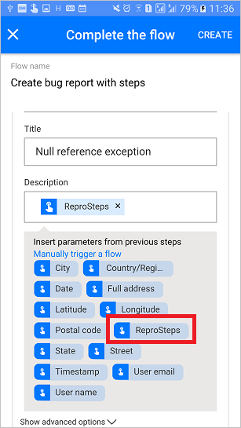  
18. Tap **Create** to save your flow.  

	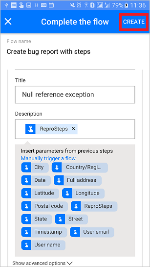  
19. Your flow is saved and you can now run it from the **Buttons** tab of the flow app.  

	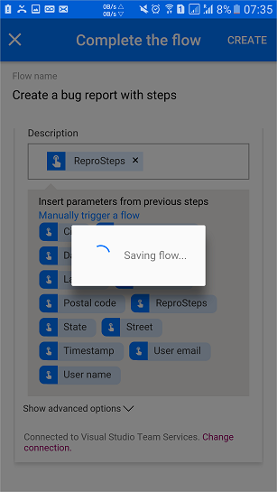  

## Run a button flow with user input
In this walk-through, you will see how to provide user input in a run of the button flow.  

After launching the flow app:  
<<<<<<< HEAD
=======

>>>>>>> upstream/master
1. Tap the **Buttons** tab.  
2. Tap the **Create bug report with steps** button.  

	  
3. Enter the title for the bug you are reporting. For example:  

	  
4. Enter the steps to reproduce the bug you are reporting. For example:  
	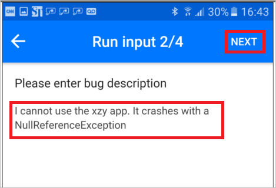  
5. Tap **Done**. This will execute the flow, creating a bug with the title and repro steps you provided.  

	  
6. The flow runs. You can see the results on the **Activity** tab.  

	  
7. See the detailed results of the flow run on the **Activity** tab by tapping the **Create a new work item** step.  

	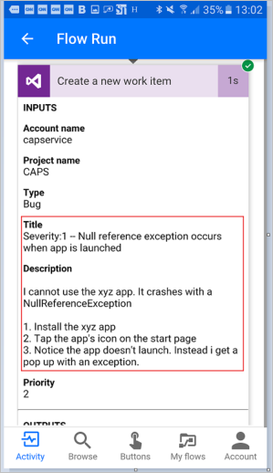  

## Next steps

- [Learn about button flows](./introduction-to-button-flows.md)  
- [Learn about button flows with trigger tokens](./introduction-to-button-trigger-tokens.md)  
- [Learn about flows](./guided-learning/learning-introducing-flow.md)  
