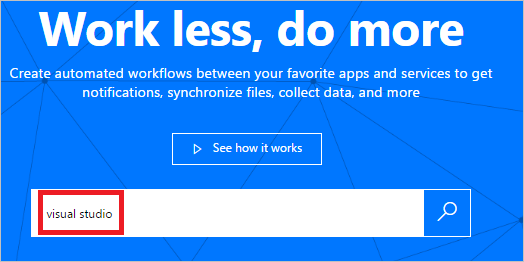
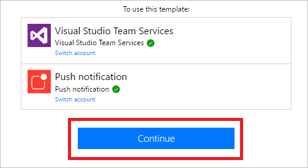
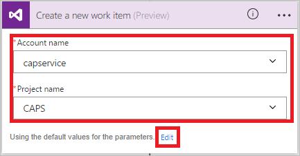
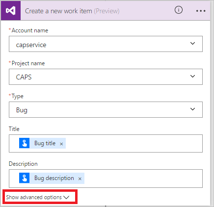
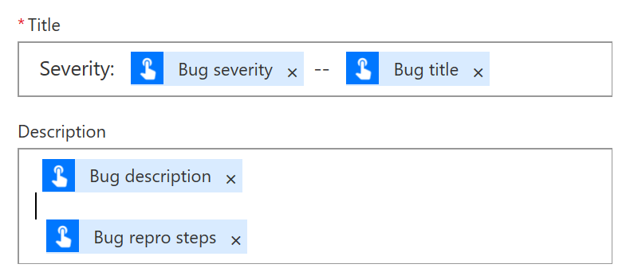
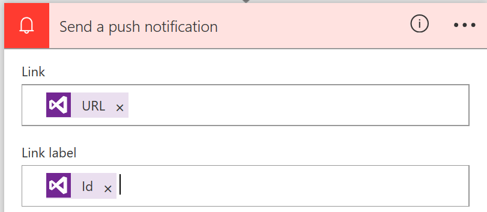
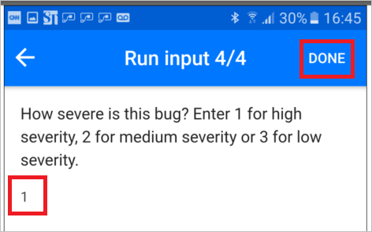
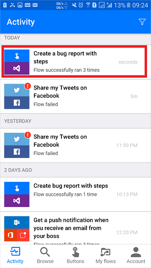

<properties
    pageTitle="Learn how to automate repetitive tasks with button flows that take user input | Microsoft Flow"
    description="Microsoft Flow makes it easy automate repetitive tasks. Your flows can even take user input when running a repetitive task."
    services=""
    suite="flow"
    documentationCenter="na"
    authors="msftman"
    manager="anneta"
    editor=""
    tags=""/>

<tags
   ms.service="flow"
   ms.devlang="na"
   ms.topic="article"
   ms.tgt_pltfrm="na"
   ms.workload="na"
   ms.date="02/15/2017"
   ms.author="deonhe"/>

# Introducing button flows with user input
Create a button flow to run routine tasks by simply tapping a button. Customize your flow by allowing the user to provide specific details that will be used when the flow runs. This topic walks you through creating a button flow that takes input from the user and then running the button flow, highlighting how to provide the user input.

You can create a button flow in the Microsoft Flow website or the mobile app for Microsoft Flow. For this topic, you'll use the website.

### Prerequisites
- An account on the Microsoft Flow website.

## Open the template ##
1. Sign in to the [Microsoft Flow website](https://flow.microsoft.com), enter **Visual Studio** in the search box, and then click or tap the search icon to find all templates that relate to Visual Studio:

	  

2. Select the **Open a Priority 2 Bug in Visual Studio** template:

	  

3. Select **Use this template** button:

	  

	This template uses the Visual Studio Team Services (VSTS) and the Push notification services. You'll need to sign into these services if you don't have a connection to either of them. The **Sign in** button will appear only if you need to sign into a service.

4. After you sign into all required services, select the **Continue** button:

	  

5. (optional) Change the name of the flow by typing a name of your choice into the box at the top of the portal:

	

## Customize the flow ##
1. In the trigger card, select **Edit**:

	  

1. Select the **+** icon to expand the page so that you can add custom input fields:

	

1. Enter the **Input title** and **Input description** for each custom field that you want to make available when someone runs your flow.  

	In this example, you'll create two custom input fields (**Bug repro steps** and **Bug severity**) so that anyone who uses this flow can enter the steps to reproduce the bug and rate the bug's severity:  

	  

1. Tap the **Create a new work item** card's title bar:

	  

1. Make the selections that are appropriate for your VSTS environment, and then select **Edit**:

	For example, connect to myinstance.visualstudio.com by typing **myinstance**.

	  

1. Select **Show advanced options** to reveal the other fields for this card:

	  

1. Place the cursor before the **Bug title** token, and then enter "Severity: " into the **Title** text field.

1. With the cursor still in the title text field, select the **Bug severity** token, and then enter " -- ".  

1. In the **Description** text field, place your cursor just after the **Bug description** token, and then press Enter to start a new line.

1. Place your cursor on the new line, and then select the **Bug Repro steps** token:

	  

1. Tap the title bar on the **Send a push notification** card to expand it.

1. In the list of dynamic content tokens, select **See more**, and then add the **URL** token in the **Link** text field.

1. In the **Link label** text field, add the **Id** token:

	  

1. Tap **Create flow** on the menu to create your flow:
	  

## Run your flow ##
In this walk-through, you'll use the Microsoft Flow mobile app to run the button flow you just created. You'll provide all the user input that's needed to create a bug with a title, a description, repro steps, and severity level.  

In the Microsoft Flow mobile app:  

1. Tap the **Buttons** tab, and then tap the **Create bug report with steps** button.

	  

3. Enter the title for the bug you are reporting, and then tap **Next**. For example:

	  

4. Enter the description of the bug you are reporting, and then tap **Next**. For example:

	  

5. Enter the steps to reproduce the bug you are reporting, and then tap **Next**. For example:

	  

6. Enter the severity of the bug you are reporting, and then tap **Done**:  
	  

	The flow runs.

7. (optional) Tap the **Activity** tab to show the results.

	  

8. (optional) Show the detailed results of the flow's run by tapping the **Create a new work item** step.

	  

## Next steps
- [Learn about flows](./guided-learning/learning-introducing-flow.md)  
- [Learn about button flows](./introduction-to-button-flows.md)  
- [Learn about button flows with trigger tokens](./introduction-to-button-trigger-tokens.md)  
