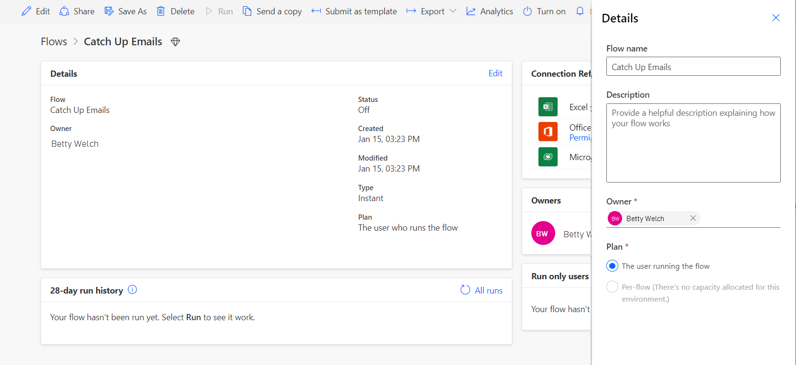
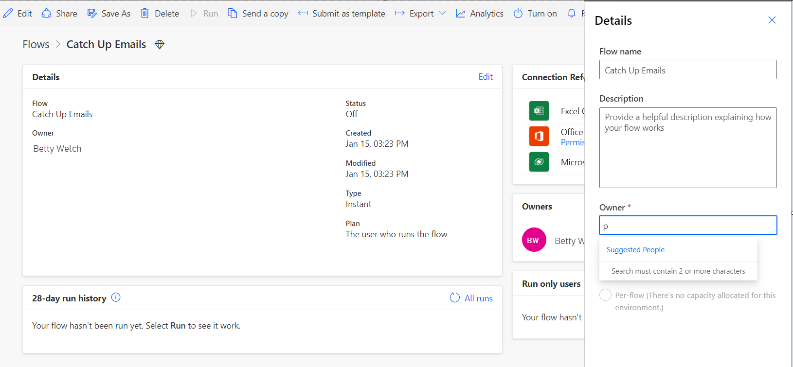
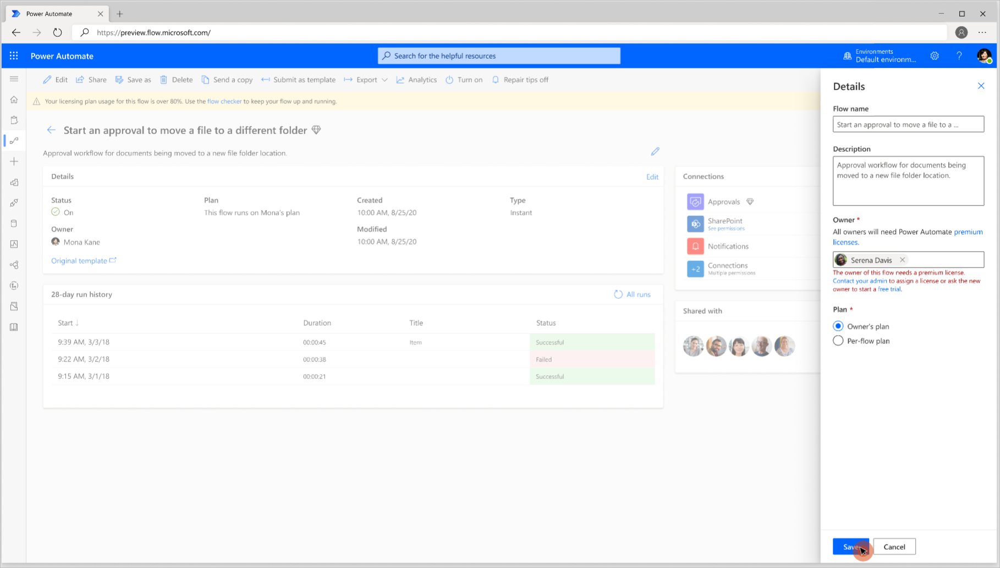
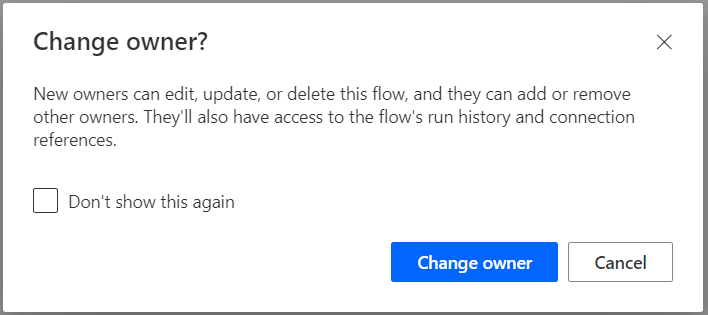
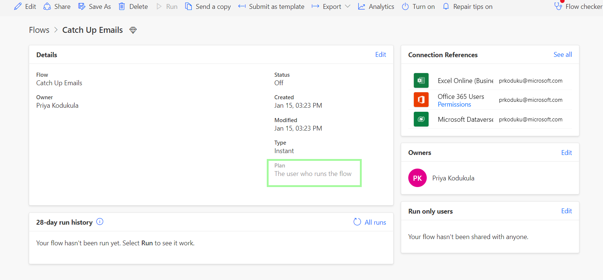

# Change the owner of a cloud flow

An owner, co-owner, or an admin can change the owner of a solution-aware flow to another user to ensure business continuity. After the change of ownership completes, the original owner and the new owner both become co-owners of the flow.

You can change the owner to an individual (not a distribution list) or a user account used as a service account. If the flow uses a service account, ensure it's licensed correctly to avoid [multiplexing](/power-platform/admin/power-automate-licensing/faqs#multiplexing).

Follow these steps to change the owner of a flow.

1. On the left pane, select **Solutions**.

1. Select the solution that contains the flow you want to change.

1. Select the flow for which you're changing the owner.

1. Select **Edit** on the **Details** section.

    >[!div class="mx-imgBorder"]
    >

1. In the **Owner** section, remove the current owner.

    >[!div class="mx-imgBorder"]
    >

1. Enter the email address for the new owner.

    >[!div class="mx-imgBorder"]
    >

   >[!WARNING]
   >If the flow uses premium features but the new owner doesn’t have a premium license, a warning is shown with the next steps.

    >[!div class="mx-imgBorder"]
    >

The flow can still be assigned to the new owner. The flow continues to run for 30 days, allowing time for the new owner to purchase a license. If the new owner doesn't have a premium license after the grace period, Power Automate turns off the flow. They can turn it on anytime after purchasing the license. 

Once assigned, the new owner gets access to the run history and connection references. The new owner can update the flow or reassign to other users too.

>[!div class="mx-imgBorder"]
>

If the flow is a **scheduled** or **automated** flow, after the owner is changes, the flow runs under the license of the new owner and uses their Power Platform request limits. This change can take up to seven (7) days to become effective. If you need the new owner to take effect immediately, edit the flow and then save it to force the flow to use the new owner’s license.

If the flow is a **manual** flow, the flow runs under the license of the user who runs the flow. The plan section shows whose license plan the flow uses.

>[!div class="mx-imgBorder"]
>

>[!NOTE]
>This change is limited to solution-aware flows. To change the owner of a non-solution-aware flow, the new owner must export, and then import the flow.

### More information

To learn how to export and import non-solution-aware flows, go to this [video](https://www.youtube.com/watch?v=K7_xWJvEPUc).

