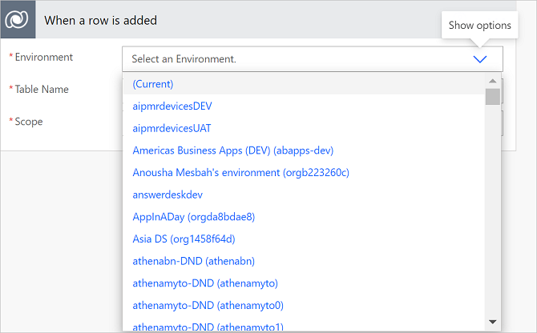
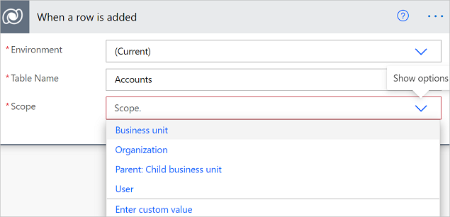
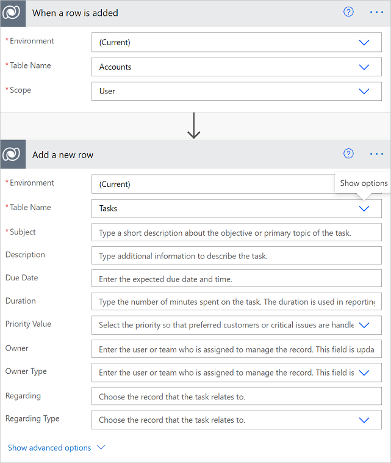

# Create an automated flow with Microsoft Dataverse

>[!IMPORTANT]
>There are three connectors available to connect to Dataverse. Use the recommended [Microsoft Dataverse connector](./connection-cds-native.md). The **Microsoft Dataverse (legacy)** connector, covered in this article, and the [Dynamics 365 connector](/connectors/dynamicscrmonline/) are available if you are unable to use the recommended connector.

With the Microsoft Dataverse (legacy) connector, you can create flows that are initiated by create and update events within Dataverse. Additionally, you can perform create, update, retrieve, and delete actions on rows within Dataverse.

## Initiate a cloud flow from Dataverse

You can use any of the following triggers to initiate your flow.

- When a flow step is run from a business process flow
- When a row is added
- When a row is modified
- When a row is deleted
- When a action is performed (preview)

> [!div class="mx-imgBorder"]
> 

If the selected trigger requires an environment to be selected, then you can choose `(Current)`, which will always use the database within the environment in which Power Automate runs. If you want your flow to always trigger based on an event in a specific environment, select that environment.

> [!div class="mx-imgBorder"]
> 

You can use scopes to determine if your flow runs if you add row, if a new row is added by a user within your business unit, or if a new row is added by any user in your organization.

> [!div class="mx-imgBorder"]
> 

|Scope|Trigger timing|
| --- | --- |
|Business Unit|Action is taken on a row owned by your business unit|
|Organization|Action is taken by anyone within the organization or database|
|Parent: Child business unit|Action is taken on a row owned by your business unit or a child business unit|
|User|Action is taken on a row owned by you|

Triggers that run when a row is modified can also use filtering columns. This ensures that the flow only runs when any of the defined columns are modified.

> [!IMPORTANT]
> Use filter columns to prevent your flow from unnecessarily running.

This flow triggers any time the first or last name of a contact that the flow user owns is modified.

> [!div class="mx-imgBorder"]
> 

## Trigger privileges

To create a cloud flow that triggers based on create, update, or delete on a row, the user needs to have user level permissions for create, read, write, and delete on the Callback Registration table. Additionally, depending on the scopes defined, the user might need at least that level of read on the same table.  [Learn more](/power-platform/admin/database-security) about environment security.

## Write data into Dataverse

Use any of the following actions to write data into Dataverse:

- Create a new row
- Update a row

Here's an example of creating a follow-up task when the given user creates a new account row.  

> [!div class="mx-imgBorder"]
> 

## Advanced concepts

### Write data into customer, owner, and regarding columns

To write data into customer, owner, and regarding columns, two columns must be populated.

| Column category | Example settings |
| --- | --- |
| Regarding | Regarding = ID of the row (for example, account ID) and Regarding Type as selected from the list. |
| Customer | Represents the ID of the row and the customer type as selected from the list. |
| Owner | Represents the ID of the system user or team, and owner type as selected from the list. |

### Enable upsert behavior

You can leverage the **update a row** command to provide upsert actions, which updates the row if it already exists, or creates a new row. To invoke upsert, provide the table and a GUID key. If the row with the specified type and key exists, an update occurs. Otherwise, a row with the specified key is created.

### Trigger behavior

If you have a trigger registered on the update of a row, the flow runs for every *committed* update to the given row. The service invokes your flow asynchronously, and with the payload that it captures at the time the invocation occurs.

Flow runs may be delayed if there is a backlog of system jobs in your environment.  If this delay occurs, your flow is triggered when the system job to invoke the flow runs.

[!INCLUDE[footer-include](includes/footer-banner.md)]