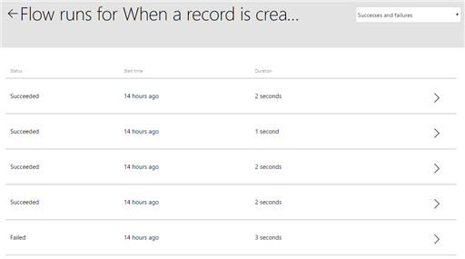
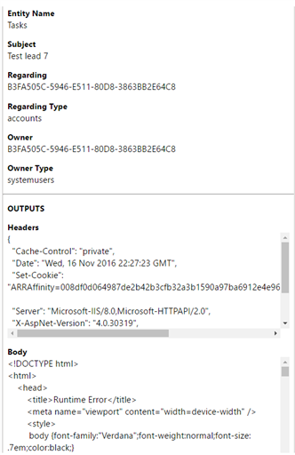

<properties
    pageTitle="Create a flow with Dynamics 365 (online) and Microsoft Flow"
    description="Create useful workflows using a Dynamics 365 connection and Microsoft Flow"
    services=""
    suite="flow"
    documentationCenter="na"
    authors="Mattp123"
    manager="anneta"
    editor=""
    tags=""/>

<tags
   ms.service="flow"
   ms.devlang="na"
   ms.topic="article"
   ms.tgt_pltfrm="na"
   ms.workload="na"
   ms.date="02/06/2017"
   ms.author="matp"/>

# Create a flow using Dynamics 365 (online)

Microsoft Flow is a service that lets you set up automated workflows between your favorite apps and services to synchronize files, get notifications, collect data, and more. Using a Dynamics 365 connector, you can create flows that initiate when an event occurs in Dynamics 365, or some other service, which then performs an action in Dynamics 365, or some other service.   

## Create a flow from a template
You can create a flow using one of the many templates available. Here are a few templates that are available.
* When an object is created in Dynamics 365, create a list item in SharePoint.
* Create Dynamics 365 lead records from an Excel table.
* Copy Dynamics 365 accounts to customers in Dynamics 365 for Operations.

To create a flow from a template, follow these steps.

1. Sign in to [https://flow.microsoft.com/](https://flow.microsoft.com/).

2. Click **Services**, and then click **Dynamics 365**.

3. Several templates are available. To get started, select the template that you want.

## Walkthrough 1: Create a task whenever a new lead is created in Dynamics 365
If a template isn’t available for what you need, create a flow from scratch. This walkthrough shows you how to create a task in Dynamics 365 whenever a new lead is created in Dynamics 365.

1. Sign in to [https://flow.microsoft.com/](https://flow.microsoft.com/).

2. Click **My flows**, and then click **Create from blank**.

3. In the list of flow triggers, click **Dynamics 365 - When a record is created**. You may be prompted to sign-in to Dynamics 365.

4. Enter the following information.
  * **Organization Name**. Select the Dynamics 365 instance where you want the flow to listen.
  * **Entity Name**. Select the entity that you want to listen to, which will act as a trigger initiating the flow. In this walkthrough **Leads** is selected.

    
5.	Click **New step**, and then click **Add an action**.

6.	Click **Dynamics 365 – Create a new record**.

7.	Enter the following information.
  * **Organization Name**. Select the Dynamics 365 instance where you want the flow to create the record. Notice that it doesn’t have to be the same instance where the event is triggered from.
  * **Entity Name**. Select the entity that will create a record when the event occurs. In this walkthrough, **Tasks** is selected.

8.	A Subject box appears. When you click the box, a dynamic content pane appears where you can select either of the following fields.

  * **Last Name**. Selecting this field will insert the last name of the lead in to the Subject field of the task, when the task record is created.
  * **Topic**. Selecting this field will insert Topic field for the lead in to the Subject field of the task, when the task record is created.

  For this walkthrough, **Topic** is selected.

  

  >[**Tip**]    On the dynamic content pane, click **See more** to display more fields that are  associated with the entity. For example **Company Name**, **Customer**, **Description**, or **Email**, that can be used to populate the subject field in a task.

9.	Click **Create flow**.

## Walkthrough 2: Create a flow that creates a task in Wunderlist whenever a task is created in Dynamics 365

This walkthrough shows you how to create a task in Dynamics 365 whenever a task is created in [Wunderlist](http://www.wunderlist.com). Wunderlist is an internet-based service that you can use to create to-do lists, reminders, or track errands.

1. Sign in to [https://flow.microsoft.com/](https://flow.microsoft.com/).

2. Click **My flows**, and then click **Create from blank**.

3. In the list of flow triggers, click **Dynamics 365 - When a record is created**.

4. Enter the following information.

  * **Organization Name**. Select the Dynamics 365 instance that you want the flow to listen to.
  * **Entity Name**. Select the entity that you want to listen to, which will act as a trigger to initiate the flow. In this walkthrough, **Tasks** is selected.

5.	Click **New step**, and then click **Add an action**.

6.	Type *create a task*, and then click **Wunderlist – Create a task**.

7.	In the List ID box select the list where you want to create the task, such as your **inbox** or **Work**.

8.	Click **Create flow**.  

## Working with advanced options
When you add a step to a flow, clicking **Show advanced options** allows you to control how the data is filtered in the flow by adding a filter or order by query.

For example, you can use a filter query to retrieve only active contacts and order by the contact last name.  To do this, enter the OData filter query *statuscode eq 1* and select **Last Name** from the dynamic content pane. For more information about filter and order by queries, see [MSDN: $filter](https://msdn.microsoft.com/library/gg309461.aspx#Anchor_1) and [MSDN: $orderby](https://msdn.microsoft.com/library/gg309461.aspx#Anchor_2).

  

### Best practices when using advanced options  
Notice that when you add a value to a field, you must match the field type whether you type a value or select from the dynamic content that is displayed.

Field type  |How to use  |Where to find  |Name  |Data type  
---------|---------|---------|---------|---------
Text fields|Text fields require a single line of text or dynamic content that is a text type field. Examples include the **Category** and **Sub-Category** fields.|**Settings** > **Customizations** > **Customize the System** > **Entities** > **Task** > **Fields** |**category** |**Single Line of Text**.       
Integer fields | Some fields require integer or dynamic content that is an integer type field. Examples include **Percent Complete** and **Duration**. |**Settings** > **Customizations** > **Customize the System** > **Entities** > **Task** > **Fields** |**percentcomplete** |**Whole Number**         
Date fields | Some fields require a date entered in mm/dd/yyyy format or dynamic content that is a date type field. Examples include **Created On**, **Start Date**, **Actual Start**, **Last on Hold Time**, **Actual End**, and **Due Date**. | **Settings** > **Customizations** > **Customize the System** > **Entities** > **Task** > **Fields** |**createdon** |**Date and Time**         
Fields that require both a record ID and lookup type |Some fields that reference another entity record require both the record ID and the lookup type. |**Settings** > **Customizations** > **Customize the System** > **Entities** > **Account** > **Fields**  | **accountid**   | **Primary Key**

### More examples of fields that require both a record ID and lookup type
Expanding on the previous table, here are more examples of fields that don't work with values selected from the dynamic content list. Instead, these fields require both a record ID and lookup type entered into the fields in PowerApps.  
*  Owner and Owner Type. The Owner field must be a valid user or team record ID. The Owner Type must be either **systemusers** or **teams**.
* Customer and Customer Type. The Customer field must be a valid account or contact record ID. The Owner Type must be either **accounts** or **contacts**.
* Regarding and Regarding Type. The Regarding field must be a valid record ID, such as an account or contact record ID. The Regarding Type must be the lookup type for the record, such as **accounts** or **contacts**.

The following task creation action example adds an account record that corresponds to the record ID adding it to the regarding field of the task.

  

This example also assigns the task to a specific user based on the user's record ID.

  

To find a record's ID, see [Find the record ID](#find-the-record-id).

> [**Important**]   Fields that have a description of "For internal use only," such as Traversed path, Additional Parameters, and Time Zone Rule Version Number, should not contain a value.

## Troubleshooting flows
1. To view the status of flow runs, click **My flows**, and then in the list of flows, click  next to the flow.

2. Next, click a row, such as a failed run that you want to view.

  

3. Click the flow component that indicates the failure, such as this example that failed during the **When a record is created** trigger.

  

4. Details of the flow component are displayed. This information can help you determine the reason for the failure.

  

## Find the record ID
1. In the Dynamics 365 web application, open a record, such as an account record.

2. On the actions toolbar, click **Pop Out**
.
Alternatively, on the actions toolbar click **EMAIL A LINK** to copy the full URL in to your default email program.

3. Notice the URL that is displayed in the address bar of the web browser. The record ID is in between the %7b and %7d encoding characters of the URL.

  

## Related topics
[Flow in your organization Q&A](organization-q-and-a.md)

[Frequently asked questions](frequently-asked-questions.md)
