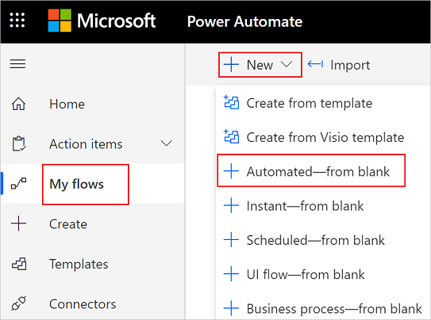
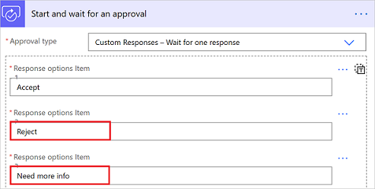

# Create custom response options for approval flows

Let’s say you want to send an approval request each time an employee uploads an expense report to SharePoint and then allow the approver to respond with one of three options: Accept, Need more info, or Reject.

## Prerequisites

- A Power Automate account.
- A SharePoint list for employees to enter their expense reports.

[!INCLUDE [sharepoint-detailed-docs](includes/sharepoint-detailed-docs.md)]

## Create approval flow
1. Sign in to [Power Automate](https://flow.microsoft.com).
1. Select **My flows** from the left navigation bar.
1. Select **New** > **Automated-from blank**.

    

1. On the screen that opens, provide a name for your flow in  **Flow name**. 
  
1. Search for **SharePoint** in **Choose your flow's trigger**, select **When an item is created** from the list of triggers, and then select **Create**.

   

1. Provide the SharePoint **Site Address** and **List Name**. 

   >[!TIP]
   >Select **Enter custom value** from the **Site Address** field before you enter text into **Site Address**.

1. Select **New step**, search for **Approval**, and then select **Start and wait for an approval**.

1. On the **Start and wait for an approval** card, select the **Approval type** list.

1. Select **Custom Responses - Wait for one response**.

    

    Next, you will create the custom responses that your approvers will use when they respond to an approval request for an employee expense.

1. In the **Response options Item** box, enter **Accept** and then select **Add new item**. 

    

1. In the **Response options Item** box, enter **Reject** and then select **Add new item**.

1. In the **Response options Item** box, enter **Need more info**.

       
    

1. Enter a **Title**, **Assigned to** (email for the approver), and **Details** (the details to be contained in the approval request).

    Here's an example of what you might include for your organization.

    

Now that you've created your custom responses, you might want to do different things in your flow, depending on the response from the approver.

## Use approval responses 

If the response to the request is **Accept**, you might want to send an email to the accounting department, asking them to reimburse the employee for the expense. 

If the response is **Reject**, you might want to send an email to the employee, letting them know that the request was rejected.

And finally, if the response from the approver is **Need more info**, you might want to send an email to the employee, requesting the employee to provide more information.

To do any of these in the flow, add a [**Condition**](add-condition.md) or a **Switch** action to your flow, and then select the **Outcome** field of the approval request from the dynamic content picker. Be sure to confirm whether the value is Accept, Need more info, or Reject.

## Respond to approval requests with a custom response

Approvers receive approval requests in email. The requests are also displayed in the approval center on Power Automate. 

## Limitations

Outlook and Outlook Web Access(OWA) actionable messages have a limit of five custom responses. This means that only the first five responses that are defined within the flow will be visible in the actionable section of Power Automate approval emails. You can submit the remaining options via a non-actionable HTML email, the Power Automate approval center, the Power Automate mobile application, or Teams.

Approvals that rely on custom responses can fail if they're sent to many users with the type set to **Everyone must approve**. This failure is due to the data size limitations of the results field.

>[!NOTE]
>For approvals using a single custom response, Outlook and OWA expand the response field so users do not need to select a button before they can respond like they do when there are multiple approval options.

## Learn more
- Create [single approver flows](modern-approvals.md)
- Create [sequential approver flows](sequential-modern-approvals.md)

[!INCLUDE[footer-include](includes/footer-banner.md)]
