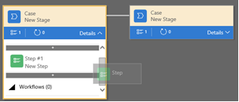
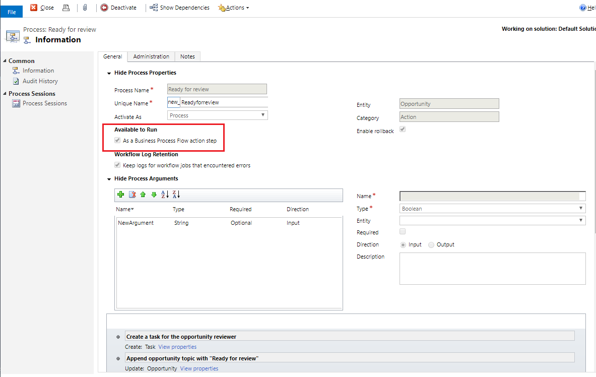
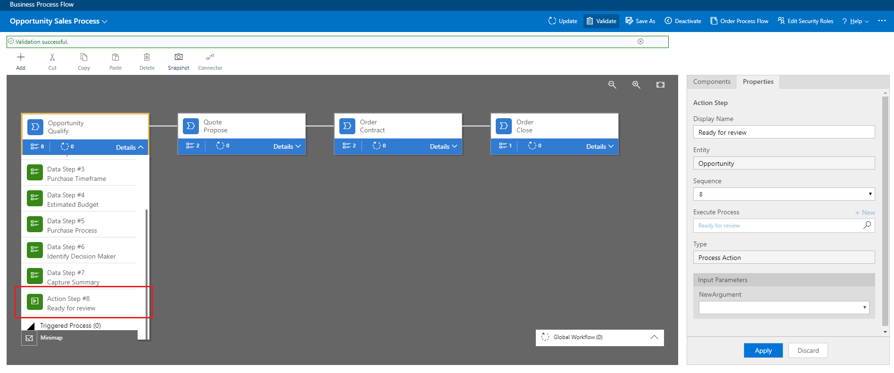
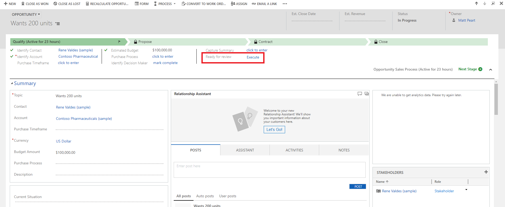
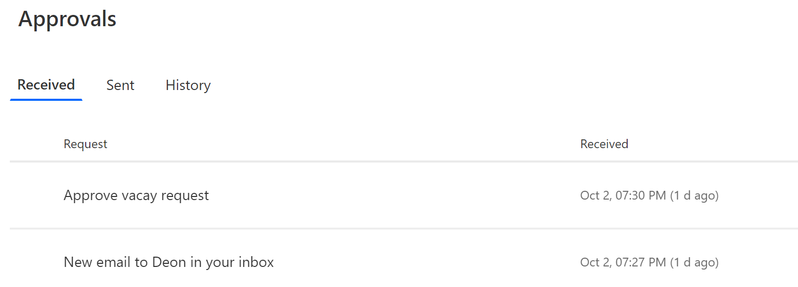
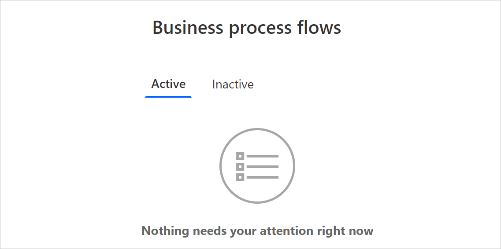

# Tutorial: Create a business process flow to standardize processes

[!INCLUDE[cc-data-platform-banner](./includes/cc-data-platform-banner.md)]

This tutorial shows you how to create a business process flow with Power Apps. To learn more about why you use business process flows, see [Business process flows overview](business-process-flows-overview.md). For information on creating a mobile task flow, see [Create a mobile task flow](/dynamics365/customer-engagement/customize/create-mobile-task-flow).  
  
 When a user starts a business process flow, the stages and steps of the process are displayed in the process bar at the top of a form:  
  
   
  
 > [!TIP]
 >  After you create a business process flow definition, you can provide control over who can create, read, update, or delete the business process flow instance. For example, for service-related processes, you could provide full access for customer service reps to change the business process flow instance, but provide read-only access to the instance for sales reps so they can monitor post-sales activities for their customers. To set security for a business process flow definition you create, select **Enable Security Roles** on the action bar.  
  
<a name="BKMK_Createbusinessprocessflows"></a>

## Prerequisites

You need a [per user plan](https://preview.flow.microsoft.com/pricing/) in order to create business process flows. Some Dynamics 365 license plans include the per user plan.

## Create a business process flow  
  
1. Open [solution explorer](/powerapps/maker/model-driven-apps/advanced-navigation#solution-explorer).
1. On the left navigation pane, select **Processes**. 
1. On the **Actions** toolbar, select **New**.  
1. In the **Create Process**  dialog box, complete the required columns:  
  
    - Enter a process name. The name of the process doesn’t need to be unique, but it should be meaningful for people who need to choose a process. You can change this later.  
  
    - In the **Category** list, select **Business Process Flow**.  
  
         You cannot change the category after you create the process.  
  
    - In the **Entity** list, select the table on which you want to base the process.  
  
         The table you select affects the columns available for steps that can be added to the first stage of the process flow. If you don’t find the table you want, make sure the table has the Business process flows (columns will be created) option set in the table definition. You cannot change this after you save the process.  
1. Select **OK**.  
  
     The new process is created, and the business process flow designer opens with a single stage created for you.  
       
1. **Add stages.** If your users will progress from one business stage to another in the  process:
  
    1. Drag a **Stage** component from the **Components** tab and drop it on a + sign in the designer.  
  
          
    1. To set the properties for a stage, select the stage, and then set the properties in the **Properties** tab on the right side of the screen:  
  
        - Enter a display name.  
        - If desired, select a category for the stage.  The category  (such as **Qualify** or **Develop**), appears as a chevron in the process bar.  
  
              
        - When you're done changing properties, select the **Apply** button.  
1. **Add steps to a stage.** To see the steps in a stage, select **Details** in the lower-right corner of the stage. To add more steps:  
  
    1. Drag the **Step** component to the stage from the **Components** tab.  
  
          
  
    1. Select the step, and then set properties in the **Properties** tab:  
  
        1. Enter a display name for the step.  
        1. If you want users to enter data to complete a step, select the appropriate column from the drop-down list.  
        1. Select **Required** if people must fill in the column to complete the step before moving to the next stage of the process.  
        1. Select **Apply** when you're done.  

     > [!NOTE]
     >
     > - If you set a two-option boolean column as **Required**, users can't continue unless the column value is **Yes**. The user is required to mark the column as completed before moving to the next stage.
     > - If either **Yes** or **No** are acceptable column values, then you should make the column an option set instead of a two-option boolean column.
  
1. **Add a branch (condition) to the process.** To add a branching condition:  
  
     1. Drag the **Condition** component from the **Components** tab to a + sign between two stages.
     
        
     1. Select the condition, and then set properties in the **Properties** tab. For more information on branching properties, see [Enhance business process flows with branching](enhance-business-process-flows-branching.md). When you're finished setting properties for the condition, select **Apply**.  
1. **Add a workflow.** To invoke a workflow:  
  
    1. Drag a **Workflow** component from the **Components** tab to a stage or to the **Global Workflow** item in the designer.   Which one you add it to depends on the following:  
  
        - **Drag it to a stage** when you want to trigger the workflow on entry or exit of the stage. The workflow component must be based on the same primary table as the stage.  
        - **Drag it to the Global Workflow item** when you want to trigger the workflow when the process is activated or when the process is archived (when the status changes to **Completed** or **Abandoned**). The workflow component must be based on the same primary table as the process.  
    1.  Select the workflow, and then set properties in the **Properties** tab:  

        1. Enter a display name.  
        1. Select when the workflow should be triggered.  
        1. Search for an existing on-demand active workflow that matches the stage table or create a new workflow by selecting **New**.  
        1. Select **Apply** when you're done.  
  
    For more information on workflows, see [Workflow processes](/common-data-service/workflow-processes.md).  
  
1. To validate the business process flow, select **Validate** on the action bar.  
1. To save the process as a draft while you continue to work on it, select **Save** in the action bar.  
  
    > [!IMPORTANT]
    >  As long as a process is a draft, people won’t be able to use it.  
  
12. To activate the process and make it available to your team, select **Activate** on the action bar.  

13. To provide control over who can create, read, update, or delete the business process flow instance, select **Edit Security Roles** on the command bar of the designer. For example, for service-related processes, you could provide full access for customer service reps to change the business process flow instance, but provide read-only access to the instance for sales reps so they can monitor post-sales activities for their customers.

  In the **Security Roles** screen, select the name of a role to open the security role information page. Select the Business Process Flows tab, and then assign appropriate privileges on the business process flow for a security role.

  > [!NOTE]
  > The System Administrator and System Customizer security roles have access to new business process flows by default.

   

  Specify privileges by selecting the appropriate radio buttons, and click Save. For more information about privileges, see [Business process flow privileges](business-process-flows-overview.md#BKMK_MultipleBPF).

  Next, don't forget to assign the security role to appropriate users in your organization.

> [!TIP] 
>  Here are a few tips to keep in mind as you work on your task flow in the designer window:  
>   
> - To take a snapshot of everything in the business process flow window, select **Snapshot** on the action bar. This is useful, for example, if you want to share and get comments on the process from a team member.  
> - Use the mini-map to navigate quickly to different parts of the process. This is useful when you have a complicated process that scrolls off the screen.  
> - To add a description for the business process, select **Details** under the process name in the left corner of the business process flow window. You can use up to 2000 characters.  
  
<a name="BKMK_Editbusinessprocessflows"></a>   
## Edit a business process flow  
 To edit business process flows, open solution explorer, select **Processes**, and then select the **Business Process Flow** from the list of processes that you want to edit.  
  
 When you select the name  of the business process flow you want to edit from the list of processes, it opens in the designer, where you can make any updates you want. Expand **Details** under the name of the process to rename it or add a description, and view additional information.  
  
   
  
  
## Other things to know about business process flows
 **Edit Stages**  
Business process flows can have up to 30 stages.    
  
You can add or change the following properties of a stage:  
  
- **Stage Name**  
  
- **Entity**. You can change the table for any stage except the first one.  
  
- **Stage Category**. A category lets you group stages by a type of action. It is useful for reports that will group records by the stage they are in. The options for the stage category come from the Stage Category global option set. You can add additional options to this global option set and change the labels of existing options if you want. You can also delete these options if you wish, but we recommend that you keep the existing options. You won’t be able to add the exact same option back if you delete it. If you don’t want them to be used, change the label to ”Do not use”.  
  
- **Relationship**. Enter a relationship when the preceding stage in the process is based on a different table. For the stage currently being defined, choose **Select relationships** to identify a relationship to use when moving between the two stages. It is recommended you select a relationship for the following benefits:  
  
    -   Relationships often have column maps defined that automatically carry over data between records, minimizing data entry.  
  
    -   When you select **Next Stage** on the process bar for a record, any records that use the relationship will be listed in the process flow, thereby promoting reuse of records in the process. In addition, you can use workflows to automate creation of records so that the user simply selects it instead of creating one to further streamline the process.  
  
**Edit Steps**  
 Each stage can have up to 30 steps.    
  
**Add branch**  
To learn about adding a branch to a stage, see [Enhance business process flows with branching](enhance-business-process-flows-branching.md).  
  
To make a business process flow available for people to use, you must order the process flow, enable security roles, and activate it.  
  
**Set Process Flow Order**  
 When you have more than one business process flow for a table (row type), you’ll need to set which process is automatically assigned to new records.. In the command bar, select **Order Process Flow**. For new records or records that do not already have a process flow associated with them, the first business process flow that a user has access to is the one that will be used.  
  
**Enable Security Roles**  
Users have access to a business process flow depending on the privilege defined on the business process flow in the security role assigned to the user. 

By default, only the **System Administrator** and **System Customizer** security roles can view a new business process flow. 

To specify privileges on a business process flow, open the business process flow for edit, and then select **Edit Security Roles** on the command bar of the business process flow designer. See step 13 under [Create a business process flow](#create-a-business-process-flow) listed earlier in this topic.
  
**Activate**  
Before anyone can use the business process flow, you must activate it. In the command bar, select **Activate**. After you confirm the activation, the business process flow is ready to use. If a business process flow has errors, you will not be able to activate it until the errors are corrected.  

## Add an on-demand action to a business process flow
The Dynamics 365 (online), version 9.0 update introduces a business process flow feature: business process flow automation with Action Steps. You can add a button to a business process flow that will trigger an action or workflow.

### Add on-demand workflows or actions using an Action Step
Suppose that, as part of the opportunity qualification process, the Contoso organization requires all opportunities to be reviewed by a designated reviewer. Subsequently, the Contoso organization created an action that: 

- Creates a task row that is assigned to the opportunity reviewer. 
- Appends “Ready for review” to the opportunity topic. 

Additionally, Contoso needs to be able to run these actions on demand. To integrate these tasks into the opportunity qualification process, the actions must appear on the opportunity business process flow. To enable this functionality, select **As a Business Process Flow action step**.


Next, the Action Step is added to Contoso’s opportunity business process flow. Then the process flow is validated and updated.



Now, members of Contoso’s salesforce can kick-off the action from the **Opportunity Qualify** business process step, on demand, by selecting **Execute**.



> [!IMPORTANT]
> - To be able to execute an action or workflow on demand, the business process flow must include an Action Step. If the Action Step runs a workflow, the workflow must be configured to run on demand.
> - The table associated with the action or workflow must be the same as the table associated with the business process flow.

### Limitation of using Action Steps in a business process flow

- Actions are not available as Action Steps if the input or output parameters are Entity, EntityCollection, or OptionSet (Picklist) types. Actions with more than one EntityReference output parameter or any number of EntityReference input parameters are not available as Action Steps. Actions not associated with a primary table (global action) are not available as Action Steps.

## Instant flows in business process flows

You can run an **instant flow** to automate repetitive tasks, generate documents, track approvals, and more, from inside a stage in a business process.

### Add an instant flow as a step in a business process

Let's assume you sell printers and you use the **Lead to Opportunity Sales Process** to close deals. As part of this process, you’d like to have the team lead review and approve proposals that the sales team puts together in an earlier stage of the business process flow before sharing it with the customer.

To do this, you'll need to do two things:
1. Build an instant flow that requests review and approval of the proposal from the team.
1. Add the instant flow as a step in the **Lead to Opportunity Sales Process**.

> [!TIP]
> Only [solution-aware flows](/flow/overview-solution-flows) can be added as a step in a business process. 

### Build an instant flow

1. In Power Automate, select **Solutions** in the navigation menu.
1. Select **Default Solution** from the list of solutions that appears. 
1. Select the **+ New** menu, and then select **Flow** from the list that appears.
1. Search for, and then select the **Microsoft Dataverse** connector.
1. Search for, and then select the **When a row is selected** trigger from the list of **Microsoft Dataverse** triggers.
1. Set **Environment** to **Default**, and then set **Entity Name** to **Lead to Opportunity Sales Process**.
1. Add a text input column for the user to enter the link to the proposal.

   

   We'll need information from the business process flow instance to help provide context for the approval request so follow these steps to do this.

1. Add the **Parse JSON** action. 
1. Set **Content** to **entity** by selecting it from the list of dynamic values for the **When a row is selected** trigger.
1. Paste the following content into the **Schema** column.

    ```json
    {
        "type": "object",
        "properties": {
        "entity": {
            "type": "object",
            "properties": {
                "FlowsWorkflowLogId": {
                    "type": "string"
                },
                "BPFInstanceId": {
                    "type": "string"
                },
                "BPFInstanceEntityName": {
                    "type": "string"
                },
                "BPFDefinitionId": {
                    "type": "string"
                },
                "BPFDefinitionEntityName": {
                    "type": "string"
                },
                "StepId": {
                    "type": "string"
                },
                "BPFDefinitionName": {
                    "type": "string"
                },
                "BPFInstanceName": {
                    "type": "string"
                },
                "BPFFlowStageLocalizedName": {
                    "type": "string"
                },
                "BPFFlowStageEntityName": {
                    "type": "string"
                },
                "BPFFlowStageEntityCollectionName": {
                    "type": "string"
                },
                "BPFFlowStageEntityRecordId": {
                    "type": "string"
                },
                "BPFActiveStageId": {
                    "type": "string"
                },
                "BPFActiveStageEntityName": {
                    "type": "string"
                },
                "BPFActiveStageLocalizedName": {
                    "type": "string"
                }
            }
          }
        }
   }
   ```

   Things should look like this now:

   

  1. Add the **Get record** action from the **Microsoft Dataverse** connector.
  1. Set **Environment** to **(Current)**, **Entity Name** to **Lead to Opportunity Sales Process**, and **Item Identifier** to **BPFFlowStageEntityRecordID**.

     

     Now that we have the data, define the approval process by adding the **Start and wait for an approval (V2)** action, and then filling in the relevant information. Learn more about [approvals]( sequential-modern-approvals.md) if you are not familiar.

     > [!TIP]
     > - Use the dynamic content picker to add columns from the **Get record** action to add relevant information to the approval request so that approvers can easily know what the request is about. 
     > - To provide further context regarding the active stage that the business process is in, add the **BPFActiveStageLocalizedName** column from the list of dynamic values.

     Your **Start and wait for an approval (V2)** card might look similar to this one:

      

1. Finally, save the flow and then turn it on.

### Add this flow as a step in the Lead to Opportunity Sales Process.

Now that you've created the instant flow, all that's needed is for you to add it to your business process flow. 

1. Open the **Lead to Opportunity Sales Process** in the business process flow designer. 
1. Drag and drop the **Flow Step (Preview)** from the list of **Components** onto the **Propose** stage.
1. Next, select the search icon in the **Select a Flow** column to list all flows that you can added to a business process flow.
1. Select a cloud flow from the list, and then save your changes by selecting the **Apply** button at the bottom of the properties pane.
1. Finally, select the **Update** button to make this business process flow with its new instant flow step available to your users.

### Flow step considerations
The status of your flow step might be **Processing** even after your flow successfully ran to completion, if you are not writing to the process log. In order to mark a cloud flow step as completed, add the **Update a record** action of the Microsoft Dataverse (legacy) connector under the **If yes** path. Set the **Environment** to **Default** and **Entity** to **Process Logs**. Then set **Record identifier** to **FlowsWorkflowLogId** by picking it from the list of dynamic values. Finally, set **Status Value** to **Succeeded** by selecting it from the dropdown.

## The action center

When you need to see the list of business process flows in which you're involved, check out the unified action center. 





In the unified action center, you will see all business processes in which you're assigned at least one Microsoft Dataverse table row that the process uses. For example, if a business process uses the **Lead** and **Opportunity** tables in Dataverse, you will see all instances of this process where either the Lead or the Opportunity row is assigned to you.

View all instances that are currently being worked under the **Active** tab. From this tab, you can view the following details:

- The name of the process.
- The current stage for each process.
- The owner of the Dataverse row associated with the active stage.
- The time since the instance was created.

To see the

Select an instance to open it in a new tab, or select it to copy a link, share a link via email, abandon, or delete the instance.
  
## Next steps

 - [Business process flows overview](business-process-flows-overview.md)  
 - [Enhance business process flows with branching ](enhance-business-process-flows-branching.md)
 - [Overview of approvals](sequential-modern-approvals.md)
 - [Detailed steps for adding an instant flow to a business process flow](/business-applications-release-notes/april19/microsoft-flow/instant-steps-business-process-flows)


[!INCLUDE[footer-include](includes/footer-banner.md)]