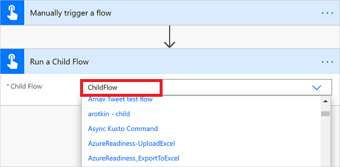
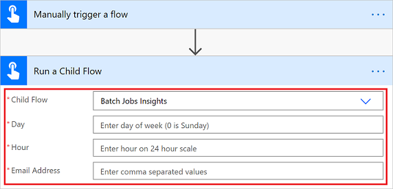

# Create child flows

Today, people are building flows that need dozens or hundreds of steps; however, if you try to put all of these actions into a _single_ flow, it can be difficult to navigate and maintain that flow. 

You can use child flows to easily manage flows, avoiding flows with hundreds of steps. This approach is especially beneficial if you want to reuse tasks in multiple places in a cloud flow, or even across multiple flows.

Let's look at an example where you have a child flow that you want to create or update a contact in Dataverse based on that contact's name.

You will need a solution with two flows:
- A *child* flow. This is the flow that is nested inside the *parent* flow and contains the smaller tasks you want to run.
- A *parent* flow. This flow can have any type of trigger and will call into the child flow.

## Create the child flow in a solution

1. Sign into Power Automate, select **Solutions**, and then pick an existing solution. 
   
   Alternatively, you can create a solution. 

1. Select **New** > **Flow** > **Button flow** > **Manually trigger a flow**. 

   >[!TIP]
   >You can also use the **Power Apps** or the  **When an HTTP request is received** triggers for child flows.

1. Select **Add an input**.
   The input you define here will be passed in to the child flow from the parent flow.

    

1. For this walkthrough, the child flow creates a contact, so it needs the **Contact name** and **Contact email**.

   

1. Build the logic that you want the child flow to run. This logic can contain as many steps as you need. 

   After your steps, you need to return data to the parent flow. In this case you can use one of two actions:

   i. **Respond to a Power App or flow** (under the Power Apps connector).
   
   ii. **Response** (on the premium HTTP request/response connector).

1. As with the trigger, you can define as many outputs as you want to be returned from the child flow. In the following image, we can respond with the ID of the contact.

   

1. Give your flow a descriptive name and then save it. 

   You need to then test your child flow. Because you can manually trigger this flow, it's very easy to test right inside of the designer. Try it out with a couple different inputs, and verify that the outputs are what you expect.

1. Lastly, if your flow uses anything other than built-in actions or the Microsoft Dataverse connector, you will need to update the flow to use the connections **embedded** in the flow. To do this, select the back button to get to the child flow's properties page, and then select **Edit** in the **Run only users** tile.

1. In the pane that appears, for each connection used in the flow, you will need to select **Use this connection (<_connection name>_)** instead of **Provided by run-only user**.

1. Select **Save**. At this time, you cannot pass connections from the parent flow to the child flow. If you do not do this, you will receive an error stating that the name cannot be used as a child workflow because child workflows only support embedded connections.

## Create the parent flow in a solution

1. Build the parent flow in the same solution in which you created the child flow.
   
   Alternatively, you can bring an existing flow into that solution. The parent flow can have any type of trigger.

1. Find the place in your *parent flow* from which you want to call the child flow and then add the **Run a Child Flow** action that's located under the **Flows** connector on the **Built-in** tab.

1. Pick the child flow that you created earlier. 

   >[!NOTE]
   >You will only see the flows to which you have access and are located in a solution. Child flows must also have one of the three triggers mentioned earlier.

   

1. After you select your child flow, you will see the _inputs_ that you defined. After the child flow action, you will be able to use any of the _outputs_ from that child flow.

   

   When the parent flow runs, it waits for the child flow to complete for the lifetime of the flow (one year for flows that use built-in connections and Dataverse or 30 days for all other flows).

1. Save and test this flow. 

   >[!TIP]
   >When you export the solution that contains these two flows and import it into another environment, the new parent and child flows will be automatically linked, so there's no need to update URLs. 
   
## Known issues

We are working to address the following known issues and limitations.

1. If you block the HTTP Request connector via data loss prevention (DLP), child flows are also blocked because child flows are implemented using the HTTP connector. Work is underway to separate DLP enforcement for child flows so that they are treated like other cloud flows.

1. You must create the parent flow and all child flows **directly** in the same solution. If you import a flow into a solution, you will get unexpected results.

[!INCLUDE[footer-include](includes/footer-banner.md)]
