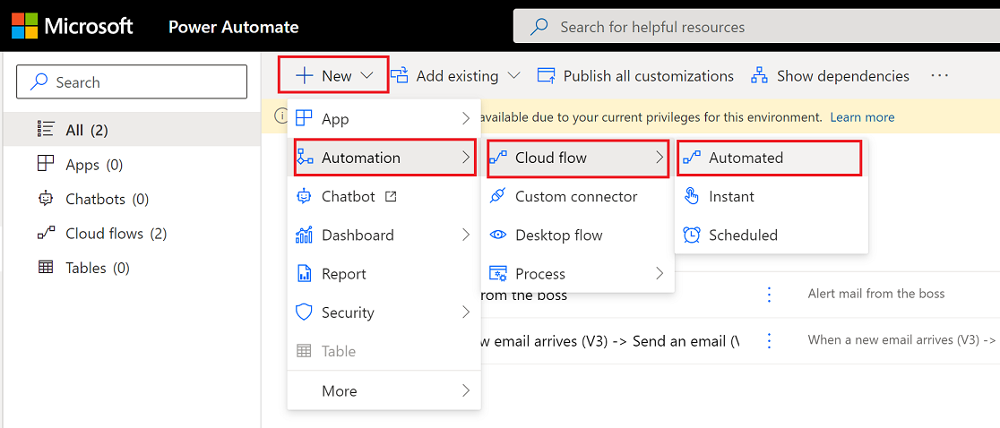
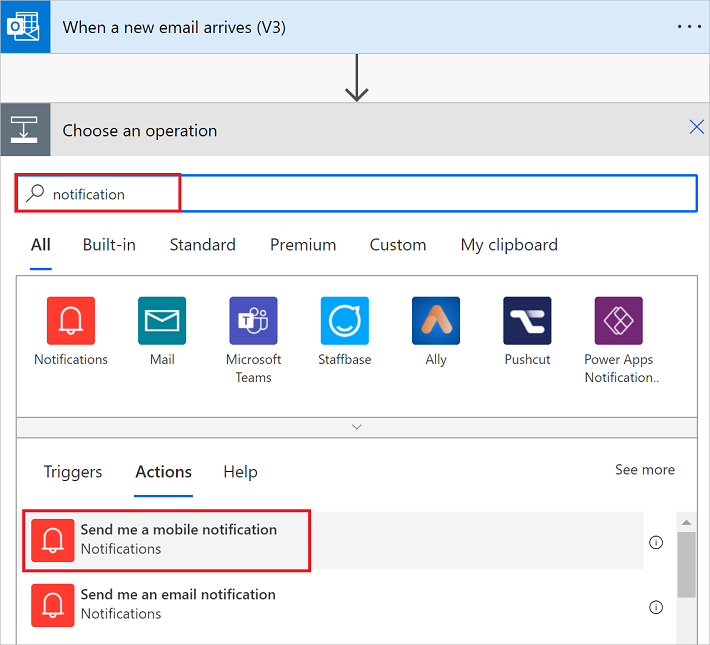
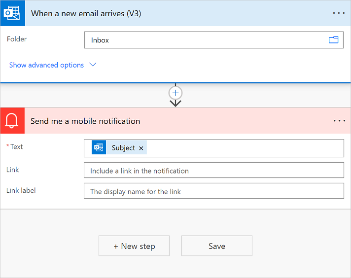

# Create a cloud flow in a solution

Cloud flows you create in a solution are known as *solution-aware flows*. Follow these steps to create a solution-aware cloud flow.

## Prerequisites

You need to have at least one solution before you can create a solution-aware flow.

## Create a solution-aware cloud flow

1. Sign into [Power Automate](https://flow.microsoft.com).
1. Select **Solutions** from the navigation bar.

   

1. Select the solution in which you'll create your flow.

1. Select **New** > **Automation** > **Cloud flow** > **Automated**.

   

   >[!TIP]
   >If an automated cloud flow doesn't meet your requirements, you can create any other [type of flow](./flow-types.md).

   Power Automate opens.

1. Use the available connectors and triggers to build your flow.

   In this example, we'll build a simple flow that sends a notification when an email arrives in your inbox.
1. Give your flow a name.
1. Search for, **new email** in the **Search all triggers** box.
   
1. Select the **When a new email arrives (V3)** trigger.
1. Select **Create**.
1. Select **New step**.
1. Search for **Notification**, and then select the **Send me a mobile notification** action.

   

1. Add the **Subject** dynamic token to the **Text** field of the **Send me a mobile notification** card.
1. Select **Save** to save your flow.

   Your flow should appear like the following image.

   

1. Select **Solutions** to see your flow in the solution.

   

## Find a solution-aware cloud flow
Solution-aware cloud flows can be found either via the **My flows** lists or via **Solutions**.

### Find a solution-aware cloud flow via My flows

1. In [Power Automate](https://powerautomate.com), select **My flows** from the navigation bar on the left side.
1. Find the flow you want to edit.
   >[!TIP]
   >Cloud flows you own are on the **Cloud flows** tab and flows for which you are a co-owner are on the **Shared with me** tab.

The **Shared with me** tab shows the following solution cloud flows.

   - Flows you co-own.
   - Flows that are owned by a Dataverse team in whcih you are a member.
   - Flows that are co-owned by a Dataverse team in which you are a member. 

If you are the owner of a solution cloud flow, you can always find it on the **Cloud flows** tab. If you have the 'run only' permission to a flow, you will only see that flow on the **My flows** tab if you are an owner or a co-owner too.

### Find a solution-aware cloud flow via Solutions

1. Sign into [Power Automate](https://powerautomate.com), and then select **Solutions** from the navigation bar on the left side.
1. Select the solution that contains the flow you want to edit.

## Find a solution that contains a solution-aware cloud flow

Solution-aware cloud flows have a **Solutions** card in the flow details page that provides a list of the solutions that reference that cloud flow. To open the solution, select the solution name. 

The **Objects** tab of a solution shows all the solution objects in the solution, such as connection references, environment variables, or child flows that the flow might reference. The **Overview** tab shows the details of the solution, such as the description and status, and provides access to solution actions, such as [export](./export-flow-solution.md).

## Learn more

* [Create a solution](./overview-solution-flows.md)
* [Export a solution](./export-flow-solution.md)
* [Import a solution](./import-flow-solution.md)
* [Edit a solution-aware flow](./edit-solution-aware-flow.md)
* [Remove a solution-aware flow](./remove-solution-aware-flow.md)

[!INCLUDE[footer-include](includes/footer-banner.md)]
