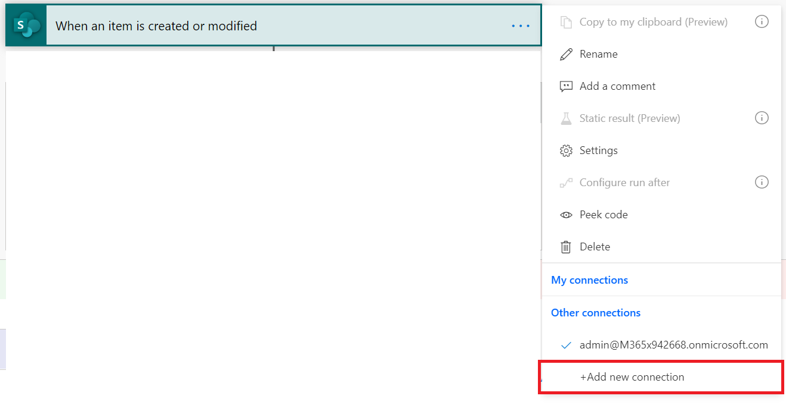
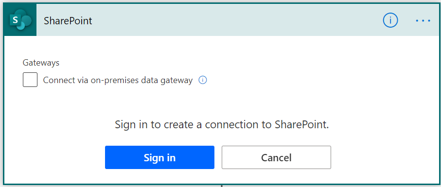
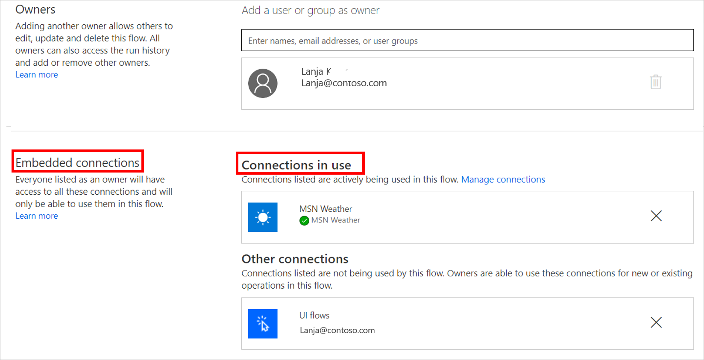
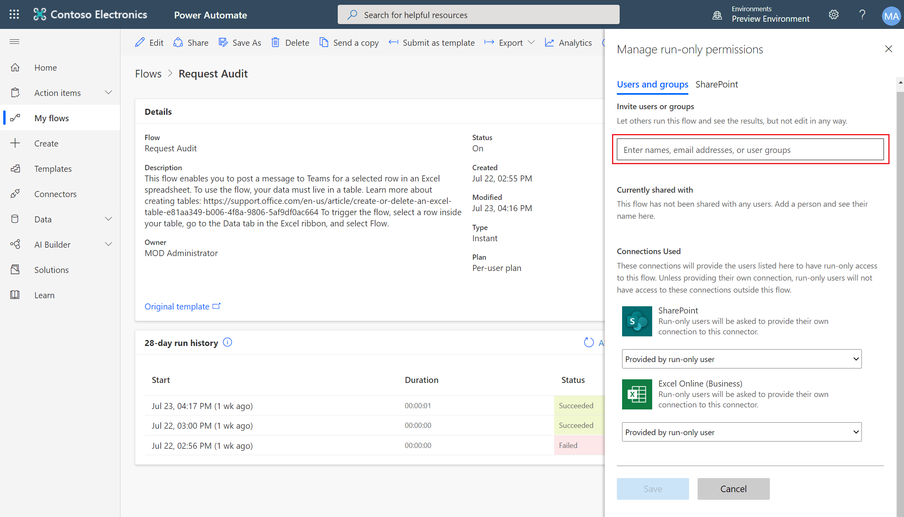
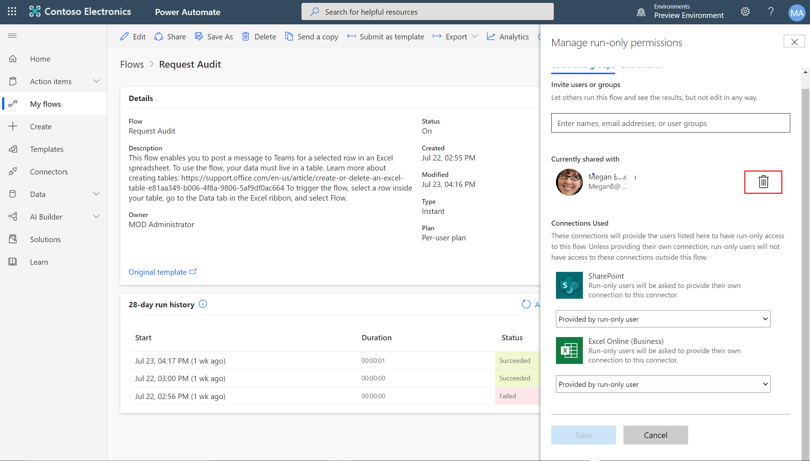
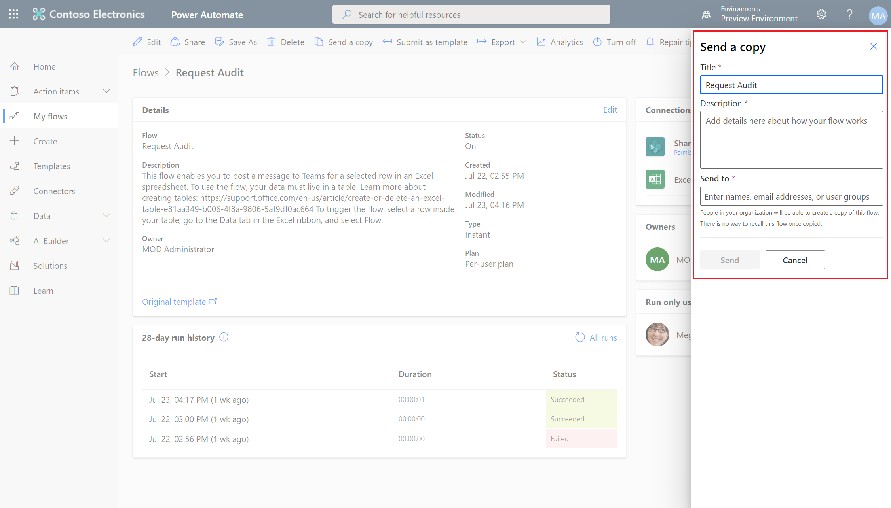

# Share a flow 

Share a flow with others in your organization so they can also benefit from automations you've created. There are three primary ways to share a flow in Power Automate:

1. Add an owner to a flow.
2. Share a flow with run only privelages.
3. Share a copy of a flow.

## Prerequisites

- You must have a [paid Power Automate license](https://flow.microsoft.com/pricing/) to share a flow. 
- You must be the creator or owner to add/remove owners from a flow.

## Add an owner to a flow

Adding an owner to a flow is the most common way in which to share a flow. Any owner of a flow can perform these actions:

* View the run history.
* Manage the properties of the flow (for example, start or stop the flow, add owners or update credentials for a connection).
* Edit the definition of the flow (for example, add or remove an action or condition).
* Add or remove other owners (but not the flow's creator).
* Delete the flow.

If you're the creator or an owner of a flow, you'll find it listed on the **Team flows** tab in [Power Automate](https://flow.microsoft.com).

>[!NOTE]
>Shared connections can be used **only** in the flow in which they were created.

Owners can use services in a flow but can't modify the credentials for a connection that another owner created.

### Steps to add an owner to a flow

Follow these steps to add more owners to a flow.

1. Sign into the [Power Automate](https://flow.microsoft.com), and then select **My flows**.
1. Select **...** (more commands), and then select **Share** for the flow that you want to share:
   
    

   >[!NOTE]
   >You can also share a flow using the Share option on the flow details page. 

1. Enter the name, email address, or group name for the person or group that you want to add as an owner:
   
    
1. The user or group you've selected becomes an owner of the flow:
     
    
   
     Congratulations&mdash;your team flow has been created!

## Remove an owner

> [!IMPORTANT]
> When you remove an owner whose credentials are used to access Power Automate services, you should update the credentials for those connections so that the flow continues to run properly.

1. In the flow details page choose the edit link in the owner section

   >[!NOTE]
   >You can also edit the owners of flow using the Share button in the Flow details page mentioned earlier

1. Select the **Delete** icon for the owner that you want to remove:
   
    
1. On the confirmation dialog box, select **Remove this owner**:
   
    
1. Congratulations &mdash; the user or group that you removed is no longer listed as an owner of the flow.

### Update connections

You might need to change the owner of a connection in a flow if you remove the existing owner or if you just want to use a different account to sign in to an action/trigger. Follow these steps to edit the connections of a trigger or action of a shared flow:

1. Navigate to the flow that you want to modify
2. Click on Edit to edit the flow

3. Click on the overflow menu for the step you want to edit the connection for the trigger or action you want to edit
4. If you have a connection already simply choose that, if not just click on "Add new connection" to create a new connection

5. Click sign in to create your new connection and you're all set!

### Embedded and other connections

Connections used in a flow fall into two categories:

* **Embedded** &mdash; These connections are used in the flow.
* **Other** &mdash; These connections have been defined for a flow but aren't used in it.

If you stop using a connection in a flow, that connection appears in the **Other** connections list, where it remains until an owner includes it in the flow again.

Follow the steps to [update a connection](./create-team-flows.md#update-connections) to make changes to embedded connections.

The list of connections appears under the list of owners in a flow's properties:

## Add a list as a co-owner

You can add SharePoint lists as co-owners to a flow so that everyone who has edit access to the list automatically gets edit access to the flow. Once the flow is shared, you can simply distribute a link to it.

> [!TIP]
> Use a list when the flow is connected to SharePoint, and use a group in other cases.
>

## Share a flow with run-only permissions

Instant flows (i.e. flows that use a manual trigger such as Button, For a selected item etc) can be shared using just run only permissions. Any user who's added as a run only user will not have access to edit or modify the flow in any way. They will only have permissions to trigger the flow. 

### Add a run only user

1. In the flow details page select the "Edit" link next to the Run only users section. 

2. In the Manage run-only permissions flyout specify the users, groups you want to provide run only access to

3. As an owner you can choose if the run-only users will need to provide their own connections when sharing the flow or use a connection thats already defined in the flow

4. Congratulations &mdash; the user or group will now have access to run the flow.

### Remove a run only user

1. In the flow details page select the "Edit" link next to the Run only users section. 

2. In the Manage run-only permissions flyout hit the delete icon next to the user you want to remove run only access to and hit save at the bottom of the page

3. Congratulations &mdash; the user or group will no longer have access to run this flow.

## Share a copy of a flow

Share a copy allows you to share the definition of a flow with another user as a template. It provides a good way for you to share the general structure of a flow without sharing any connections while also allowing the recipient to modify their flow independant of your flow so they can make it fit their needs.

> [!NOTE]
> Share a copy creates an independant instance of the flow for the recipient. There is no way to revoke access to the flow once shared.

### Send a copy of a flow

1. In the flow details page select the "Send a copy" option in the top command bar

   >[!NOTE]
   >You can also select send a copy from the flow overflow menu

   

1. In the flyout menu you can edit the name and description of the flow you want to share and specify the users you want to share the flow with.

1. The recipient will receive an email stating that you have shared a Flow template with you and allows them to create their own instance of that flow

   
   
   >[!NOTE]
   >As a recipient you can also access the flow from the Shared with me section under templates

   

## FAQ

### What happens if the user who created a shared flow leaves the organization?
As long as the shared flow still has an active owner the flow will continue to run. 

>[!NOTE]
>If the flow uses any active or embedded connections that belongs to the user who has left the organizations those specific actions might fail. To fix this, follow the steps mentioned in the [update a connection](./create-team-flows.md#update-connections) section to change the connection of any trigger or action.

