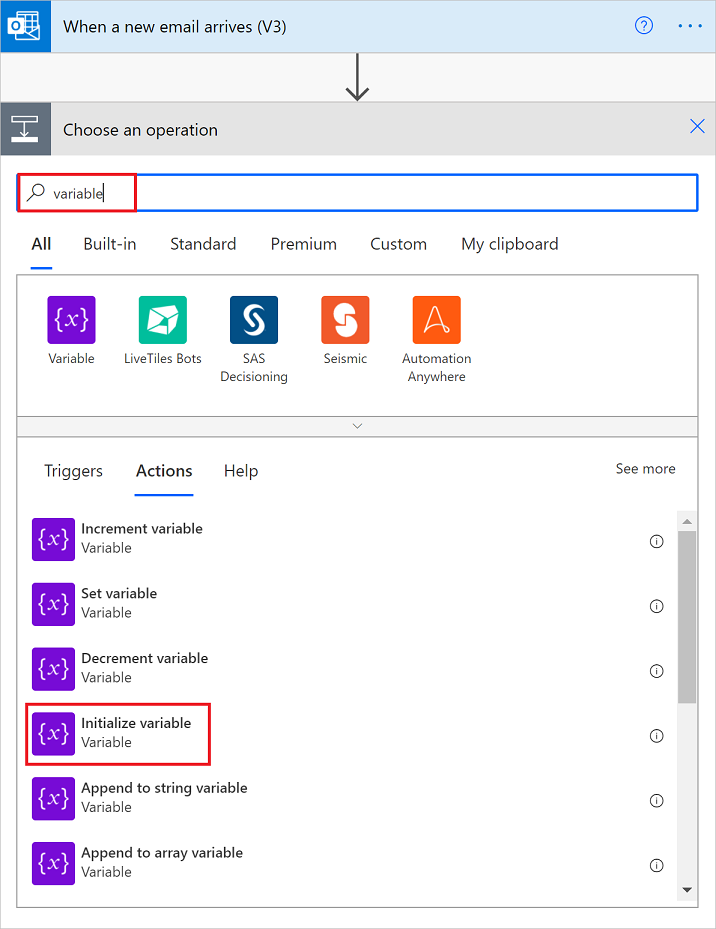
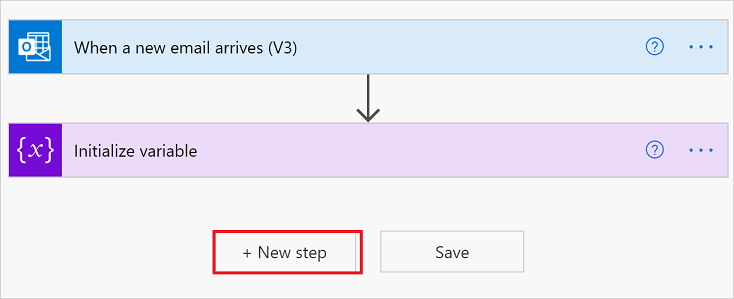
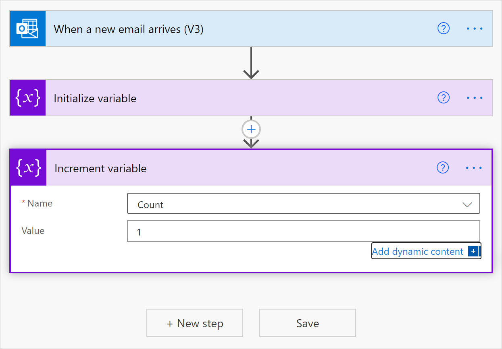
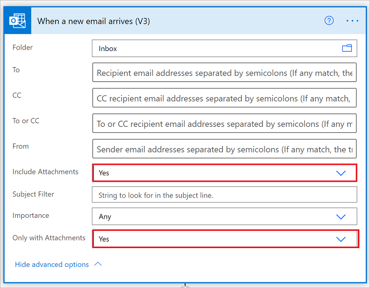
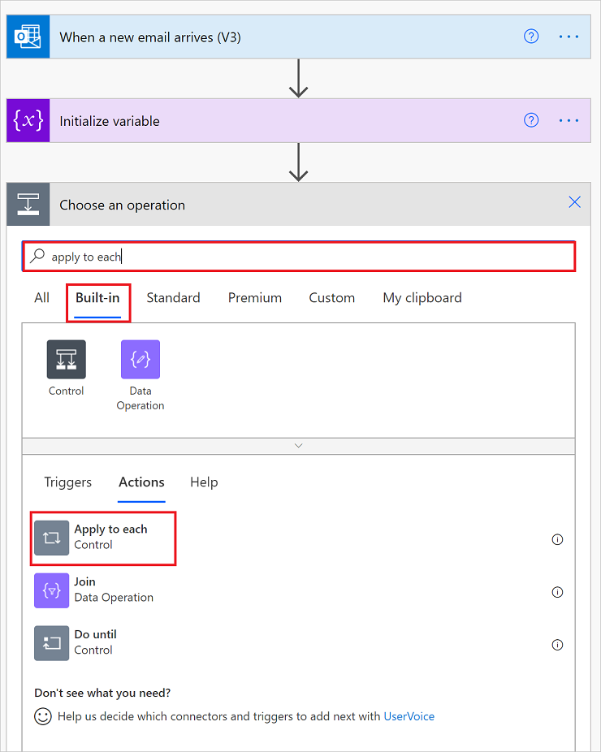
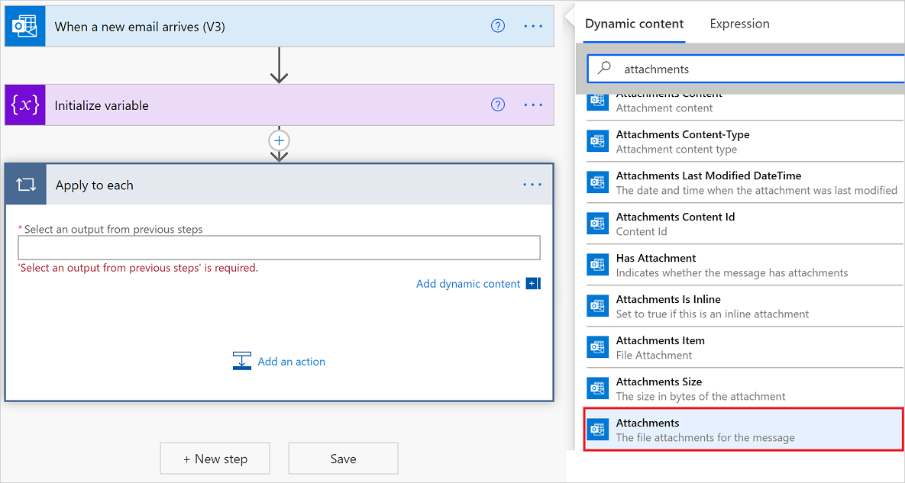
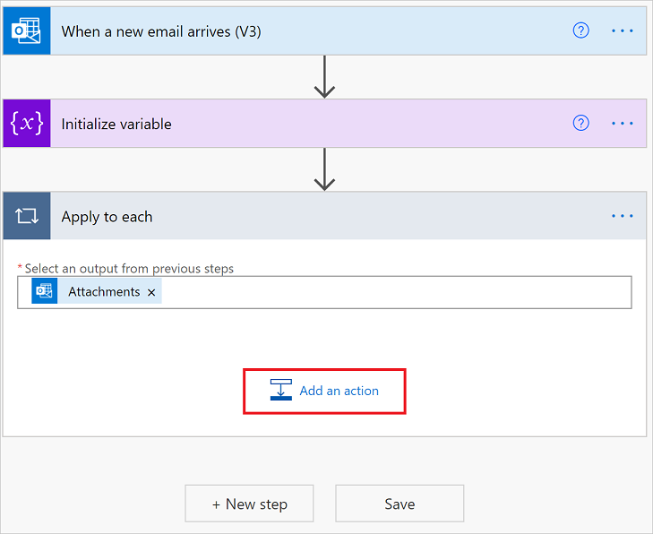
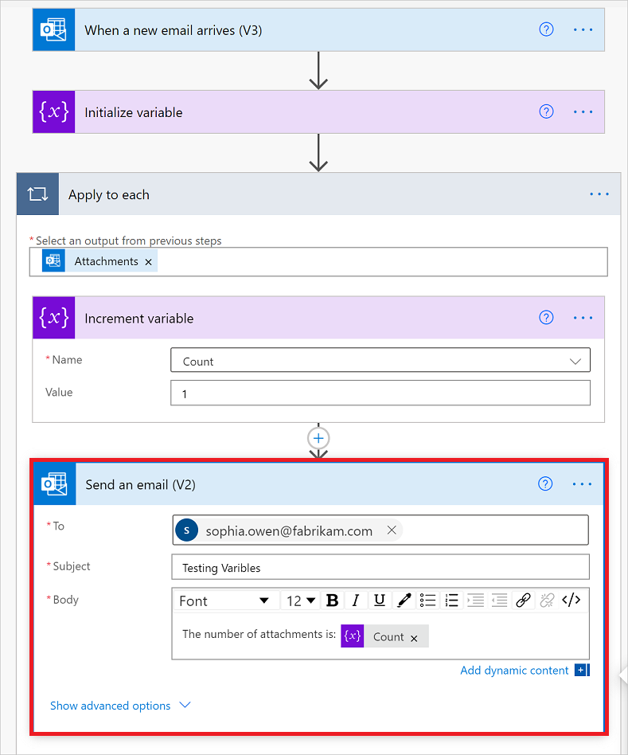

# Store and manage values in variables

This article shows how to create and work with variables to store values in your cloud flows. For example, variables can help you track the number of times that a loop runs. To iterate over an array or check an array for a specific item, you can use a variable to reference the index number apply to each array item.

You can create variables for data types such as integer, float, boolean, string, array, and object. After you create a variable, you can perform other tasks, for example:

* Get or reference the variable's value.
* Increase or decrease the variable by a constant value, also known as *increment* and *decrement*.
* Assign a different value to the variable.
* Insert or *append* the variable's value as the last item in a string or array.

Variables exist and are global only within the cloud flow that creates them. Also, they persist across any loop iterations inside the flow. 

When you reference a variable, use the variable's name as the token, not the action's name, which is the usual way to reference an action's outputs.

> [!WARNING]
> By default, each iteration in "apply to each" loops run sequentially. You can run the loop iterations in parallel to improve performance. If you use variables in "apply to each" loops, you **must** run the loop iterations *sequentially* if it's important for your loop variables to return predictable results.

## Prerequisites

* Access to [Power Automate](https://powerautomate.com).

* A cloud flow in which you want to create the variable.

  If you're new to Power Automate, review [Getting started with Power Automate](getting-started.md) and [Overview of cloud flows](overview-cloud.md).


>[!NOTE]
>Before you can add actions for creating and working with variables, your flow must start with a trigger.

## Initialize variable

You can create a variable and declare its data type and initial value - all within one action in your flow. You can only declare variables at the global level, not within scopes, conditions, and loops.

1. Sign into [Power Automate](sign-up-sign-in.md).

1. Create a cloud flow and under the step where you want to add a variable, follow one of these steps: 

   * To add an action under the last step, select **New step**.

     

   * To add an action between steps, move your mouse over the connecting arrow so that the plus sign (**+**) appears. Select the plus sign, and then select **Add an action**.

1. Under **Choose an action**, in the search box, enter `variable` as your filter. From the actions list, select **Initialize variable**.

   

1. Provide this information about your variable:

   | Property | Required | Value |  Description |
   |----------|----------|-------|--------------|
   | **Name** | Yes | <*variable-name*> | The name for the variable to increment |
   | **Type** | Yes | <*variable-type*> | The data type for the variable |
   | **Value** | No | <*start-value*> | The initial value for your variable <p><p>**Tip**: Although optional, set this value as a best practice so you always know the start value for your variable. |
   |||||

   For example:

   

1. Now continue adding the actions you want. When you're done, select **Save**.

> [!NOTE]
> Although the **Initialize variable** action has a `variable` section that's structured as an array, the action can create only one variable at a time. Each new variable requires an individual **Initialize variable** action.

Here are examples for some other variable types:

*String variable*

```json

   "name": "myStringVariable",
   "type": "String",
   "value": "lorem ipsum"
```

*Boolean variable*

```json
   "name": "myBooleanVariable",
   "type": "Boolean",
   "value": false
```

*Array with integers*

```json
   "name": "myArrayVariable",
   "type": "Array",
   "value": [1, 2, 3]
```

*Array with strings*

```json
   "name": "myArrayVariable",
   "type": "Array",
   "value": ["red", "orange", "yellow"]
```

## Get the variable's value

To retrieve or reference a variable's contents, you can use the variables() function in the Power Automate designer.


<!--confirm earlier creation-->
For example, this expression gets the items from the array variable by using the `variables()` function. The `string()` function returns the variable's contents in string format: `"1, 2, 3, red"`

```json
@{string(variables('myArrayVariable'))}
```

## Increment variable 

To increase or *increment* a variable by a constant value, add the **Increment variable** action to your flow. 

>[!IMPORTANT]
>This action works only with integer and float variables.

1. In the Power Automate designer, under the step where you want to increase an existing variable, select **New step**. 

   For example, this cloud flow already has a trigger and an action that created a variable. So, add a new action under these steps:

   

   To add an action between existing steps, move your mouse over the connecting arrow so that the plus sign (+) appears. Select the plus sign, and then select **Add an action**.

1. In the search box, enter "increment variable" as your filter. In the actions list, select **Increment variable**.

   

1. Provide this information for incrementing your variable:

   | Property | Required | Value |  Description |
   |----------|----------|-------|--------------|
   | **Name** | Yes | <*variable-name*> | The name for the variable to increment |
   | **Value** | No | <*increment-value*> | The value used for incrementing the variable. The default value is one. <p><p>**Tip**: Although optional, set this value as a best practice so you always know the specific value for incrementing your variable. |
   ||||

   For example:

   

1. When you're done, on the designer toolbar, select **Save**.

## Example: Create loop counter

Variables are commonly used for counting the number of times that a loop runs. This example shows how to create and use variables for this task by creating a loop that counts the attachments in an email.

1. In the Power Automate, create a cloud flow. Add a trigger that checks for new email and any attachments.

   This example uses the Office 365 Outlook trigger for **When a new email arrives**. You can set up this trigger to fire only when the email has attachments. However, you can use any connector that checks for new emails with attachments, such as the Outlook.com connector.

1. In the trigger, to check for attachments and pass those attachments into your flow, select **Yes** for these properties:

   * **Include Attachments**
   * **Only with Attachments**

   

1. Add the **Initialize variable** action. Create an integer variable named `Count` that has a zero start value.

   

1. Add an *apply to each* loop to cycle through the attachments.

   1. Under the **Initialize variable** action, select **New step**.

   1. Under **Choose an action**, select **Built-in**. In the search box, enter `apply to each` as your search filter, and select **Apply to each**.

      

1. In the loop, select inside the **Select an output from previous steps** box. When the dynamic content list appears, select **Attachments**.

   

   The **Attachments** property passes an array, which has all email attachments from the email, into your loop.

1. In the **Apply to each** loop, select **Add an action**.

   

1. In the search box, enter "increment variable" as your filter. From the actions list, select **Increment variable**.

   > [!NOTE]
   > The **Increment variable** action must appear inside the loop.

1. In the **Increment variable** action, from the **Name** list, select the **Count** variable.

1. Under the loop, add any action that sends you the number of attachments. In your action, include the value from the **Count** variable, for example:

   

1. On the designer toolbar, select **Save**.


## Decrement variable

To decrease or *decrement* a variable by a constant value, follow the steps for increasing a variable except that you find and select the **Decrement variable** action instead. This action works only with integer and float variables.

Here are the properties for the **Decrement variable** action:

| Property | Required | Value |  Description |
|----------|----------|-------|--------------|
| **Name** | Yes | <*variable-name*> | The name for the variable to decrement | 
| **Value** | No | <*increment-value*> | The value for decrementing the variable. The default value is one. <p><p>**Tip**: Although optional, set this value as a best practice so you always know the specific value for decrementing your variable. |
||||| 

## Set variable

To assign a different value to an existing variable, follow the steps for increasing a variable except that you:

1. Find and select the **Set variable** action instead.

1. Provide the variable name and value you want to assign. Both the new value and the variable must have the same data type. The value is required because this action doesn't have a default value.

Here are the properties for the **Set variable** action:

| Property | Required | Value |  Description |
|----------|----------|-------|--------------|
| **Name** | Yes | <*variable-name*> | The name for the variable to change |
| **Value** | Yes | <*new-value*> | The value you want to assign the variable. Both must have the same data type. |
||||| 

> [!NOTE]
> Unless you're incrementing or decrementing variables, changing variables inside loops *might* create unexpected results if you run loops in parallel. For these cases, try setting your loop to run sequentially, which is the default setting. 


## Append to variable

For variables that store strings or arrays, you can insert or *append* a variable's value as the last item in those strings or arrays. You can follow the steps for increasing a variable except that you follow these steps instead: 

1. Find and select one of these actions based on whether your variable is a string or an array. 

   * **Append to string variable**
   * **Append to array variable** 

1. Provide the value to append as the last item in the string or array. This value is required.

Here are the properties for the **Append to...** actions:

| Property | Required | Value |  Description |
|----------|----------|-------|--------------|
| **Name** | Yes | <*variable-name*> | The name for the variable to change |
| **Value** | Yes | <*append-value*> | The value you want to append, which can have any type |
|||||


## Next steps

* Learn about [Power Automate connectors](/connectors/connectors)