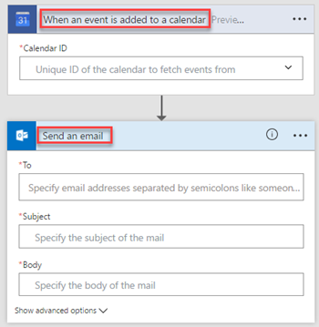
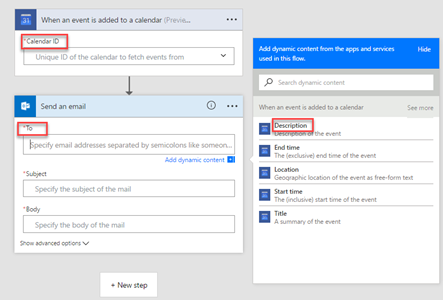
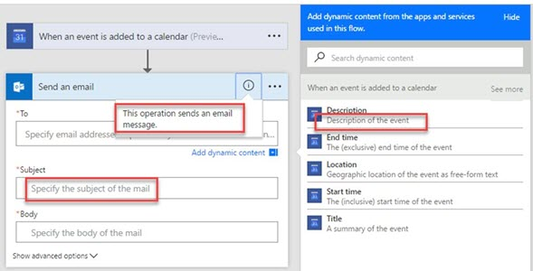
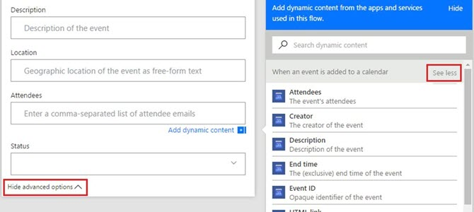
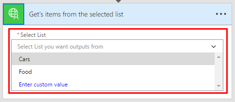
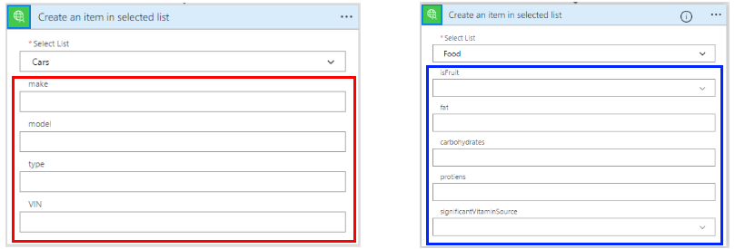

<properties
	pageTitle="Customize your Swagger definition for Microsoft Flow | Microsoft Flow"
	description="View the schema extensions required by Swagger to work with Microsoft Flow"
	services=""
    suite="flow"
	documentationCenter=""
	authors="msftman"
	manager="anneta"
	editor="sunaysv"/>

<tags
   ms.service="flow"
   ms.devlang="na"
   ms.topic="article"
   ms.tgt_pltfrm="na"
   ms.workload="na"
   ms.date="04/11/2017"
   ms.author="deonhe"/>

# Customize your Swagger definition for Microsoft Flow

## Introduction

To use custom connectors in Microsoft Flow, you must provide a Swagger definition, which is a language-agnostic machine-readable document describing the API's operations and parameters.  In addition to the out-of-the-box Swagger specification, there are some extensions available when creating a custom API for Microsoft Flow: summary, x-ms-summary, description, x-ms-visibility, x-ms-dynamic-values, and x-ms-dynamic-schema.

## summary 
Title of the operation. Example - 'When a task is created" or "Create new lead'. 

Applies to:

* Operations



It is recommended that you use **sentence case** for the summary of your operations.

## x-ms-summary
Title of the entity. Example - 'Task Name', 'Due Date', etc. 

Applies to:

* Parameters
* Response Schema



It is recommended that you use **title case** in x-ms-summary.
 
## description
A verbose explanation of the operation's functionality or an entity's format and function. Example - 'This operation triggers when a task is added to your project'.

Applies to:

* Operations
* Parameters
* Response Schema



It is recommended that you use **sentence case** in the description.


## x-ms-visibility
Determines the user facing visibility of the entity. The possible values are ‘important’, ‘advanced’ and ‘internal’. Entities marked as ‘internal’ do not show up in the Flow UI.

Applies to:

* Operations
* Parameters
* Schemas



## x-ms-dynamic-values
Enables populating a dropdown for collecting input parameters to an operation.

Applies to:

* Parameters



#### Usage:
Annotate a parameter by using the x-ms-dynamic-values object within the parameter definition. 

>[AZURE.NOTE] See sample [Swagger](https://procsi.blob.core.windows.net/blog-images/sampleDynamicSwagger.json) for more details. 

#### Properties:

* `operationID` [Required] - Specifies the operation to invoke to populate the dropdown
* `value-path` [Required] - A path string in the object inside "value-collection" that refers to the value for the parameter, if value-collection is not specified, the response is evaluated as an array
* `value-title` [Optional] - A path string in the object inside "value-collection" that refers to a description for the value, if value-collection is not specified, the response is evaluated as an array
* `value-collection` [Optional] - A path string that evaluates to an array of objects in the response payload
* `parameters` [Optional] - Object whose properties specify the input parameters required to invoke a dynamic-values operation

Example:

```json
  "x-ms-dynamic-values": {
    "operationId": "PopulateDropdown",
    "value-path": "name",
    "value-title": "properties/displayName",
    "value-collection": "value",
    "parameters": {
      "staticParameter": "<value>",
      "dynamicParameter": {
        "parameter": "<value_to_pass_to_dynamicParameter>"
      }
    }
  }
```

Sample code from Swagger: 

```json
"/api/lists/{listID-dynamic}": {
      "get": {
        "description": "Get items from a single list - uses dynamic Values and outputs dynamic-schema",
        "summary": "Get's items from the selected list ",
        "operationId": "GetListItems",
        "parameters": [
          {
            "name": "listID-dynamic",
            "type": "string",
            "in": "path",
            "description": "Select List you want outputs from",
            "required": true,
            "x-ms-summary": "Select List",
            "x-ms-dynamic-values": {
              "operationId": "GetLists",
              "value-path": "id",
              "value-title": "name"
            }
          }
        ]
```

## x-ms-dynamic-schema
This is a hint to the flow designer that the schema for this parameter or response is dynamic in nature. It can invoke an operation as defined by the value of this field, and discover the schema dynamically. It can then display an appropriate UI to take inputs from the user or display available fields.

Applies to:

* Parameters
* Response


Notice how the input form changes based on the dropdown selection



Notice how the outputs change based on the dropdown selection


#### Usage:
Annotate a request parameter or a response body with the x-ms-dynamic-schema object.

>[AZURE.NOTE] See sample [Swagger](https://procsi.blob.core.windows.net/blog-images/sampleDynamicSwagger.json) for more details

#### Properties:

* `operationID` [Required] - Specifies the operation to invoke to fetch the schema
* `parameters` [Required] - Object whose properties specify the input parameters required to invoke a dynamic-schema operation
* `value-path` [Optional] - A path string that refers to the property holding the schema, if not specified, the response is assumed to contain the schema in the properties of the root object

Sample code for dynamic parameters: 

```json
  {
    "name": "dynamicListSchema",
    "in": "body",
    "description": "Dynamic Schema of items in selected list",
    "schema": {
      "type": "object",
      "x-ms-dynamic-schema": {
        "operationId": "GetListSchema",
        "parameters": {
          "listID": {
            "parameter": "listID-dynamic"
          }
        },
        "value-path": "items"
      }
    }
  }
```

Sample code for dynamic response:

```json
"DynamicResponseGetListSchema": {
      "type": "object",
      "x-ms-dynamic-schema": {
        "operationId": "GetListSchema",
        "parameters": {
          "listID": {
            "parameter": "listID-dynamic"
          }
        },
        "value-path": "items"
      }
    }
```

## Next steps

[Register a Custom connector](register-custom-api.md).

[Use an ASP.NET Web API](customapi-web-api-tutorial.md).

[Register an Azure Resource Manager API](customapi-azure-resource-manager-tutorial.md).

