<properties
	pageTitle="Using webhooks with Microsoft Flow | Microsoft Flow"
	description="Learn how to create flows that interact with webhooks in Microsoft Flow"
	services=""
    suite="flow"
	documentationCenter=""
	authors="msftman"
	manager="anneta"
	editor=""/>

<tags
   ms.service="flow"
   ms.devlang="na"
   ms.topic="article"
   ms.tgt_pltfrm="na"
   ms.workload="na"
   ms.date="12/06/2016"
   ms.author="deonhe"/>

# Using webhooks with Microsoft Flow

[Webhooks](http://www.webhooks.org/) are simple HTTP callbacks used to provide event notifications.  Microsoft Flow allows you to use webhooks to trigger flows.  This tutorial demonstrates how to create a flow triggered by a webhook.

>[AZURE.NOTE] We will use GitHub as an example of a service that can send notifications via webhooks, but the techniques demonstrated here can be extended to any service that uses webhooks.

## Prerequisites

To complete the tutorial, you will need:

 - Basic understanding of [webhooks](http://www.webhooks.org/).
 - Basic understanding of the [OpenAPI Specification](http://swagger.io/specification/) (Swagger).
 - A [GitHub](https://www.github.com) account.
 - The [sample OpenAPI JSON file](http://pwrappssamples.blob.core.windows.net/samples/githubWebhookSample.json) for this tutorial.
 - Alternatively you can also use the [triggers UI](https://flow.microsoft.com/en-us/documentation/customapi-webhooks/#creating-webhook-triggers-from-the-UI) to define webhook triggers, in case you don’t want to hand write the OpenAPI file.

## The OpenAPI file

Webhooks are implemented in Microsoft Flow as a type of [custom connector](./customapi-web-api-tutorial.md), so we'll need to provide an OpenAPI JSON file to define the shape of our webhook.  The OpenAPI contains three definitions critical to making the webhook work:

1. Creating the webhook
2. Defining the incoming hook request from the API (in this case, GitHub)
3. Deleting the webhook

### Creating the webhook

The webhook is created on the GitHub side by an HTTP POST to `/repos/{owner}/{repo}/hooks`.  Flow will need to post to this URL when a new flow is created using the trigger defined in the OpenAPI, or whenever the trigger is modified.  In the sample below, the `post` property contains the schema of the request that will be posted to GitHub.

```json
"/repos/{owner}/{repo}/hooks": {
    "x-ms-notification-content": {
    "description": "Details for Webhook",
    "schema": {
        "$ref": "#/definitions/WebhookPushResponse"
    }
    },
    "post": {
    "description": "Creates a Github webhook",
    "summary": "Triggers when a PUSH event occurs",
    "operationId": "webhook-trigger",
    "x-ms-trigger": "single",
    "parameters": [
        {
        "name": "owner",
        "in": "path",
        "description": "Name of the owner of targetted repository",
        "required": true,
        "type": "string"
        },
        {
        "name": "repo",
        "in": "path",
        "description": "Name of the repository",
        "required": true,
        "type": "string"
        },
        {
        "name": "Request body of webhook",
        "in": "body",
        "description": "This is the request body of the Webhook",
        "schema": {
            "$ref": "#/definitions/WebhookRequestBody"
        }
        }
    ],
    "responses": {
        "201": {
        "description": "Created",
        "schema": {
            "$ref": "#/definitions/WebhookCreationResponse"
        }
        }
    }
    }
},
```

>[AZURE.IMPORTANT] The `"x-ms-trigger": "single"` property is a schema extension that tells Flow to display this webhook in the list of available triggers in the flow designer, so be sure to include it.

### Defining the incoming hook request from the API 

The shape of the incoming hook request (the notification from GitHub to Flow) is defined in the custom `x-ms-notification-content` property, as shown in the sample above.  It doesn't need to contain the entire contents of the request, just the portions you want to use in your flows.

### Deleting the webhook

It's very important to include a definition in the OpenAPI that tells Flow how to delete the webhook.  Flow will try to delete the webhook every time you update the trigger in your flow, or when you delete your flow.

```json
"/repos/{owner}/{repo}/hooks/{hook_Id}": {
    "delete": {
    "description": "Creates a Github webhook",
    "operationId": "DeleteTrigger",
    "parameters": [
        {
        "name": "owner",
        "in": "path",
        "description": "Name of the owner of targetted repository",
        "required": true,
        "type": "string"
        },
        {
        "name": "repo",
        "in": "path",
        "description": "Name of the repository",
        "required": true,
        "type": "string"
        },
        {
        "name": "hook_Id",
        "in": "path",
        "description": "ID of the Hook being deleted",
        "required": true,
        "type": "string"
        }
    ]
    }
},
```

>[AZURE.IMPORTANT] In order for Flow to be able to delete a webhook, the API **must** include a `Location` HTTP header in the 201 response at the time the webhook is created.  The `Location` header should contain the path to the webhook that will be used with the HTTP DELETE.  For example, the `Location` included with GitHub's response follows this format: `https://api.github.com/repos/<user name>/<repo name>/hooks/<hook ID>`.

## Authentication

The API sending the webhook request to Flow will usually have some form of authentication, and GitHub is no exception.  Several types of authentication are supported.  For this tutorial, we'll use GitHub's personal access tokens.

1. Navigate to [GitHub](https://www.github.com) and sign in if you haven't already.

2. In the upper right, click your **profile picture**, and then, in the menu, click **Settings**.

    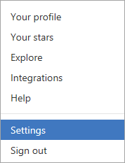

3. In the menu on the left, under **Developer settings**, click **Personal access tokens**.

    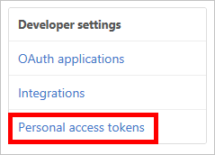

4. Click the **Generate new token** button.

    

5. In the **Token description** box, enter a description.

6. Tick the **admin:repo_hook** checkbox.

    

7. Click the **Generate token** button.

8. Make note of your new token.

    

    >[AZURE.IMPORTANT] You won't be able to access this token again. You should copy and paste it somewhere like Notepad to use later in the tutorial.

## Adding the webhook to Flow

Now we've got everything we need to add the webhook to Flow as a custom connector.

1. Navigate to the [Microsoft Flow web portal](https://flow.microsoft.com) and sign in if you haven't already.

2. Click the **settings** icon, and then click **custom connectors**.

    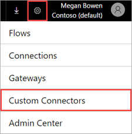

3. Click the **Create custom connector** button.

4. Click the file folder icon in the **Import OpenAPI** box and then select the sample OpenAPI file.

5. Click **Upload icon** in the **General information** section and then select an image file to use as an icon.

6. Click **Continue**.

    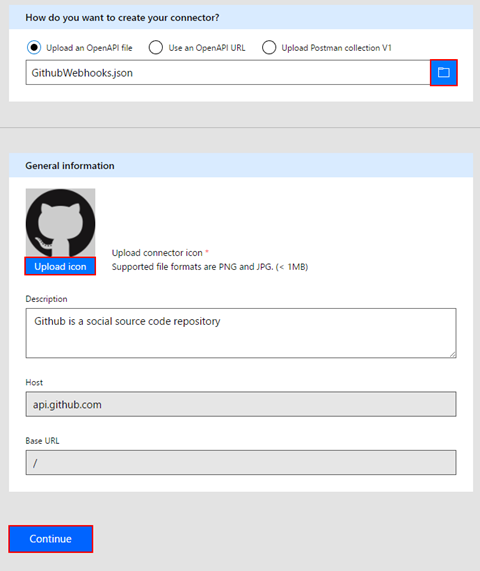
    
7. On the next screen, we'll configure security settings.  Under **Authentication type**, select **Basic authentication**.

8. In the **Basic authentication** section, for the label fields, enter the text **User name** and **Password**.  Note that these are only labels that will be displayed when the trigger is used in a flow.

    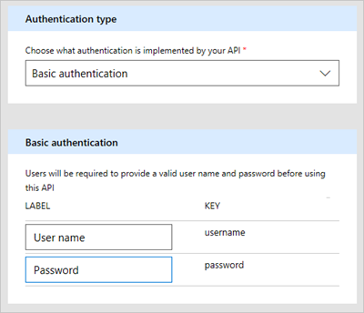

9. At the top of the page, give your flow a name and click **Create API**.

    

The new custom connector should now appear in the list on the custom connectors page.

## Creating webhook triggers from the UI

1. After uploading / creating your base Open API file, navigate to the **Definition** tab of the custom connector wizard

2. In the left hand pane, click on + New trigger and fill out the description of your trigger. In this example, we are creating a trigger that fires when a pull request is made to a repository.

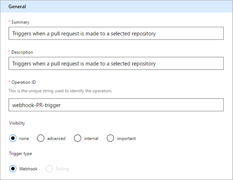

3. Next, define the request to create the webhook trigger. You can do this by importing a sample create webhook trigger request. [Github API reference](https://developer.github.com/v3/repos/hooks/#create-a-hook) for creating a webhook. 

4. Flow automatically adds standard ```content-type``` and security headers, so we don’t need to define those while importing from a sample. 

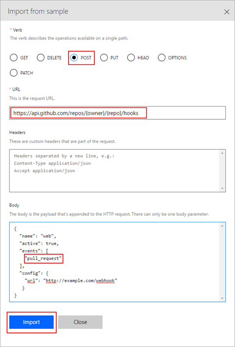

5. After importing the create webhook request, next we will define the **Webhook response** by importing from a sample response. [API reference](https://developer.github.com/v3/activity/events/types/#pullrequestevent) for a pull request event. 
**Note**: You don’t have to paste in the full response. Only the fields that you need should be defined.
For this example, we are extracting only the PR url and information of the user who made the PR.

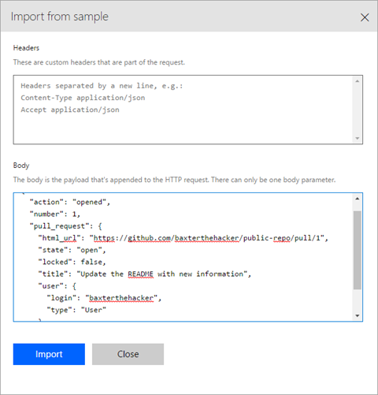

6. The final step for you is to select a parameter in the Webhook creation request, in the value of which Flow should populate a callback URL for Github to populate. For us this is the url property in the ```config``` object.

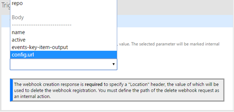


## Using the webhook as a trigger

Now that we've got everything configured, we can use the webhook in a flow.  Let's create a flow that will send a push notification to the Flow mobile app whenever our GitHub repo receives a git push.

1. In the [Microsoft Flow web portal](https://flow.microsoft.com), at the top of the page, click **My flows**.

2. Click **Create from blank**.

3. In the flow designer, search for the custom connector we registered earlier.

    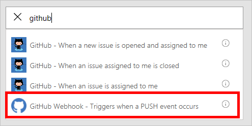

    Click on the item in the list to use it as a trigger.

4. Since this is the first time we've used this custom connector, we have to connect to it.  For **Connection name**, enter a descriptive name.  For **User name**, use your GitHub username.  For **Password**, use the **personal access token** you created earlier.

    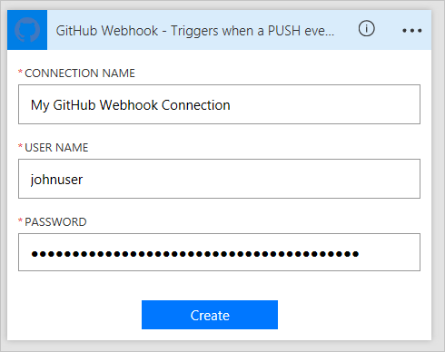

    Click **Create**.

5. Now we need to give Flow information about the repo we want to monitor.  You might recognize the fields from the **WebhookRequestBody** object in the OpenAPI file.  For **owner** and **repo**, enter the owner and repo name of a GitHub repo you want to monitor.

    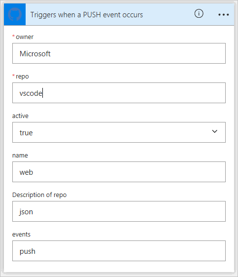

    >[AZURE.IMPORTANT] In this example, I'm using the repository for [Visual Studio Code](https://code.visualstudio.com). You should use a repo that your account has rights to.  The easiest way to do this would be to use your own repo.

6. Click **+ New step**, and then click **Add an action**.

7. Search for and select the **Push notification** action.

    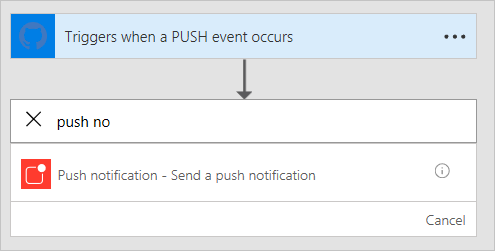

8. Enter some text in the the **Text** field.  Note that the **WebhookPushResponse** object in the OpenAPI file defines the list of parameters you can use.
    
    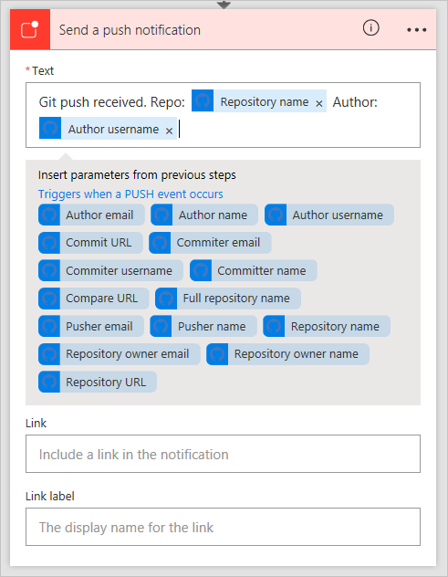

9. At the top of the page, give the flow a name and click **Create flow**.

    

## Verification and troubleshooting

To verify everything is set up correctly, click **My flows**, and then click the **information icon** next to the new flow to view the run history.  You should already see at least one "Succeeded" run from the webhook creation.  This indicates that the webhook was created successfully on the GitHub side.  If the run failed, you can drill into the run details to see why it failed.  If the failure was due to a "404 Not Found" response, it's likely your GitHub account doesn't have the correct permissions to create a webhook on the repo you used.

## Summary

If everything is correctly configured, you will now receive push notifications in the Microsoft Flow mobile app whenever a git push occurs on the GitHub repository you selected.  Using the process above, you can use any webhook-capable service as a trigger in your flows.

## Next steps

- [Register a custom connector](./register-custom-api.md).
- [Use an ASP.NET Web API](./customapi-web-api-tutorial.md).
- [Register an Azure Resource Manager API](./customapi-azure-resource-manager-tutorial.md).


