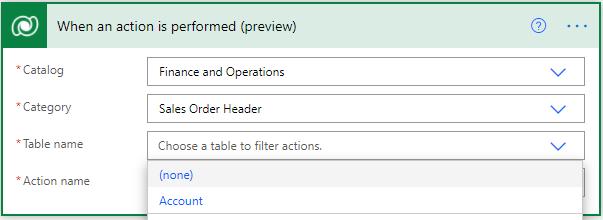
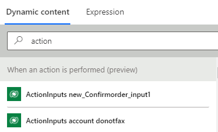

# When an action is performed

**Initial setup**: To create a flow that triggers based on execution of a
Dataverse action, the action must be included in both a [Catalog and a Category](https://docs.microsoft.com/en-us/powerapps/developer/data-platform/catalog-catalogassignment), and your role needs [permissions](https://docs.microsoft.com/power-platform/admin/database-security#assign-security-roles-to-users-in-an-environment-that-has-a-dataverse-database) to read it, which may require read access to the *sdkmessage*, *customapi*,
or *workflows* tables in Dataverse.

As the name suggests, this trigger runs the flow whenever a Dataverse action is
performed. A Dataverse action is     distinct from a Power Automate action. In
Dataverse, custom process actions, or simply actions, are a way of extending out
of the box operations on data. You can use them to define custom business logic
that is reusable. To learn more, see [Work with
actions](https://docs.microsoft.com/powerapps/maker/data-platform/actions)
and [Use Custom Process Actions with
code](https://docs.microsoft.com/powerapps/developer/data-platform/workflow-custom-actions).
To learn how to invoke Dataverse actions from Power Automate, see [Perform bound or unbound actions](https://docs.microsoft.com/power-automate/dataverse/bound-unbound).

The trigger uses the following input fields: 

- **Catalog** – used to organize and manage Dataverse process actions, much
    like using folders to organize files.

- **Category** – used as a sub-classification within a Catalog.

- **Table name** – used to filter available actions by their associated table
    (bound actions), or to filter global actions (unbound actions). For unbound
    actions, select *(none)*.

- **Action name** – used to identify the action that will trigger the flow each time it is successfully executed. The list of available actions is filtered by the catalog, category, and table name.

    

## Using dynamic content and action inputs / outputs

As a Dataverse custom action is meant for custom business logic, it accepts
inputs parameters and returns output parameters. When this trigger is executed,
these parameters are available as dynamic content in the flow and can be used in
subsequent steps as shown below.

The naming scheme of the parameters is as follows –

- The prefixes *ActionInputs* and *ActionOutputs* specify whether it is an
    input or output parameter

- The next literal is the name of the parameter

- For complex data types such as an entity object, the last literal is the
    column name (for eg. *donotfax*)

