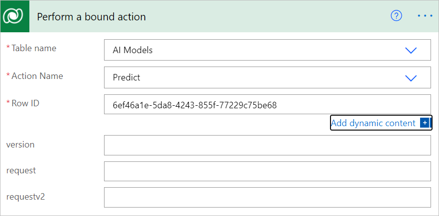
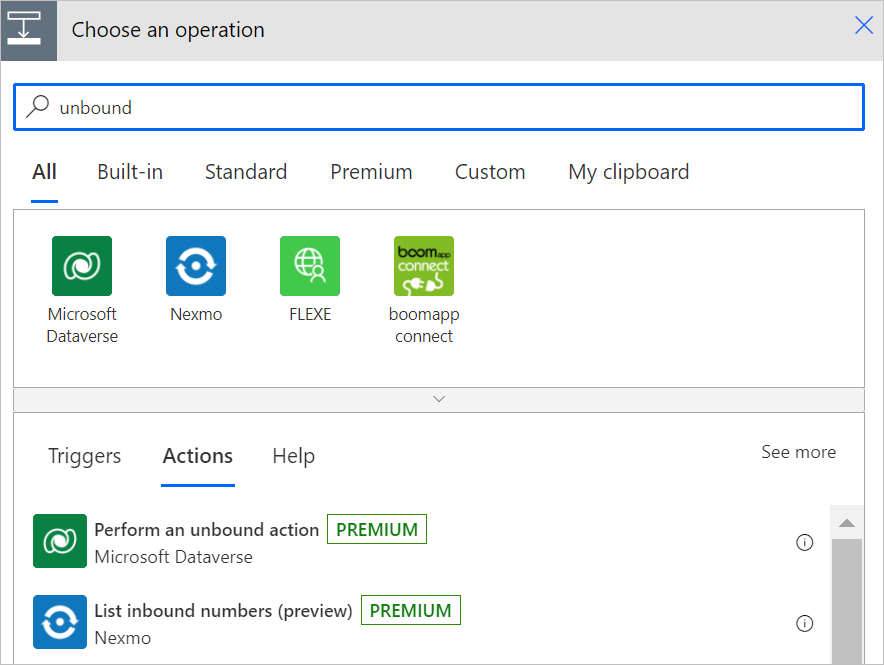

# Perform bound actions or unbound actions

>[!IMPORTANT]
>In this acticle, the term "action" means a [Dataverse action](/dynamics365/customer-engagement/web-api/actions?view=dynamics-ce-odata-9&preserve-view=true).
>Dataverse actions are not the same as Power Automate actions. In Dataverse, you use actions to extend out of the box operations on data. You can use these actions to define reusable custom business logic.

Flows can call [Dataverse actions](/dynamics365/customer-engagement/web-api/actions?view=dynamics-ce-odata-9&preserve-view=true) that are available in the Microsoft Dataverse connector. These actions include everything from fulfilling a sales order to exporting a solution. 

Actions represent operations that might have side effects in the database, such as creating or updating rows.

There are two types of Dataverse actions that you can use in flows.

- [Bound actions](#bound-action)
- [Unbound actions](#unbound-action)

## Bound actions

*Bound actions* target a single table or a set of rows from a single table.

To perform a bound action, add **Perform a bound action** to your flow.

Follow these steps to edit one of your flows to perform a bound action.

1. After any step in your flow, select **Add new step**.
1. Enter **bound** in the search box, select **Microsoft Dataverse** from the list of connectors, and then select **Perform a bound action**.

   

1. In **Table name**, select the name of a table you want to use.
1. In **Action name**, select the action you'll perform.
1. In **Row ID**, enter the row in the table on which you want to perform the bound action.

   

1. Save, and then run your flow.
1. Confirm that the bound action completes successfully on the table that you selected.

## Unbound actions

*Unbound actions* aren’t bound to a table and are called as static operations. Unbound actions are performed on the entire environment, not on specific tables or rows.

To perform an unbound action in your flow, add **Perform an unbound action** to your flow.

Follow these steps to edit one of your flows to perform an unbound action.

1. After any step in your flow, select **Add new step**.

1. Enter **unbound** in the search box, select **Microsoft Dataverse** from the list of connectors, and then select **Perform an unbound action**.

   

1. In **Action name**, select an action.

   

1. Enter or select any of the optional details on the **Perform an unbound action** card.

1. Save, and then run your flow.

1. Confirm that the unbound action completes successfully.
