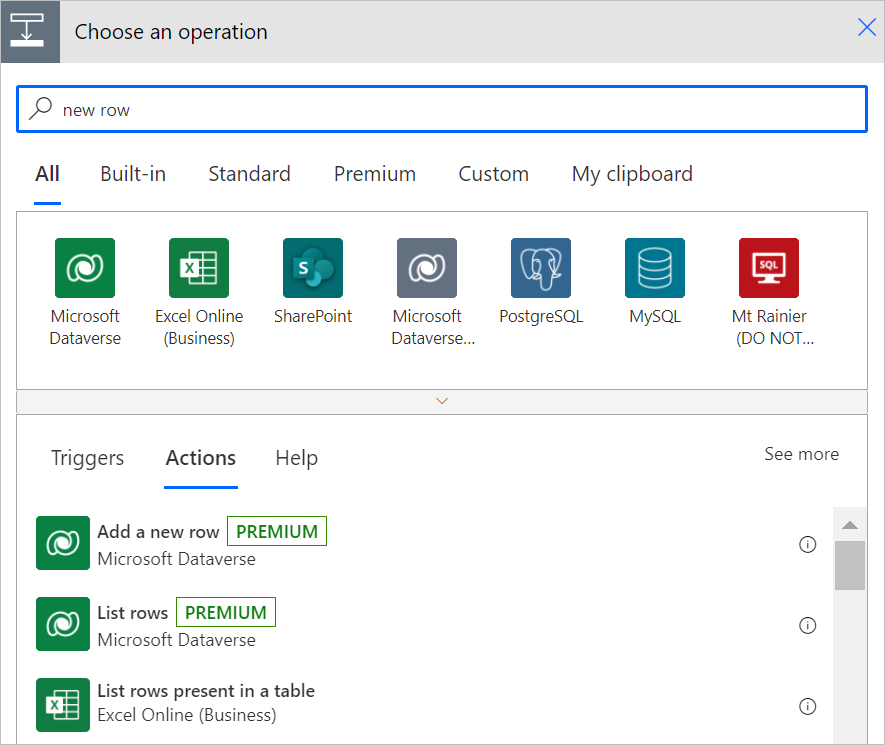
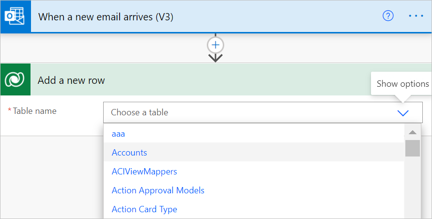
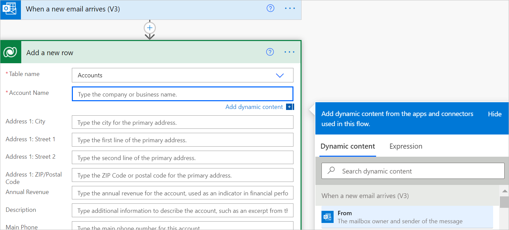

# Use a flow to add a row in Dataverse

Use the **Add a new row** action to add a new row in Microsoft Dataverse.<!-- Edit note: Can we say, "In the Microsoft Dataverse connector in Power Automate, use the ..." -->

Follow these steps to add a new account in Dataverse when you receive an email to your sign-up address, as shown in the following image:

1. Create a flow with the **When a new email arrives (V3)** trigger to your flow.
1. Select **New step** to add an action to your flow.
1. Enter **new row** into the **Search connectors and actions** search box on the **Choose an operation** card.
1. Select **Microsoft Dataverse**.
1. Select **Add a new row** action.

   

1. Select the **Accounts** table in the **Add a new row** card.

   

   After you select a table, the card expands, displaying both optional and required items. All mandatory items display an asterisk (\*).

1. Optional: If you don't see a column that you need, select **Show advanced options** at the bottom of the card to view all columns.

   

>[!TIP]
>You can use outputs from previous triggers and actions in the **Dynamic content** selector, as shown in the following image, or modify them by building an expression as outlined in [Use expressions in flow actions](https://flow.microsoft.com/en-us/blog/use-expressions-in-actions/).<!-- Edit note: Try to avoid use of en-us. -->

   
