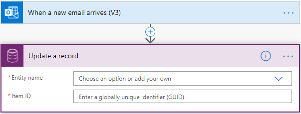

# Update a row

Using this action, you can update an existing record in Common Data Service.

For example, you can set up a flow to update an existing Account in Common Data
Service when you receive an email, as shown below.

After selecting an entity, new fields appear that allow you to set values for
specific fields. Mandatory fields are indicated with an asterisk (\*), and it is
not necessary to enter a value for optional fields. Fields that are left blank
would be skipped in the update unless a null value is explicitly provided.

The **Item ID** field is the unique ID of the record that you are updating, as
shown below. If you do not see an attribute, you can click on **Show advanced
options** at the bottom of the card.

