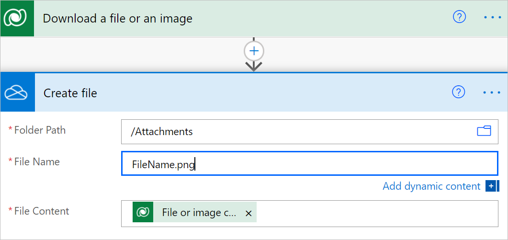
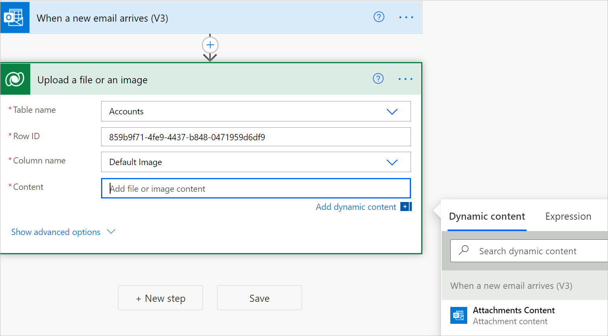

# Upload or download image and file content

In late 2019, two new column datatypes were added to Dataverse.

- **File** – With **File**, you can have a [column that stores arbitrary file data for your table](https://docs.microsoft.com/powerapps/developer/common-data-service/file-columns).

- **Image** – In addition to a column for storing the full size of an image as
    a file, the **Image** datatype can also include [thumbnail information](https://docs.microsoft.com/powerapps/developer/common-data-service/image-columns).

You can use the Microsoft Dataverse connector to work with these datatypes in Power Automate.

## Download image or file contents

Follow these steps to add the **Download a file or an image** action to your flow. You can use the downloaded file contents in suitable actions later in the flow.

1. Select **New step** to add an action to your flow.
1. Enter **Download a file** into the **Search connectors and actions** search box on the **Choose an operation** card.
1. Select **Microsoft Dataverse**.
1. Select the **Download a file or an image** *action*.

   

1. Select the table from which you want to download the file/image content or enter your own custom value for the table name.
1. Enter the **Row ID** of the row in the table you just selected.

   >[!TIP]
   >You can normally grab the row identifier from a previous request via the dynamic content.

   The list of supported file and image columns for the table you selected earlier will be populated in the **Column name** list. 

1. Select the **Column name** for the column that holds the file/image content that you want to download.

   

   You now can access the file or image contents via the **File or image content** variable in the list of dynamic content.

       
 
   With the content output of the action, you can pass it to any action later in the flow. In the following example, the file contents are being passed to the **Create file** action.

      

## Upload file or image content

1. Add the **Upload a file or an image** action to your flow so that you can upload content to a corresponding file or image column in Dataverse.

   

1. Select the table to which you want to upload the file/image content or enter a custom value for the **Table name**.  

1. Enter the identifier in **Row ID** for the row to which you want to upload the file or image content.  

   >[!TIP]
   >You can normally grab the row identifier from a previous request by using the dynamic content.  

   The list of available file and image columns in the table that you selected is populated. 
   
1. Select the **Column name** to which you want to upload the image or enter a custom value.

   Your **Upload a file or an image** action card may look like this now.

   

1. Enter the content you want to upload.

   In this example, the files to upload are the **Attachments Content** from an email captured earlier in the flow. You will find the attachments content in the list of dynamic content that's displayed when you select **Content** on the **Upload a file or an image** card.

   

