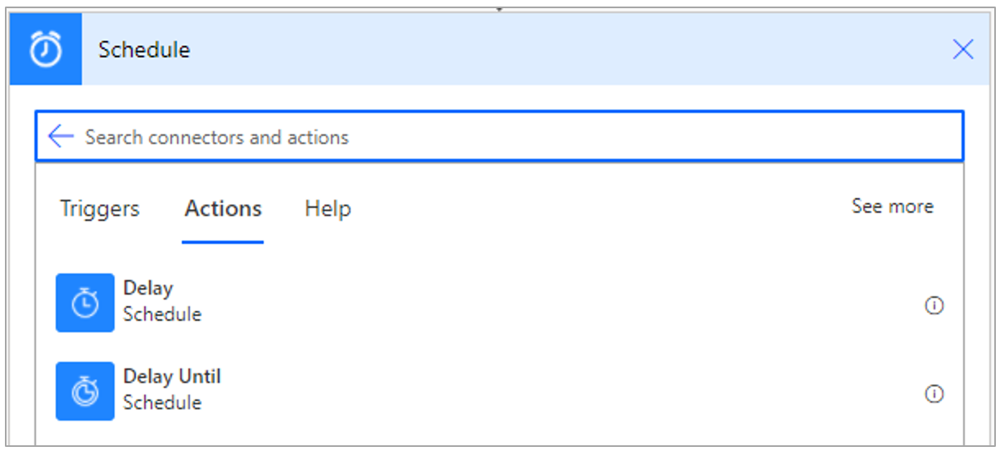
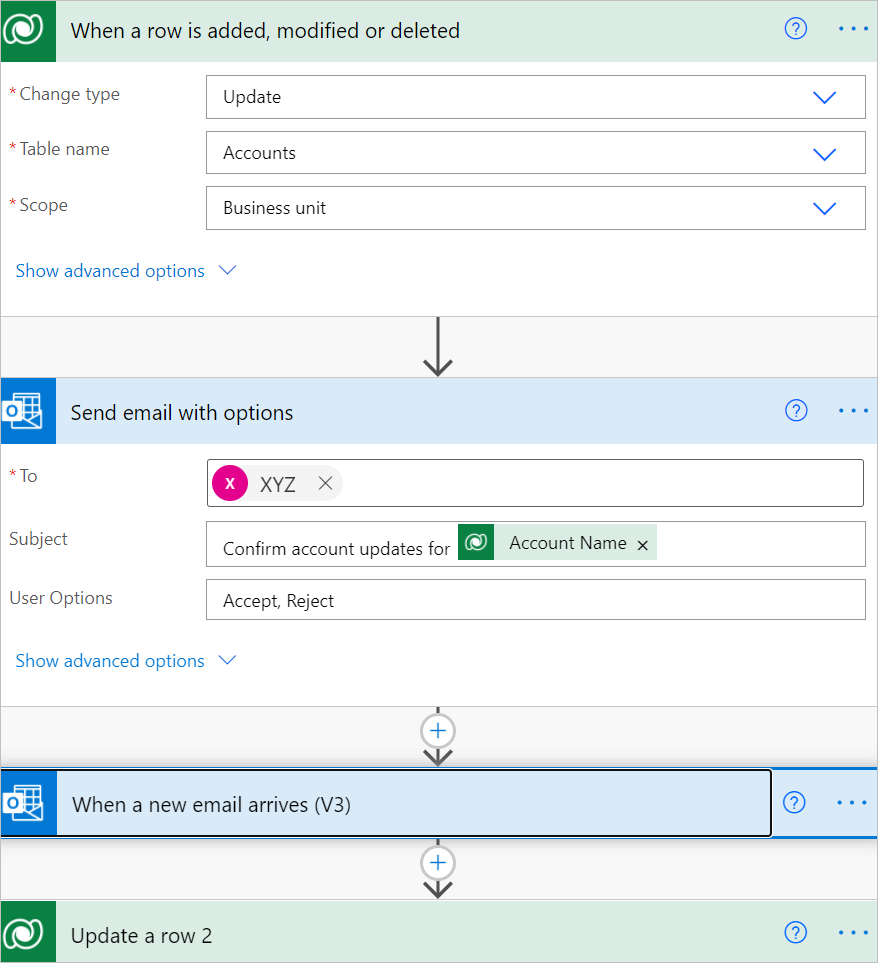

# Use wait conditions to delay flows

The Microsoft Dataverse connector provides four ways to add wait conditions. Use these wait conditions when you need to delay processing in your flows until a particular condition is met.

1. Postpone triggering the flow and the first action until a specific time.
    – See the [**Wait condition using Postpone Until** article](./create-update-delete-trigger.md#wait-condition-using-postpone-until) to learn more.

1. Add a [fixed delay](https://docs.microsoft.com/power-automate/ui-flows/edit-desktop#add-a-delay)
    before the next step.

1. [Delay an action](https://docs.microsoft.com/power-automate/ui-flows/edit-desktop#add-a-delay)
    until a specific timestamp.

    

1. Delay an action until a specific event occurs. You can use a trigger from the Microsoft Dataverse connector or any other connector as a step in the middle of the flow to delay subsequent steps until a specific event occurs. For example, you can define a flow that’s similar to the one in the following image to check for updates to **Account** rows in Dataverse and then waits for an email confirmation from the **Account** manager before updating the change.

    

