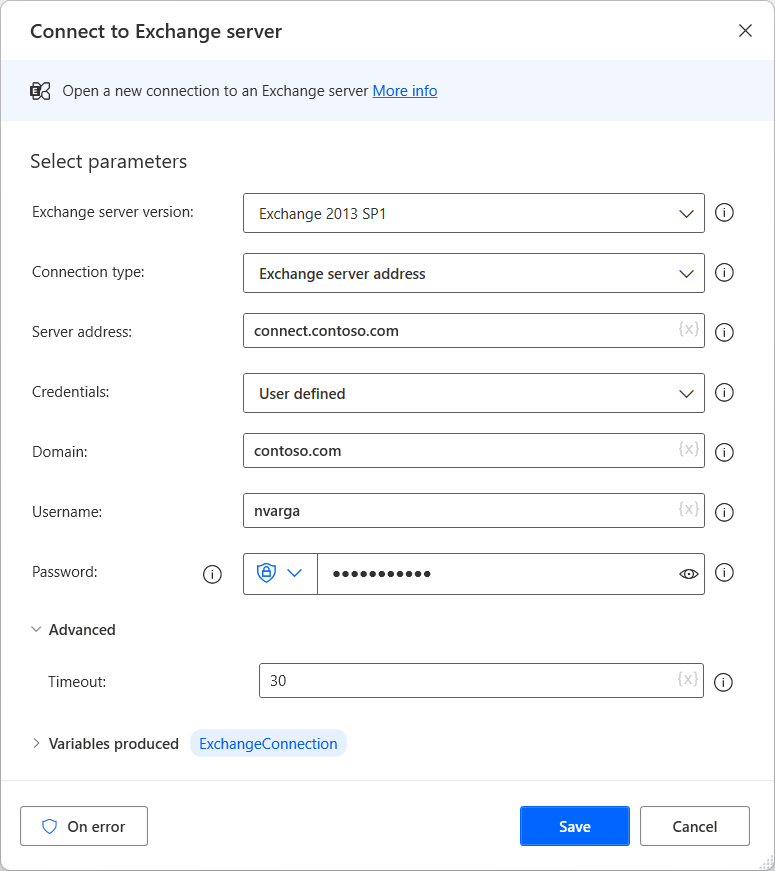
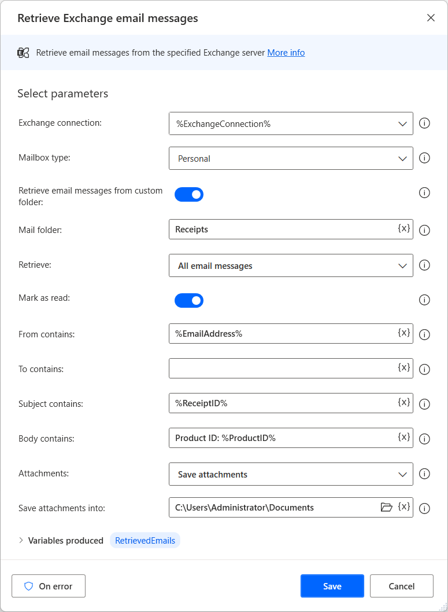

# Exchange

> [!WARNING]
> This group of actions is intended for Exchange Server automation scenarios. For automation scenarios regarding Exchange Online, use the corresponding Office 365 cloud connectors through cloud flows.

Automate sending, receiving, and managing emails through Exchange

[Connect to Exchange server](#connecttoexchangeserver)  
[Retrieve Exchange email messages](#retrieveexchangemessages)  
[Send Exchange email message](#sendmessage)  
[Process Exchange email messages](#processexchangemessages)

## Getting started with Exchange actions

The Exchange group of actions allows users to connect to an exchange server of their choice, and manage their correspondence.

Exchange actions require a connection to an Exchange server. Establish the connection by using the **Connect to Exchange server** action. In the following figure, the exchange server address has been entered manually, rather than using auto discovery. The credetials are set to user defined, so the domain, username and password are entered manually as well. In the **Advanced** section, a timeout has been set. This allows the action to return an error if a connection hasn't been established within the specified time frame.

To retrieve emails from the exchange server, use the **Retrieve Exchange email messages** action. In the figure below, the action has been set to retrieve email messages from a custom folder, Receipts. In the filters, the from, subject and body fields have been set to contain values of variables which have been previously defined in the flow. Attachments from resulting email messages will also be saved to the specified folder.

The **Process Exchange email messages** action processes email messages retrieved by the **Retrieve Exchange email messages** action. The required input is the Exchange connection and the retrieved emails variable. Use this action to move, delete or mark email messages as read.

## Exchange actions

###  Connect to Exchange server
Open a new connection to an Exchange server

##### Input parameters
|Argument|Optional|Accepts|Default Value|Description|
|-----|-----|-----|-----|-----|
|Exchange server version|N/A|Exchange 2010, Exchange 2010 SP1, Exchange 2010 SP2, Exchange 2013, Exchange 2013 SP1|Exchange 2013 SP1|The version of the Exchange server|
|Connection type|N/A|Auto discovery, Exchange server address|Auto discovery|Specifies how to connect to the Exchange server|
|Server address|No|[Text value](../variable-data-types.md#text-value)||The Exchange server address|
|Email address|No|[Text value](../variable-data-types.md#text-value)||The Exchange account email address|
|Credentials|N/A|Exchange default, User defined|Exchange default|Specifies the way to provide the user's Exchange credentials|
|Domain|Yes|[Text value](../variable-data-types.md#text-value)||The Exchange account domain. To extract the account domain from the username, left this field empty|
|Username|No|[Text value](../variable-data-types.md#text-value)||The Exchange account username|
|Password|No|Direct encrypted input or [Text value](../variable-data-types.md#text-value)||The Exchange account password|
|Timeout|Yes|[Numeric value](../variable-data-types.md#numeric-value)|30|The time in seconds to wait for the connection to be established before the action fails|

##### Variables produced
|Argument|Type|Description|
|-----|-----|-----|
|ExchangeConnection|[Exchange connection](../variable-data-types.md#connections)|The specific Exchange connection for use with later Exchange actions|

#####  Exceptions
|Exception|Description|
|-----|-----|
|Failed to connect to the Exchange server|Indicates a problem connecting to the Exchange server|

###  Retrieve Exchange email messages
Retrieve email messages from the specified Exchange server

##### Input parameters
|Argument|Optional|Accepts|Default Value|Description|
|-----|-----|-----|-----|-----|
|Exchange connection|No|[Exchange connection](../variable-data-types.md#connections)||The Exchange connection. Create an Exchange connection with the 'Connect to Exchange server' action|
|Mailbox type|N/A|Personal, Shared|Personal|The type of the mailbox to retrieve email messages from|
|Shared mailbox address|No|[Text value](../variable-data-types.md#text-value)||The address of the shared mailbox to retrieve email messages from|
|Retrieve email messages from custom folder|N/A|[Boolean value](../variable-data-types.md#boolean-value)|False|Specifies whether to retrieve email messages from a custom folder or a predefined Exchange folder|
|Exchange folder|N/A|Inbox, Deleted items, Drafts, Outbox, Sent items, Junk email|Inbox|A predefined Exchange folder to retrieve email messages from|
|Mail folder|No|[Text value](../variable-data-types.md#text-value)|Inbox|The name or path (e.g. folder1\folder2) of the mail-folder to retrieve email messages from|
|Retrieve|N/A|All email messages, Unread email messages only, Read email messages only|Unread email messages only|Specifies whether to retrieve all email messages in the folder or only the unread ones|
|Mark as read|N/A|[Boolean value](../variable-data-types.md#boolean-value)|True|Specifies whether to mark as read the retrieved email messages or leave them as is|
|From contains|Yes|[Text value](../variable-data-types.md#text-value)||The full email address of the sender to retrieve messages from. Leave this attribute blank to retrieve all messages regardless of the sender|
|To contains|Yes|[Text value](../variable-data-types.md#text-value)||The full email address(es) of the recipient(s) (separated by space if more than one) for the email messages to retrieve. Leave this attribute blank to retrieve all email messages regardless of the recipient(s)|
|Subject contains|Yes|[Text value](../variable-data-types.md#text-value)||The key phrase to find within the email subject. Leave this attribute blank to retrieve all email messages regardless of their subject|
|Body contains|Yes|[Text value](../variable-data-types.md#text-value)||The key phrase to find within the email body. Leave this attribute blank to retrieve all email messages regardless of their content|
|Attachments|N/A|Save attachments, Do not save attachments|Do not save attachments|Specifies whether to save the attachments of the email messages retrieved or not|
|Save attachments into|No|[Folder](../variable-data-types.md#files-and-folders)||The folder to save the attachments into|

##### Variables produced
|Argument|Type|Description|
|-----|-----|-----|
|RetrievedEmails|[List](../variable-data-types.md#list) of [Exchange mail messages](../variable-data-types.md#exchange)|The retrieved email messages for later processing as a list of Exchange mail messages objects|

#####  Exceptions
|Exception|Description|
|-----|-----|
|Failed to save attachments|Indicates a problem saving the attachments|
|Specified mail-folder doesn't exist|Indicates that the specified mail folder doesn't exist|
|Failed to retrieve email messages|Indicates a problem retrieving the email messages|

###  Send Exchange email message
Create and send a new email message

##### Input parameters
|Argument|Optional|Accepts|Default Value|Description|
|-----|-----|-----|-----|-----|
|Exchange connection|No|[Exchange connection](../variable-data-types.md#connections)||The Exchange connection. Create an Exchange connection with the 'Connect to Exchange server' action|
|From|No|[Text value](../variable-data-types.md#text-value)||The sender's email address|
|Sender display name|Yes|[Text value](../variable-data-types.md#text-value)||The sender's display name|
|To|No|[Text value](../variable-data-types.md#text-value)||The email(s) of the recipient(s). To enter more than one email, separate the list of addresses by semi-colons|
|CC|Yes|[Text value](../variable-data-types.md#text-value)||The email(s) of the CC recipient(s). To enter more than one email, separate the list of addresses by semi-colons|
|BCC|Yes|[Text value](../variable-data-types.md#text-value)||The email(s) of the BCC (hidden) recipient(s). To enter more than one email, separate the list of addresses by semi-colons|
|Subject|Yes|[Text value](../variable-data-types.md#text-value)||The subject of the email|
|Body|Yes|[Text value](../variable-data-types.md#text-value)||The text of the body|
|Body is HTML|N/A|[Boolean value](../variable-data-types.md#boolean-value)|False|Specifies whether to interpret the body of the email as HTML coding|
|Attachment(s)|Yes|[List](../variable-data-types.md#list) of [Files](../variable-data-types.md#files-and-folders)||The full path of any attachment(s). Enclose multiple files in double quotes (") and separate them by a space character|

##### Variables produced
This action doesn't produce any variables.

#####  Exceptions
|Exception|Description|
|-----|-----|
|Attachment not found|Indicates that the specified attachment(s) don't exist|
|Failed to send email|Indicates a problem sending the email|

###  Process Exchange email messages
Move, delete or mark as unread an email message (or a list of email messages)

##### Input parameters
|Argument|Optional|Accepts|Default Value|Description|
|-----|-----|-----|-----|-----|
|Exchange connection|No|[Exchange connection](../variable-data-types.md#connections)||The Exchange connection. Create an Exchange connection with the 'Connect to Exchange server' action|
|Email message(s) to process|No|[List](../variable-data-types.md#list) of [Exchange mail messages](../variable-data-types.md#exchange)||The email message(s) to process. Use a variable populated by a 'Retrieve Exchange email messages' action|
|Operation|N/A|Delete email messages from server, Mark email messages as unread, Move email messages to mail folder|Move email messages to mail folder|Specifies which operation to perform on the specified email messages|
|Mailbox type|N/A|Personal, Shared|Personal|The type of the mailbox to retrieve email messages from|
|Shared mailbox address|No|[Text value](../variable-data-types.md#text-value)||The address of the shared mailbox to retrieve email messages from|
|Move to custom folder|N/A|[Boolean value](../variable-data-types.md#boolean-value)|False|Specifies whether to move email messages to a custom folder or a predefined Exchange folder|
|Exchange folder|N/A|Inbox, Deleted items, Drafts, Outbox, Sent items, Junk email|Inbox|A predefined Exchange folder to move email messages from|
|Mail folder|No|[Text value](../variable-data-types.md#text-value)|Inbox|The name or path (e.g. folder1\folder2) of the mail-folder to move email messages to|

##### Variables produced
This action doesn't produce any variables.

#####  Exceptions
|Exception|Description|
|-----|-----|
|Specified mail-folder doesn't exist|Indicates that the specified mail folder doesn't exist|
|Failed to process email messages|Indicates a problem processing the specified email messages|

[!INCLUDE[footer-include](../../includes/footer-banner.md)]