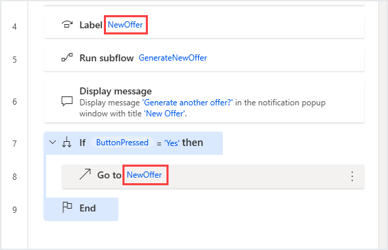

# Flow control

Control the automation flow

[Comment](#comment)  
[End](#end)  
[Exit subflow](#exitfunction)  
[Get last error](#getlasterror)  
[Go to](#goto)  
[Label](#label)  
[On block error](#block)  
[Run subflow](#callfunction)  
[Stop flow](#exit)  
[Wait](#wait)  

## Getting started with flow control

Flow control refers to controlling the order in which actions and subflows run. Power Automate enables flow control through the flow control actions.

**Labels** are used to create points of reference for the **Go to** action to direct the flow to. In the figure below, the flow is directed to a label earlier in the flow to repeat a series of actions.

The **Run subflow** action interrupts the subflow in which it's placed and runs another subflow. When the second subflow completes, the flow reverts to the original subflow to continue running. In the figure below, the subflow **Calculate Discount** has been created to run multiple times throughout the runtime of the flow to avoid repeating the same code.

## Flow control actions

###  Comment

User comment

##### Input parameters

|Argument|Optional|Accepts|Default Value|Description|
|-----|-----|-----|-----|-----|
|Comment|Yes|[Text value](../variable-data-types.md#text-value)||User comment|

##### Variables produced

This action doesn't produce any variables.

#####  Exceptions

This action doesn't include any exceptions.

###  End

##### Input parameters

This action doesn't require any input.

##### Variables produced

This action doesn't produce any variables.

#####  Exceptions

This action doesn't include any exceptions.

###  Exit subflow

Exits current subflow and returns to the point it was called from

##### Input parameters

This action doesn't require any input.

##### Variables produced

This action doesn't produce any variables.

#####  Exceptions

This action doesn't include any exceptions.

###  Get last error

Retrieves the last error that occurred in the flow

##### Input parameters

|Argument|Optional|Accepts|Default Value|Description|
|-----|-----|-----|-----|-----|
|Clear error|N/A|[Boolean value](../variable-data-types.md#boolean-value)|False|After the error is stored in the variable, it's cleared so that next time the error is retrieved, it won't retrieve the same error value|

##### Variables produced

|Argument|Type|Description|
|-----|-----|-----|
|LastError|[Error](../variable-data-types.md#error)|The details of the error that last occurred in the flow|

#####  Exceptions

This action doesn't include any exceptions.

###  Go to

Transfers the flow of execution to another point, indicated by a label

##### Input parameters

|Argument|Optional|Accepts|Default Value|Description|
|-----|-----|-----|-----|-----|
|Go to label|No|[Text value](../variable-data-types.md#text-value)||Label in the flow|

##### Variables produced

This action doesn't produce any variables.

#####  Exceptions

This action doesn't include any exceptions.

###  Label

Acts as the destination of a 'go to' statement

##### Input parameters

|Argument|Optional|Accepts|Default Value|Description|
|-----|-----|-----|-----|-----|
|Label name|No|[Text value](../variable-data-types.md#text-value)||Label in the program|

##### Variables produced

This action doesn't produce any variables.

#####  Exceptions

This action doesn't include any exceptions.

###  On block error

Marks the beginning of a block to handle actions errors

##### Input parameters

|Argument|Optional|Accepts|Default Value|Description|
|-----|-----|-----|-----|-----|
|Name|No|[Text value](../variable-data-types.md#text-value)||The name of the Exception Block for Visual purposes only.|
|Capture unexpected logic errors|N/A|[Boolean value](../variable-data-types.md#boolean-value)|False|Expand the scope of error handling, also capturing logical errors in the flow, for example, dividing a number by zero or trying to access an item from an out of bounds position.|

##### Variables produced

This action doesn't produce any variables.

#####  Exceptions

This action doesn't include any exceptions.

###  Run subflow

Run a subflow specifying any required arguments

##### Input parameters

|Argument|Optional|Accepts|Default Value|Description|
|-----|-----|-----|-----|-----|
|Subflow name|No|[Subflow](../designer-workspace.md#setting-up-subflows)||The name of the subflow to call|

##### Variables produced

This action doesn't produce any variables.

#####  Exceptions

This action doesn't include any exceptions.

###  Stop flow

Terminates the flow

##### Input parameters

|Argument|Optional|Accepts|Default Value|Description|
|-----|-----|-----|-----|-----|
|End flow|No|Successfully, With error message|Successfully|Terminate the execution of the flow, either successfully or with an error|
|Error message|No|[Text value](../variable-data-types.md#text-value)||The error message to return to the flow caller upon exit|

##### Variables produced

This action doesn't produce any variables.

#####  Exceptions

This action doesn't include any exceptions.

###  Wait

Suspends the execution of the flow for a specified amount of seconds

##### Input parameters

|Argument|Optional|Accepts|Default Value|Description|
|-----|-----|-----|-----|-----|
|Duration|No|[Numeric value](../variable-data-types.md#numeric-value)||Time duration in seconds|

##### Variables produced

This action doesn't produce any variables.

#####  Exceptions

This action doesn't include any exceptions.

[!INCLUDE[footer-include](../../includes/footer-banner.md)]
