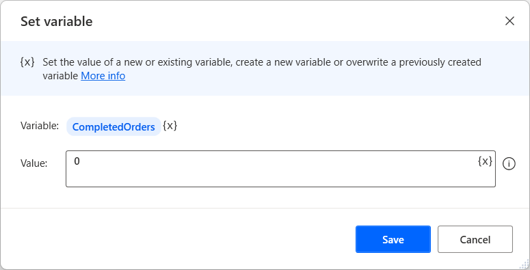
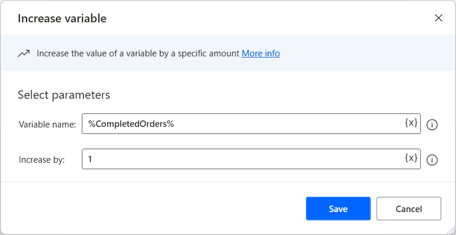
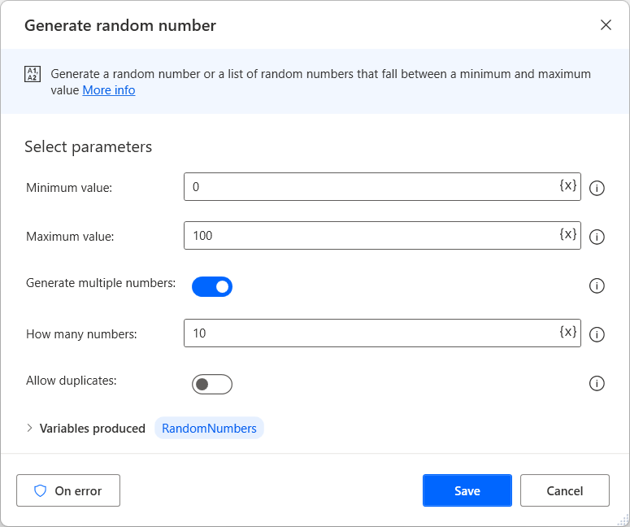
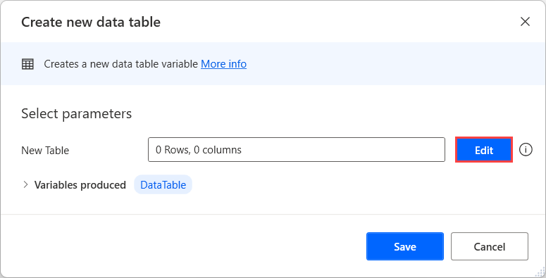

# Variables

All variable-related actions for different datatypes

[Create new data table](#createnewdatatable)  
[Insert row into data table](#addrowtodatatable)  
[Find or replace in data table](#findorreplaceindatatable)  
[Update data table item](#modifydatatableitem)  
[Delete row from data table](#deleterowfromdatatable)  
[Truncate number](#truncatenumber)    
[Generate random number](#generaterandomnumber)  
[Clear list](#clearlist)  
[Remove item from list](#removeitemfromlist)  
[Sort list](#sortlistbase)  
[Shuffle list](#shufflelist)  
[Merge lists](#mergelists)  
[Reverse list](#reverselist)  
[Remove duplicate items from list](#removeduplicateitemsfromlist)  
[Find common list items](#findcommonlistitems)  
[Subtract lists](#subtractlists)  
[Retrieve data table column into list](#retrievedatatablecolumnintolist)  
[Convert JSON to custom object](#convertjsontocustomobject)  
[Convert custom object to JSON](#convertcustomobjecttojson)  
[Add item to list](#additemtolist)  
[Create new list](#createnewlist)  
[Increase variable](#increasevariable)  
[Decrease variable](#decreasevariable)  
[Set variable](#assign)  

## Getting started with variable actions

To manually create a variable in a Power Automate desktop flow, deploy the **Set variable** action. The action requires you to provide a name and a value for the new variable.

To increase or decrease the value of a numeric variable, use the **Increase variable** and **Decrease variable** actions respectively.

Most actions output their result into a variable. For example, the **Create new list** action produces an empty list. 

Similarly, the **Generate random number** action produces a random numeric value. If you enable the **Generate multiple numbers** option in this action, you can create a list variable containing multiple random numeric values.

To add items to an existing list, use the **Add item to list** action. Populate a hard-coded value or a variable to define the item to add. Likewise, you can remove items from a list with the **Remove item from list** action.

>[!NOTE]
>List indexes start from 0, meaning that the first item in the list always has an index of 0. Use the notation %ListName[0]% to refer to the first item in the list, %ListName[1]% to the second, and so on.

If you want to create a datatable variable, deploy the **Create new data table** action and define the initial items of it using the visual builder. 

To manipulate a datatable variable, use the actions of the respective action subgroup, such as the **Find or replace in data table** and **Update data table item** actions.

## Variable actions

## Data table

Create and manipulate data in table variables

###  Create new data table
Creates a new data table variable

##### Input Parameters
|Argument|Optional|Accepts|Default Value|Description|
|-----|-----|-----|-----|-----|
|New table|No|[Datatable](../variable-data-types.md#datatable)||The input data table|

##### Variables Produced
|Argument|Type|Description|
|-----|-----|-----|
|DataTable|[Datatable](../variable-data-types.md#datatable)|The new data table|

#####  Exceptions
- This action doesn't include any exceptions

###  Insert row into data table
Inserts a row at the end or before a specific index value

##### Input Parameters
|Argument|Optional|Accepts|Default Value|Description|
|-----|-----|-----|-----|-----|
|Data table|No|[Datatable](../variable-data-types.md#datatable)||The data table variable to work with. This variable must have been previously specified by an action that produces a data table variable|
|Into location|N/A|End of data table, Before row index|End of data table|Specify whether to insert the new row at the end of the data table or before a specified row index|
|Row index|No|[Numeric value](../variable-data-types.md#numeric-value)||Insert the row index value to be used when before row index is specified as the into location parameter|
|New value(s)|No|[List](../variable-data-types.md#list), [Datarow](../variable-data-types.md#datarow)||This parameter accepts a list or datarow variable where the column count should match the column count in the data table|

##### Variables Produced
This action doesn't produce any variables

#####  Exceptions
|Exception|Description|
|-----|-----|
|Item index is out of range|Indicates that the provided item index is out of range|
|Invalid input arguments|Indicates that there's an invalid input parameter|
|Incompatible type error|Indicates that an input parameter of an incompatible type has been provided|

###  Find or replace in data table
Finds and/or replaces data table values

##### Input Parameters
|Argument|Optional|Accepts|Default Value|Description|
|-----|-----|-----|-----|-----|
|Data table|No|[Datatable](../variable-data-types.md#datatable)||The data table variable to work with. This variable must have been previously specified by an action that produces a data table variable|
|Search mode|N/A|Find, Find and replace|Find|The mode to search with (find or find and replace)|
|All matches|N/A|[Boolean value](../variable-data-types.md#boolean-value)|True|Specify whether to find or replace text in all the matching cells found or the first matching cell only|
|Text to find|No|[Text value](../variable-data-types.md#text-value)||The text to find in the data table|
|Find using a regular expression|N/A|[Boolean value](../variable-data-types.md#boolean-value)|False|Specify whether to use a regular expression to match the cell contents with the text to find|
|Match case|N/A|[Boolean value](../variable-data-types.md#boolean-value)|False|Specify whether to search for case-sensitive data|
|Match entire cell contents|N/A|[Boolean value](../variable-data-types.md#boolean-value)|False|Specify whether to search for cells that contain just the specified text|
|Text to replace with|No|[Text value](../variable-data-types.md#text-value)||The text used to replace the matching cells|
|Search by|N/A|Everywhere, On column|Everywhere|The order in which to search for the text (everywhere, or on column)|
|Column index or name|No|[Text value](../variable-data-types.md#text-value)||The column header or index value|

##### Variables Produced
|Argument|Type|Description|
|-----|-----|-----|
|DataTableMatches|[Datatable](../variable-data-types.md#datatable)|The data table containing the row and column indexes for matches|

#####  Exceptions
|Exception|Description|
|-----|-----|
|Provided regular expression is invalid|Indicates that the provided regular expression is invalid|
|Column name doesn't exist|Indicates that the provided column name doesn't exist|
|Column index is out of range|Indicates that the provided column index is out of range|
|Incompatible type error|Indicates that an input parameter of an incompatible type has been provided|

###  Update data table item
Update a data table row item on a defined column

##### Input Parameters
|Argument|Optional|Accepts|Default Value|Description|
|-----|-----|-----|-----|-----|
|Data table|No|[Datatable](../variable-data-types.md#datatable)||The data table variable to work with. This variable must have been previously specified by an action that produces a data table variable|
|Column|No|[Text value](../variable-data-types.md#text-value)||The column name or index of the item to update|
|Row|No|[Numeric value](../variable-data-types.md#numeric-value)||The row index of the item to update|
|New value|No|[Text value](../variable-data-types.md#text-value)||The new value to update at the specified row index and column|

##### Variables Produced
This action doesn't produce any variables

#####  Exceptions
|Exception|Description|
|-----|-----|
|Item index is out of range|Indicates that the specified data table item is out of range|
|Column name doesn't exist|Indicates that the provided column name doesn't exist|
|Column index is out of range|Indicates that the provided column index is out of range|
|Incompatible type error|Indicates that an input parameter of an incompatible type has been provided|

###  Delete row from data table
Update a data table row item on a defined column

##### Input Parameters
|Argument|Optional|Accepts|Default Value|Description|
|-----|-----|-----|-----|-----|
|Data table|No|[Datatable](../variable-data-types.md#datatable)||The data table variable to work with. This variable must have been previously specified by an action that produces a data table variable|
|Row index|No|[Numeric value](../variable-data-types.md#numeric-value)||The row index within a data table that should be deleted|

##### Variables Produced
This action doesn't produce any variables

#####  Exceptions
|Exception|Description|
|-----|-----|
|Item index is out of range|Indicates that the specified data table item is out of range|

###  Truncate number
Get the integral or fractional digits of a numeric value, or round up the value to a specified number of decimal places

##### Input Parameters
|Argument|Optional|Accepts|Default Value|Description|
|-----|-----|-----|-----|-----|
|Number to truncate|No|[Numeric value](../variable-data-types.md#numeric-value)||The number or variable that holds the numeric value to truncate/round up|
|Operation|N/A|Get integer part, Get decimal part, Round number|Get integer part|Specifies the operation to perform on the given number|
|Decimal places|Yes|[Numeric value](../variable-data-types.md#numeric-value)|3|The number of decimal places to round the given number up to. Enter 0 to return an integer as a result|

##### Variables Produced
|Argument|Type|Description|
|-----|-----|-----|
|TruncatedValue|[Numeric value](../variable-data-types.md#numeric-value)|The truncated or rounded number|

#####  Exceptions
- This action doesn't include any exceptions
###  Generate random number
Generate a random number or a list of random numbers that fall between a minimum and maximum value

##### Input Parameters
|Argument|Optional|Accepts|Default Value|Description|
|-----|-----|-----|-----|-----|
|Minimum value|Yes|[Numeric value](../variable-data-types.md#numeric-value)|0|The lower boundary for the random number(s) to generate|
|Maximum value|Yes|[Numeric value](../variable-data-types.md#numeric-value)|100|The upper boundary for the random number(s) to generate|
|Generate multiple numbers|N/A|[Boolean value](../variable-data-types.md#boolean-value)|False|Specifies whether to generate a single random number or a list of random numbers|
|How many numbers|Yes|[Numeric value](../variable-data-types.md#numeric-value)|10|Specifies how many random numbers to generate|
|Allow duplicates|N/A|[Boolean value](../variable-data-types.md#boolean-value)|False|Specifies whether to permit or prevent the same number from appearing more than once in the random numbers list|

##### Variables Produced
|Argument|Type|Description|
|-----|-----|-----|
|RandomNumber|[Numeric value](../variable-data-types.md#numeric-value)|The newly generated random number|
|RandomNumbers|[List](../variable-data-types.md#list) of [Numeric values](../variable-data-types.md#numeric-value)|The newly generated list of random numbers|

#####  Exceptions
|Exception|Description|
|-----|-----|
|Failed to generate random number|Indicates that there's an error generating a random number|

###  Clear list
Remove all items from a list

##### Input Parameters
|Argument|Optional|Accepts|Default Value|Description|
|-----|-----|-----|-----|-----|
|List to clear|No|[List](../variable-data-types.md#list) of [General values](../variable-data-types.md#general-value)||A list variable to remove its elements|

##### Variables Produced
This action doesn't produce any variables

#####  Exceptions
- This action doesn't include any exceptions
###  Remove item from list
Remove one or multiple items from a list

##### Input Parameters
|Argument|Optional|Accepts|Default Value|Description|
|-----|-----|-----|-----|-----|
|Remove item by|N/A|Index, Value|Index|Specifies whether to remove the item at a specified index or the item(s) with a specific value|
|At index|No|[Numeric value](../variable-data-types.md#numeric-value)||The index number of the item to remove|
|With value|No|[General value](../variable-data-types.md#general-value)||The item to remove|
|Remove all item occurrences|N/A|[Boolean value](../variable-data-types.md#boolean-value)|False|Removes all the occurrences that match the item specified|
|From list|No|[List](../variable-data-types.md#list) of [General values](../variable-data-types.md#general-value)||The list with items to remove|

##### Variables Produced
This action doesn't produce any variables

#####  Exceptions
|Exception|Description|
|-----|-----|
|Item index is out of range|Indicates that item index is out of range|
|Item not found|Indicates that item doesn't exist in the list|

###  Sort list
Sort the items of a list. Use items of the same type

##### Input Parameters
|Argument|Optional|Accepts|Default Value|Description|
|-----|-----|-----|-----|-----|
|List to sort|No|[List](../variable-data-types.md#list) of [General values](../variable-data-types.md#general-value)||The variable that holds the list to sort|
|Sort by list item's properties|N/A|[Boolean value](../variable-data-types.md#boolean-value)|False|If the list items are objects (such are files, folders, etc), enable this option to sort the item by a specific property. Leave this option disabled to sort the elements by their default property (e.g., file objects will be sorted by their full path)|
|First property to sort by|Yes|[Text value](../variable-data-types.md#text-value)||The name of an item's property to sort the list by. Refer to the help file for the property names of each object|
|Sort|N/A|Ascending, Descending|Ascending|Specifies whether to sort by the first property ascending or descending|
|Second property to sort by|Yes|[Text value](../variable-data-types.md#text-value)||The name of a second property to sort the list by|
|Sort|N/A|Ascending, Descending|Ascending|Specifies whether to sort by the second property ascending or descending|
|Third property to sort by|Yes|[Text value](../variable-data-types.md#text-value)||The name of a third property to sort the list by|
|Sort|N/A|Ascending, Descending|Ascending|Specifies whether to sort by the third property ascending or descending|

##### Variables Produced
This action doesn't produce any variables

#####  Exceptions
- This action doesn't include any exceptions
###  Shuffle list
Create a random permutation of a list

##### Input Parameters
|Argument|Optional|Accepts|Default Value|Description|
|-----|-----|-----|-----|-----|
|List to shuffle|No|[List](../variable-data-types.md#list) of [General values](../variable-data-types.md#general-value)||The variable that contains the list to shuffle|

##### Variables Produced
This action doesn't produce any variables

#####  Exceptions
- This action doesn't include any exceptions
###  Merge lists
Merge two lists into one

##### Input Parameters
|Argument|Optional|Accepts|Default Value|Description|
|-----|-----|-----|-----|-----|
|First list|No|[List](../variable-data-types.md#list) of [General values](../variable-data-types.md#general-value)||The first list of items to merge|
|Second list|No|[List](../variable-data-types.md#list) of [General values](../variable-data-types.md#general-value)||The second list of items to merge|

##### Variables Produced
|Argument|Type|Description|
|-----|-----|-----|
|OutputList|[List](../variable-data-types.md#list) of [General values](../variable-data-types.md)|The merged list. The initial lists aren't affected|

#####  Exceptions
|Exception|Description|
|-----|-----|
|The lists supplied are of incompatible types|Indicates that the lists supplied are of incompatible types|

###  Reverse list
Reverse the order of the items of a list

##### Input Parameters
|Argument|Optional|Accepts|Default Value|Description|
|-----|-----|-----|-----|-----|
|List to reverse|No|[List](../variable-data-types.md#list) of [General values](../variable-data-types.md#general-value)||The list whose items order to reverse|

##### Variables Produced
This action doesn't produce any variables

#####  Exceptions
- This action doesn't include any exceptions
###  Remove duplicate items from list
Remove the multiple occurrences of items in a list, so that in the resulting list each item will be unique

##### Input Parameters
|Argument|Optional|Accepts|Default Value|Description|
|-----|-----|-----|-----|-----|
|List to remove duplicate items from|No|[List](../variable-data-types.md#list) of [General values](../variable-data-types.md#general-value)||The list variable to remove duplicate items from|
|Ignore text case while searching for duplicate items|N/A|[Boolean value](../variable-data-types.md#boolean-value)|False|Specifies whether to perform case insensitive comparison of text while searching for duplicate items (only applies to lists made of text items)|

##### Variables Produced
This action doesn't produce any variables

#####  Exceptions
- This action doesn't include any exceptions
###  Find common list items
Compare two lists and create a new list with the items that are common to both

##### Input Parameters
|Argument|Optional|Accepts|Default Value|Description|
|-----|-----|-----|-----|-----|
|First list|No|[List](../variable-data-types.md#list) of [General values](../variable-data-types.md#general-value)||The variable that contains the first list to compare|
|Second list|No|[List](../variable-data-types.md#list) of [General values](../variable-data-types.md#general-value)||The variable that contains the second list to compare|

##### Variables Produced
|Argument|Type|Description|
|-----|-----|-----|
|IntersectionList|[List](../variable-data-types.md#list) of [General values](../variable-data-types.md#general-value)|The new list of common items|

#####  Exceptions
- This action doesn't include any exceptions
###  Subtract lists
Compare two lists and create a new list with the items that are in the first list but not in the second

##### Input Parameters
|Argument|Optional|Accepts|Default Value|Description|
|-----|-----|-----|-----|-----|
|First list|No|[List](../variable-data-types.md#list) of [General values](../variable-data-types.md#general-value)||The variable that holds the first list to compare|
|Second list|No|[List](../variable-data-types.md#list) of [General values](../variable-data-types.md#general-value)||The variable that holds the second list to compare|

##### Variables Produced
|Argument|Type|Description|
|-----|-----|-----|
|ListDifference|[List](../variable-data-types.md#list) of [General values](../variable-data-types.md#general-value)|The new resulting list|

#####  Exceptions
- This action doesn't include any exceptions
###  Retrieve data table column into list
Convert the contents of a data table column into a list

##### Input Parameters
|Argument|Optional|Accepts|Default Value|Description|
|-----|-----|-----|-----|-----|
|Data table|No|[Datatable](../variable-data-types.md#datatable)||The data table with the column to convert into a list|
|Column name or index|No|[Text value](../variable-data-types.md#text-value)||The column name, if column names are defined, or the index number of the column to retrieve|

##### Variables Produced
|Argument|Type|Description|
|-----|-----|-----|
|ColumnAsList|[List](../variable-data-types.md#list) of [General values](../variable-data-types.md#general-value)|The new list that holds the contents of the specified data table|

#####  Exceptions
|Exception|Description|
|-----|-----|
|Column name doesn't exist|Indicates that the column name isn't in the data table|
|Column index is out of range|Indicates that the column index is out of range|

###  Convert JSON to custom object
Convert a JSON string to a custom object

##### Input Parameters
|Argument|Optional|Accepts|Default Value|Description|
|-----|-----|-----|-----|-----|
|JSON|No|[Text value](../variable-data-types.md#text-value)||A JSON text, or a previously created variable containing one, to convert it to a custom object|

##### Variables Produced
|Argument|Type|Description|
|-----|-----|-----|
|JsonAsCustomObject|[General value](../variable-data-types.md#general-value)|The converted custom object from the provided JSON|

#####  Exceptions
|Exception|Description|
|-----|-----|
|Error parsing the JSON|Indicates that there's an error parsing the specified JSON|

###  Convert custom object to JSON
Convert a custom object to a JSON string

##### Input Parameters
|Argument|Optional|Accepts|Default Value|Description|
|-----|-----|-----|-----|-----|
|Custom object|No|[Custom object](../variable-data-types.md#custom-object)||The custom object to convert to JSON|

##### Variables Produced
|Argument|Type|Description|
|-----|-----|-----|
|CustomObjectAsJson|[Text value](../variable-data-types.md#text-value)|The converted JSON from the provided custom object|

#####  Exceptions
|Exception|Description|
|-----|-----|
|Error parsing the custom object|Indicates that there's an error parsing the custom object|

###  Add item to list
Append a new item to a list

##### Input Parameters
|Argument|Optional|Accepts|Default Value|Description|
|-----|-----|-----|-----|-----|
|Add item|No|[General value](../variable-data-types.md#general-value)||A value or a variable to add to the list. Provide a list of values to append multiple elements. If the list has a specific type of elements, the new element is converted over to that type|
|Into list|No|[List](../variable-data-types.md#list) of [General values](../variable-data-types.md#general-value)||A list variable to append the new elements to|

##### Variables Produced
|Argument|Type|Description|
|-----|-----|-----|
|NewList|[List](../variable-data-types.md#list) of [General values](../variable-data-types.md#general-value)|The new list|

#####  Exceptions
- This action doesn't include any exceptions
###  Create new list
Create a new empty list

##### Input Parameters
- This action doesn't require any input

##### Variables Produced
|Argument|Type|Description|
|-----|-----|-----|
|List|[List](../variable-data-types.md#list) of [General values](../variable-data-types.md#general-value)|The new list|

#####  Exceptions
- This action doesn't include any exceptions
###  Increase variable
Increase the value of a variable by a specific amount

##### Input Parameters
|Argument|Optional|Accepts|Default Value|Description|
|-----|-----|-----|-----|-----|
|Variable name|No|[Numeric value](../variable-data-types.md#numeric-value)||The numeric value to increase|
|Increase by|No|[Numeric value](../variable-data-types.md#numeric-value)||A numeric value, or a previously created variable containing one, to increase the variable by|

##### Variables Produced
This action doesn't produce any variables

#####  Exceptions
- This action doesn't include any exceptions
###  Decrease variable
Decrease the value of a variable by a specific amount

##### Input Parameters
|Argument|Optional|Accepts|Default Value|Description|
|-----|-----|-----|-----|-----|
|Variable name|No|[Numeric value](../variable-data-types.md#numeric-value)||A numeric value, or a previously created variable containing one, to decrease the variable by|
|Decrease by|No|[Numeric value](../variable-data-types.md#numeric-value)||A numeric value, or a previously created variable containing one, to decrease the variable by|

##### Variables Produced
This action doesn't produce any variables

#####  Exceptions
- This action doesn't include any exceptions
###  Set variable
Set the value of a new or existing variable, create a new variable or overwrite a previously created variable

##### Input Parameters
|Argument|Optional|Accepts|Default Value|Description|
|-----|-----|-----|-----|-----|
|To|No|*||The value to assign to the variable|

##### Variables Produced
|Argument|Type|Description|
|-----|-----|-----|
|NewVar|*|The name of the variable to set|

>[!NOTE]
> Produced variable names, may not contain special characters, white spaces and non-latin characters and can't start with arithmetic characters.

#####  Exceptions
- This action doesn't include any exceptions

[!INCLUDE[footer-include](../../includes/footer-banner.md)]