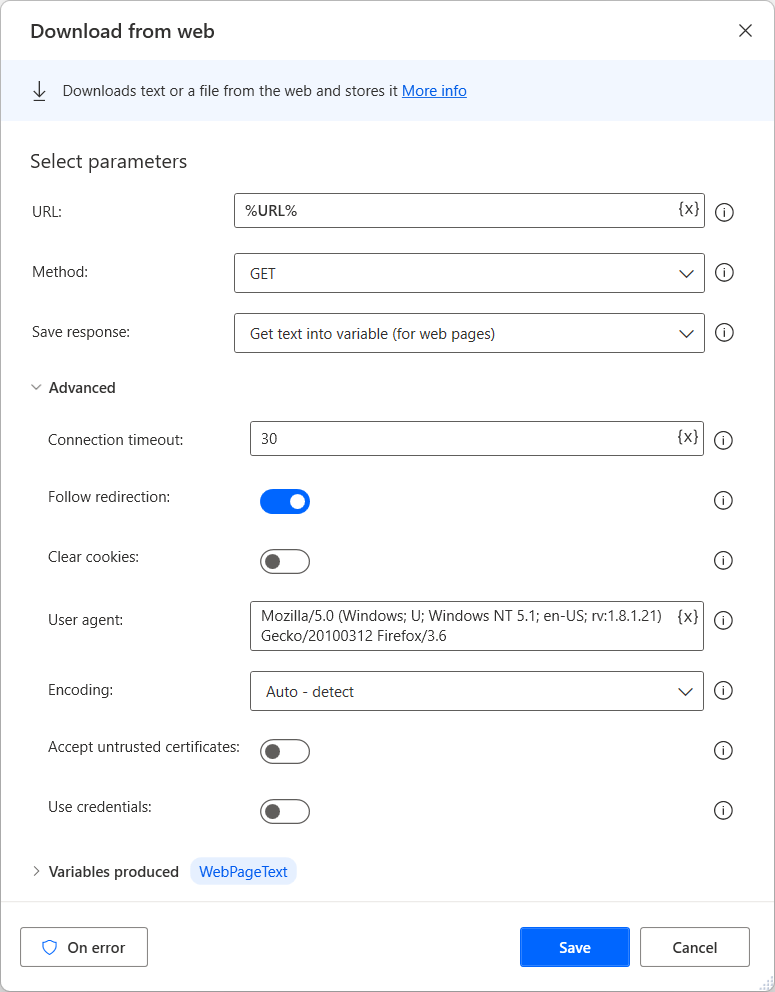

# Automate web flows

The flow designer includes a number of actions under the **Web automation** category, each of them corresponding to an interaction between a user and a web browser.

Four web browsers are currently supported:

* Internet Explorer
* Edge
* Firefox
* Chrome

Web automation is achieved by launching, or attaching to, one of the aforementioned browsers, then performing web automation actions on them. Development may be performed manually, or through the use of the web recorder.

## Building a web automation flow

To begin a web automation flow, use one of the Launch web browser actions (**Launch new Internet Explorer**, **Launch new Edge**, **Launch new Firefox**, or **Launch new Chrome**) to start a new browser session, or attach to an already existing one:

> [!NOTE]
> Some browsers may require configuration before they can be used in Power Automate Desktop. Refer to the relevant article for more information.

After the browser session is stored in a variable, add other web automation actions to interact with the browser's content. The **Web form filling** action group focuses on providing input to web pages, while **Web data extraction** actions draw data from web pages, to be used in the flow.

Most web automation actions require a browser instance as input, as well as a web element with which to interact:

Existing web elements may be added from the repository, while new ones may also be added directly from the action's properties:

To add a new element, highlight it and press **Ctrl & left-click**:

After adding all the required elements, select **Done** to save them to the repository.

## Data population on the web

To provide input to a web page, select the appropriate **Web form filling** action depending on the nature of the element to interact with, and specify the browser instance:

## Web data extraction

To extract a piece of data from a web page, use the appropriate action, depending on whether the data in question concerns the entire web page, or an element inside it:

To extract larger amounts of data, use the **Extract data from web page** action, then right-click on the required data on the web page to view the available options:

 Note that any lists or tables of data will be automatically identified after two of their elements are designated for extraction:

You'll find the list of web automation actions available in the [Actions reference](actions-reference/webautomation.md).

## Interacting with the web and web services

It is possible to communicate directly with web resources, such as web pages, files, and APIs, without using a web browser.

## Downloading web resources

Use the **Download from web** action to directly download web page content, or files on the web:

Both the **GET** and **POST** methods may be used with this action; files can be downloaded directly to the disk, while web page contents are saved into a variable.

## Accessing web APIs

Use the **Invoke web service** action to access web APIs:

A variety of methods are compatible with this action, which is fully customizable in order to accommodate virtually any API.

You'll find the list of web related actions available in the [Actions reference](actions-reference/web.md).
