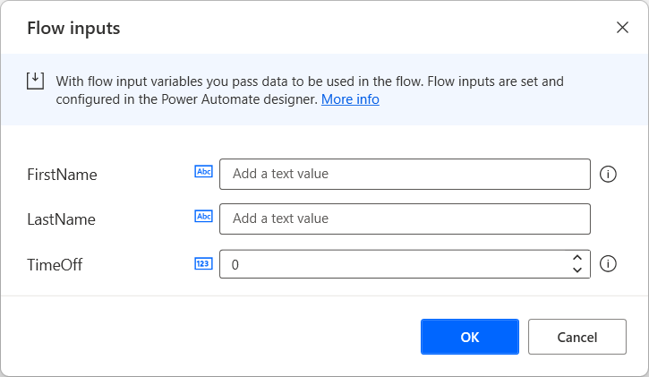

# Power Automate for desktop console

The flow console is the central interface of Power Automate.

After signing in, your username will be displayed in the top-right corner, while a list of flows occupies the central pane. At the top right-hand side, a dropdown list allows you to switch environments in order to access different flows; alongside the environments are also the Settings and Help buttons, and a search bar for easily locating flows.

## Starting a desktop flow

Users may run any Power Automate desktop flows available to them through the console, by hovering the cursor over a desktop flow and pressing the "Start" button. The status of the flow is also displayed:

If the flow contains input variables, a dialog box prompts the user to provide values for each input variable.

## Editing a desktop flow

Through the console, users may also create a new flow by pressing the "New flow" button, or edit an already existing one by double-clicking on it, or hovering the cursor over it and pressing the edit button:

In both scenarios, the flow designer will be launched; this is where flow creation and editing takes place.

>[!NOTE]
> When more than one people make changes to a shared desktop flow, the last one that saves the flow overrides all previous actions.

## Console Settings

Press the **Settings** button to configure Power Automate for desktop to your liking:

Under the **Application** category, select whether Power Automate should launch automatically, whether closing the console will close the application as well, and whether Power Automate should be able to display Windows notifications. You may also set a hotkey combination to instantly stop a running flow.

Decide whether Microsoft may collect diagnostic data to improve user experience under **Data collection**. 

>[!NOTE]
>Only an admin may change Data collection settings.

## Update Power Automate for desktop

Power Automate will frequently check for updates and display a notification dialog. In order not to disrupt your work, the update dialog offers you the option to delay the update and proceed with it at a later time. If you don't wish to receive any update notifications, you may uncheck the **Show update notifications** option in the general settings. To manually update, you may click on the **Check for updates** button in the general settings.

## Switch organization

For cases that a user is member of more than one tenants, they can switch between them by selecting their alias at the top right of the console window and clicking on **Switch organziation**.

[!INCLUDE[footer-include](../includes/footer-banner.md)]