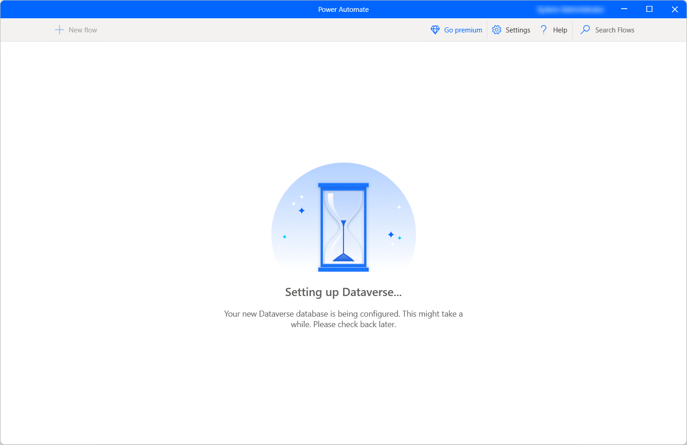
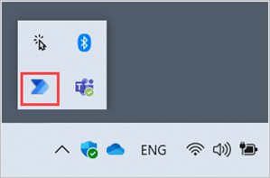

# Create a Microsoft Dataverse database

A Microsoft Dataverse database stores flows created in Power Automate.

>[!NOTE]
>For the preview release, you may need to create a Dataverse database before using Power Automate for desktop with your work or school account. This must be done only once in a tenant.

If you are an administrator or if you would like to provide information to the administrator to create a Dataverse database, see [Add a Microsoft Dataverse database](/power-platform/admin/create-database).

## Create a Microsoft Dataverse database in Power Automate for desktop

Administrators can create a Microsoft Dataverse database in Power Automate. 

If you're using a free work or school account, the provisioning will start automatically after logging in with your account. If the connected account is a premium account, select **Create database** to create a Microsoft Dataverse database.

   

## Add a Microsoft Dataverse database as a Microsoft Teams user

You can use the approvals experience in Teams to automatically add a Dataverse database that Power Automate can use to store flows. This only needs to be done once per tenant and non-admins can perform this task.

Follow these steps to create an approval from the Approvals app in Teams.

1. Sign into [Microsoft Teams](https://teams.microsoft.com/).

1. Select **More added apps (...)**.

   

1. Search for **approvals**, and then select the **Approvals** app.

1. Select **New approval request** on the top right of the app.

   

1. Provide a name for your request.
   For example, *My first request*.

1. Specify yourself in the **Approvers** list.

   

1. Select **Send**.

    This starts the process for adding a Dataverse database and may take a few minutes to complete. Once created, you will receive a notification in Teams with a request for approval.

    

1.  Approve this request.

    Your Dataverse database is now added to the default environment. 

1. Restart Power Automate for desktop (exit from the system tray icon).

    

You can now create desktop flows with Power Automate.

   

## Next Steps

- Learn how to [set up Power Automate for desktop](setup.md).
- Begin your journey in Power Automate by [creating a Power Automate desktop flow](create-flow.md). 
- Get familiar with the [console](console.md) and the [flow designer](flow-designer.md), which are part of Power Automate. 
- You'll find the list of actions available in the [Actions reference](actions-reference.md).