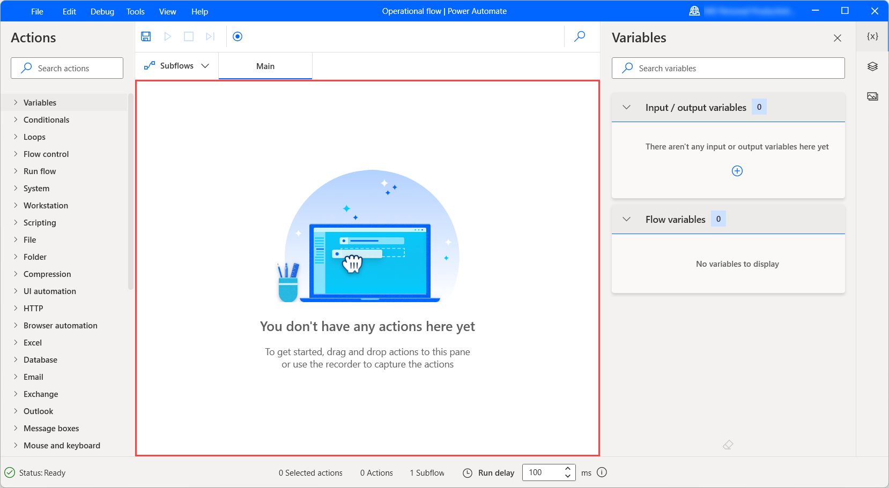
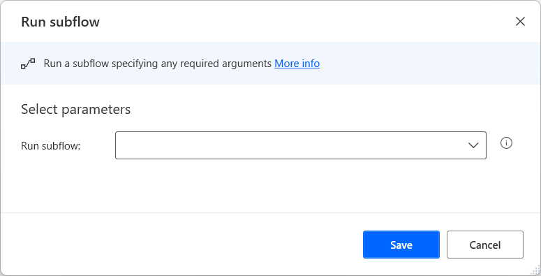

# Manage the flow designer workspace

The central pane of the flow designer is called the workspace. Here is where the series of actions that make up the flow is assembled:

During development, users may add, edit, and delete actions in the workspace.

Drag actions to rearrange them and change the order in which they run. Right-click an action and select **Enable action** or **Disable action** to enable or disable an action respectively; while running, the flow skips any disabled actions.

Copy and paste any selected actions in the workspace. This can be done within the same subflow, among different subflows, or other open instances of flow designer.

## Setting up subflows

Subflows are groups of actions, which may be referenced as a group within a cloud flow.

Every flow contains the **Main** subflow - this is the subflow that is run when a cloud flow starts. Any other subflows may be invoked through the **Run subflow** action:

Subflows are shown in tabs, directly over the main workspace. To add a new subflow, select the subflows tab, select **+**, and enter the subflow name.

Select a subflow tab to edit the respective subflow.

## Managing the workspace toolbar

Drag actions to rearrange them and change the order in which they run. Right-click an action and select **Enable action** or **Disable action** to enable or disable an action respectively. While running, the flow skips any disabled actions.

Hold down **Ctrl** to select multiple actions. Hold down **Shift** and select the first and last actions to select a range of actions. Copy and paste any selected actions in the workspace. Copy and paste actions within the same subflow, among different subflows, or other open instances of flow designer. When copying actions within the same flow, all their parameters are copied as well.

## Searching in the flow

To search for a text string, an action or variable within the flow, use the search field at the top right of the flow designer window. The results pane will show all occurrences of text string by action and subflow. Double-click on a result to highlight the action which contains it.

## Using the Go to line option

The Go to line function navigates to a specific line within the current subflow. This function is helpful in subflows which contain a large number of actions. 

Select **Edit**, then **Go to line** and enter a line. The corresponding action will be highlighted.

## Using the Run from here option

To run the flow starting from a specific action, right-click the action and select **Run from here**. This ignores all previous actions and runs the flow from the selected action onwards.

## Making use of the recorders

### Web recorder
To record web actions in real time, select Web recorder in the toolbar. In the dialog box, select the browser you would like to use. Select **Advanced** to show additional options. Use an existing web browser instance, or create a new instance, specifying an instance name. Additionally specify the tab to record web actions in.

Select **Start recording** in the Web recorder window to record actions. Web recorder keeps track of browser actions, and records each action separately. Select **Pause recording** to suspend recording actions. Select **+** to add a comment to the recorded actions.

Select the bin icon to remove individual actions. Select **Reset recording** to delete all actions recorded so far. After recording is complete, select Finish, so that the recorded actions and comments are placed in the workspace.

### Desktop recorder
Select **Desktop recorder** in the toolbar to record desktop actions. Select **Start recording** in the Desktop recorder window to record actions. Desktop recorder keeps track of mouse and keyboard activity in relation to UI elements, and records each action separately. Select **Pause recording** to suspend recording actions. Select **+** to add a comment to the Recorded actions.

Select the bin icon to remove individual actions, or select **Reset recording** to delete all actions recorded so far. After recording is complete, select Finish, so that the recorded actions and comments are placed in the workspace.

