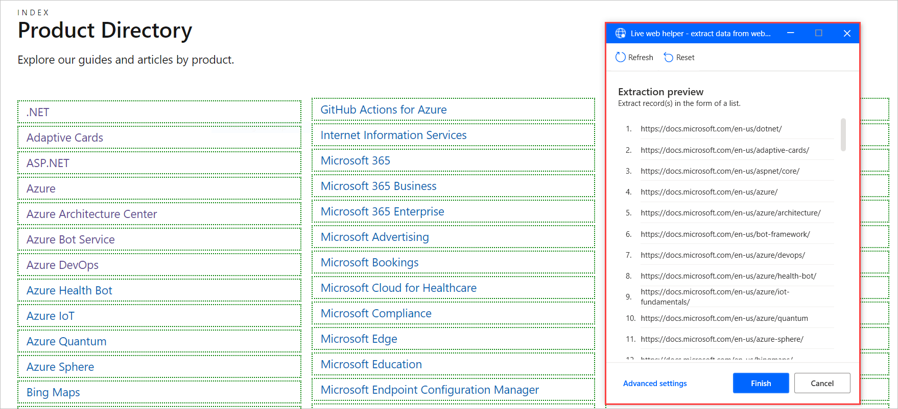
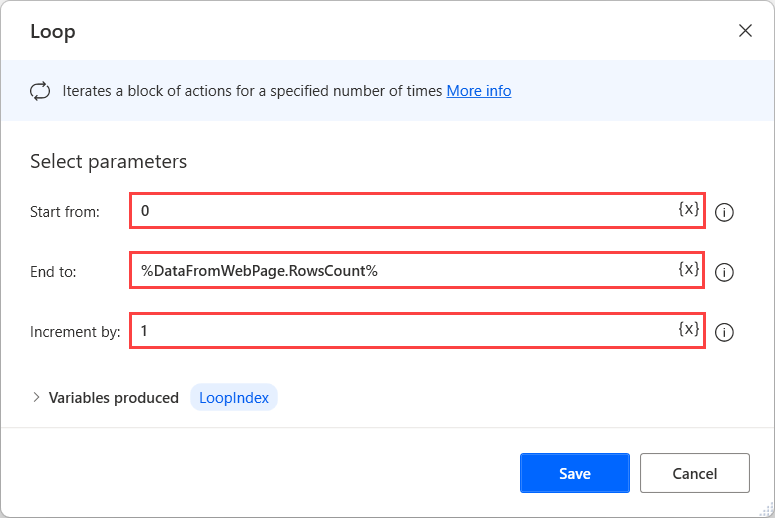
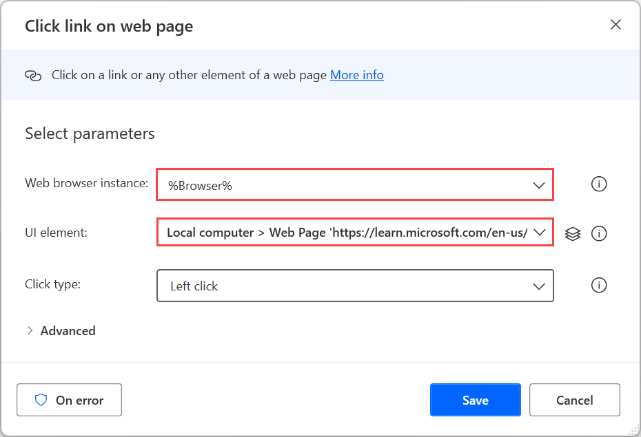
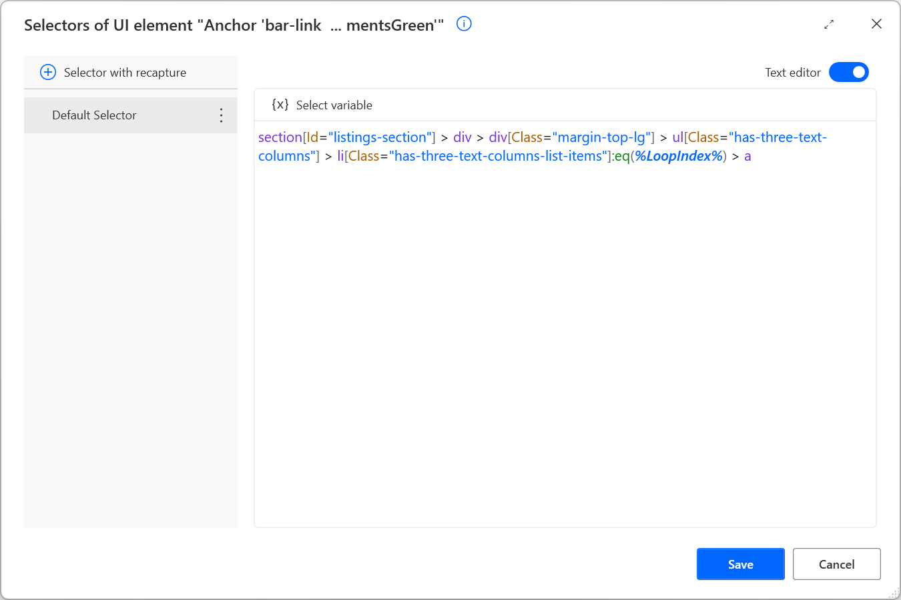
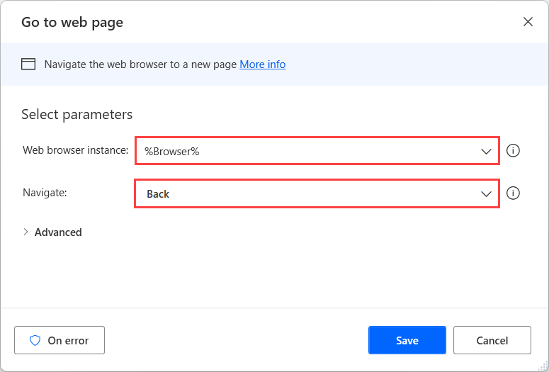

# Click all the elements in a list of links

In web automation, it's common to meet scenarios that require you to click all the elements in a list of links.

To automate these scenarios, use the **Extract data from web page** action and extract a random value from two consecutive links. Power Automate Desktop will automatically extract the respective value from all the links in the list.

> [!NOTE]
> You can find more information regarding web data extraction in [Automate web flows
](../automation-web.md).

After the extraction, you can use the **DataFromWebPage.RowsCount** property to get the number of the elements in the list.

To make the flow iterate through all the links on the page, use a **Loop** action. The loop should start from 0 and end at **%DataFromWebPage.Count-1%**.

Inside the loop, use the **Click link on web page** action and select a UI element of the first link as an input.

To make the action click all the links, modify the selector to click a different link in each loop iteration. 

To achieve this functionality, edit the selector with the **Custom selector builder**. In this step, the right part of the selector should look something like the following example:
**ul[properties] > li[properties]:eq(0) > a[properties]**

To make it select a different link in each iteration, change the **tr:eq(0)** part to **tr:eq(%LoopIndex%)**.

> [!NOTE]
> You can find more information regarding custom selectors in [Build a custom selector](../build-custom-selectors.md).

Lastly, use the **Go to web page** action to go back to the original page after each click. You can perform additional operations on each loaded page between the **Click link on web page** and **Go to web page** actions.

