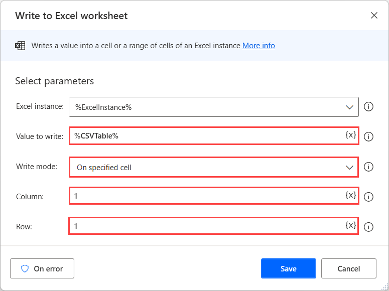

# Convert a CSV file into an Excel spreadsheet

A comma-separated values file (CSV) is a delimited text file that uses a specific character to separate a series of values.

Power Automate allows you to open comma-delimited and tab-delimited CSV files directly through the **Launch Excel** action.

To convert a CSV file of this type to XLSX, open the file and then save it as a new Excel workbook using the **Save document as** option in the **Close Excel** action.

Although the **Launch Excel** action can handle the previously mentioned cases, semicolon-delimited CSV files may require a different approach. 

> [!NOTE]
> Excel uses the list separators defined in the Windows regional settings. In some regions, you have to manually set the semicolon character as a separator or apply the following workaround.

To overcome this limitation, deploy the **Read from CSV file** action and set the semicolon character (**;**) as a custom separator in the advanced options. If the first row of the CSV file contains headers, enable the **First line contains column names** option to use the respective headers at the retrieved datatable.

Next, launch a blank Excel document using the **Launch Excel** action and paste the CSV table into cell A1 using the **Write to Excel worksheet** action. 

Now, you can deploy the **Close Excel** action to save the Excel worksheet as a new XLSX file.

