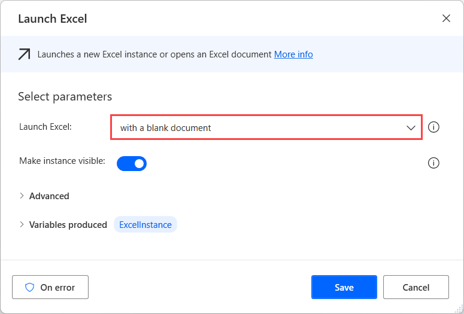
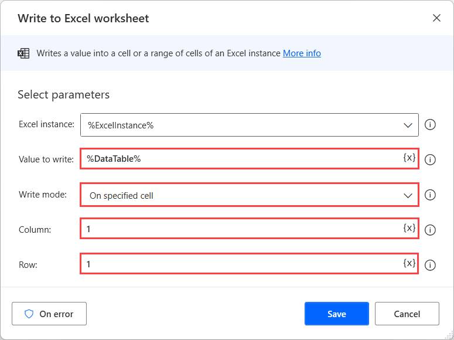
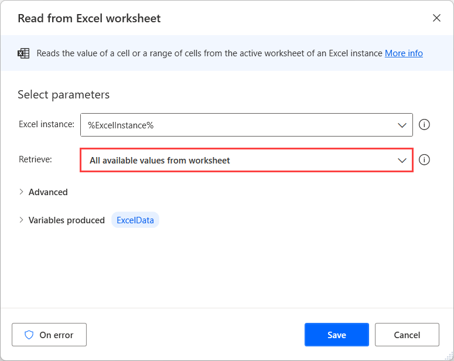
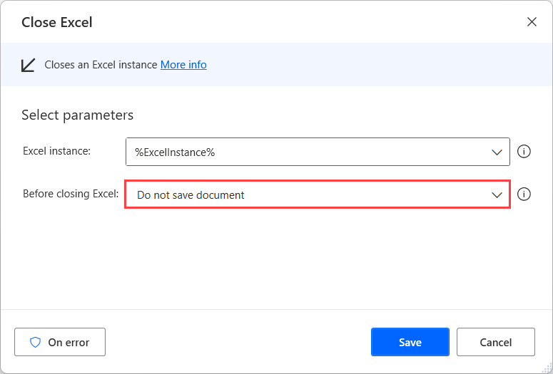

# Delete a row/column from a datatable

Although Power Automate Desktop doesn't provide a direct way to delete rows and columns from datatables, this functionality is feasible with the following workaround:

1. Use the **Launch Excel** action to launch a new Excel worksheet.

    

1. Deploy the **Write to Excel worksheet** action and configure it to write the datatable to the previously launched worksheet.

    

1. Use the **Delete row from Excel worksheet** or the **Delete column from Excel worksheet** action to delete the wanted row or column of the table, respectively.

    

1. Use the **Get first free column/row from Excel worksheet** action to retrieve the worksheet's first free row and column.

    

1. Deploy the **Read from Excel worksheet** and read all the data from the Excel worksheet. To find the last populated row and column, use the produced variables of the **Get first free column/row from Excel worksheet** action.

    

1. Close the Excel worksheet without saving using the **Close Excel** action.

    