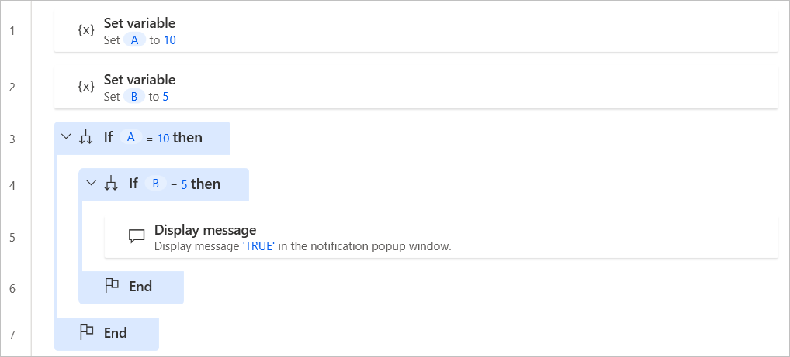
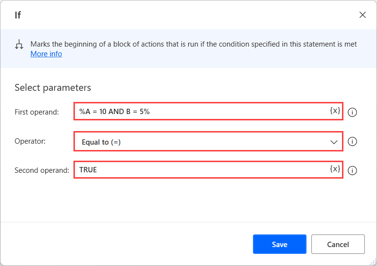

# Use logical operations on conditional statements 

Data validation is a typical requirement in most business tasks and allows the implementation of different behavior based on the available data. 

Power Automate Desktop provides various conditionals that execute blocks of actions only if a given condition is met. If the condition is false, the actions are skipped.

> [!NOTE]
> You can find more information regarding conditionals in [Use conditionals](../use-conditionals.md).

While validating data, you may encounter cases where you need to check multiple variables in the same part of the flow. For example, you may want to run a set of actions only if two variables have specific values.

To implement this functionality, you can use either multiple nested **If** actions or a single **If** action containing a complex logical expression.

To create a nested if statement, deploy an **If** action within the block of another **If** action. All the actions inside the nested block will run only when both if statements are valid. 

Although the implementation of nested if statements is convenient in some cases, it can lead to complicated flows when many checks are needed.

A more efficient way to achieve the same results is the use of complex logical expressions. In the following example, you can see a single **If** action that offers the same result as the previously nested **If** actions.

The expression in the **First operand** field uses the **AND** operator to check whether the variables **A** and **B** contain the value **10** and **5**, respectively.

In general, logical operators can check multiple conditions simultaneously, allowing you to implement more complex logic in a single expression. The **AND** operator returns **TRUE** when both parts of the expression are valid. To check if either of the two parts (or both) are valid, use the **OR** operator.

The **Second operand** field is populated with the value **TRUE**, while the selected **Operator** is **Equals to**. This configuration makes the action check if the expression in the **First operand** field is valid. If it's valid, the actions inside the if block will run. To check if an expression is invalid, populate the value **FALSE** in the **Second operand** field.

> [!NOTE]
> The logical expression must be enclosed by percentage signs (**%**). The percentage sign is used as a special character to denote variables and expressions. You can find more information regarding percentage notation in [Use variables and the % notation](../variable-manipulation.md).

