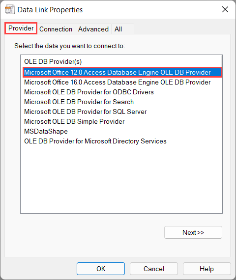
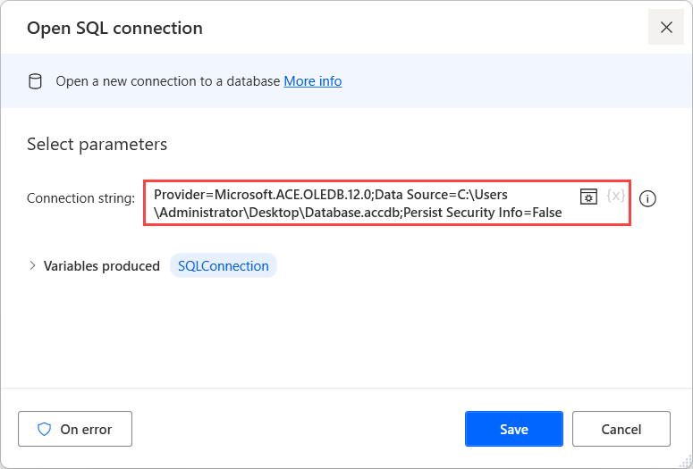
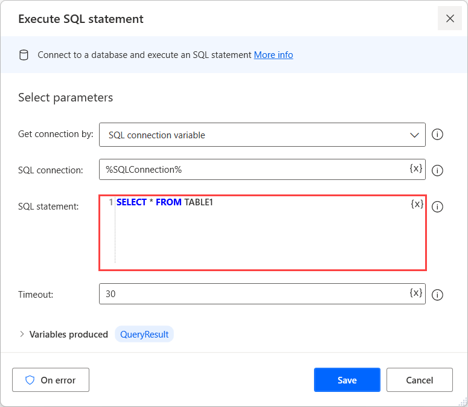

# Run SQL queries to Microsoft Access

Apart from database servers, Power Automate Desktop supports the automation of Microsoft Access databases.

To establish a connection with a Microsoft Access database, use the **Open SQL connection** action, and open the connection string builder.

In the **Provider** tab of the appeared dialog, select **Microsoft Office 12.0 Access Database Engine OLE DB Provider**.

> [!NOTE]
> If the presented provider is missing from the available options, you have to download and install [Microsoft Access Database Engine 2010 Redistributable](https://www.microsoft.com/download/details.aspx?id=13255).

Next, populate the path of the Microsoft Access database in the **Data Source** field of the **Connection** tab.

The generated connection string must be similar to the following one:

**Provider=Microsoft.ACE.OLEDB.12.0;Data Source=DatabasePath;Persist Security Info=False**

> [!NOTE]
> All the connection strings that establish connections with Microsoft Access databases consist of three main parts: the provider, the data source, and the security credentials (if applicable).

To run queries on the connected database, use the **Execute SQL statement** action. Power Automate Desktop supports all the essential queries, such as **SELECT**, **INSERT INTO**, and **UPDATE**.

When all the queries have been executed, deploy the **Close SQL connection** to close the connection with the database.