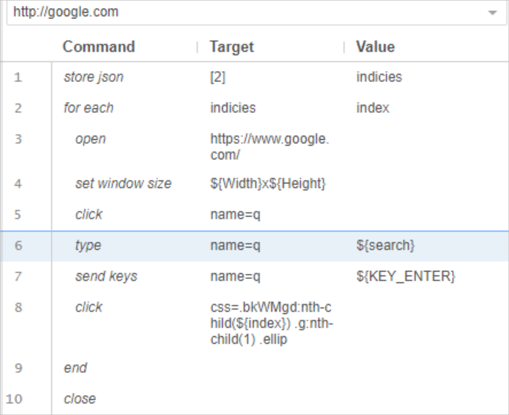

# Use inputs and outputs in Selenium IDE flows

> [!IMPORTANT]
>
> From February 28 2023, Selenium IDE will no longer be supported. Migrate your flows created with Selenium IDE to Power Automate for desktop or delete them.

You can define inputs to pass to your automated applications during playback. You can also pass *output* from your automated applications to your flow.

## Define inputs for a Web UI flow

Inputs of a UI flow let you pass information from an external source such as a database or another UI flow to the target legacy software that you will automate.

Any variable that is used (read) before initialization (usually done via **store** commands) will be automatically treated as an input variable and it will be displayed on the **Run a UI flow for web** action card.

You can use variables via string interpolation, for example, change the click command's target field to "id=\${elementId}". Or change the type command's value field to "\${inputText}".

The command, **set window size** and the command, **type** in the following screenshots use uninitialized variables \${Width}, \${Height}, and \${search}. These variables will become input values.

You can use variables directly in some commands, for example, forEach command's target/value fields are both variables, you don't need to surround it with "\${}".

Consult [Selenium commands](https://www.seleniumhq.org/selenium-ide/docs/en/api/commands/) reference to determine which commands take variable names directly.

## Define outputs for a Web UI flow

Any variable defined in the selenium script automatically becomes an output value. Use the following commands to declare variables:

[Store](https://www.seleniumhq.org/selenium-ide/docs/en/api/commands/#store)

[Store attribute](https://www.seleniumhq.org/selenium-ide/docs/en/api/commands/#store-attribute)

[Store json](https://www.seleniumhq.org/selenium-ide/docs/en/api/commands/#store-json)

[Store title](https://www.seleniumhq.org/selenium-ide/docs/en/api/commands/#store-title)

[store value](https://www.seleniumhq.org/selenium-ide/docs/en/api/commands/#store-value)

[Store window handle](https://www.seleniumhq.org/selenium-ide/docs/en/api/commands/#store-window-handle)

[Store xpath count](https://www.seleniumhq.org/selenium-ide/docs/en/api/commands/#store-xpath-count)

[Execute script](https://www.seleniumhq.org/selenium-ide/docs/en/api/commands/#execute-script)(add 'return' syntax to return the object you want to store at the end of the
script)

## Next steps

- Learn how to [create Selenium IDE flows](create-web.md).
- Learn how to [trigger Windows recorder (V1) flows](run-desktop-flow.md).

[!INCLUDE[footer-include](../includes/footer-banner.md)]