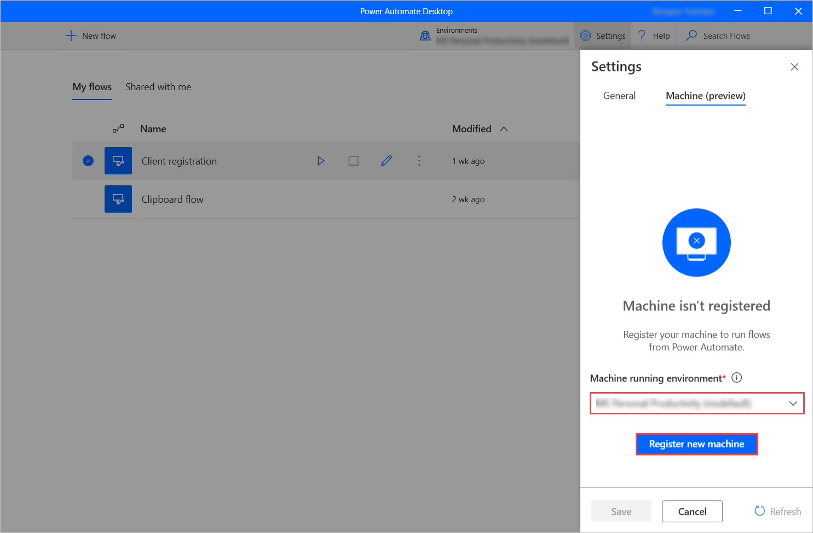
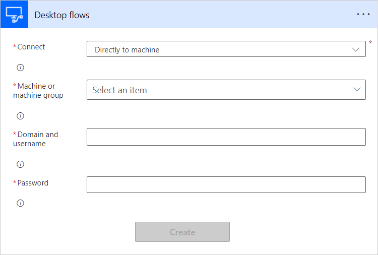
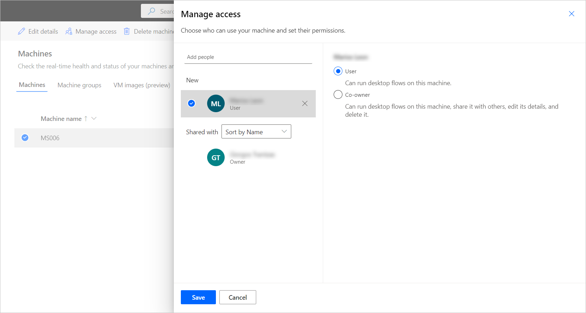

# Manage machines (preview)

[!INCLUDE [cc-beta-prerelease-disclaimer](../includes/cc-beta-prerelease-disclaimer.md)]

Machines are the physical or virtual devices that are used to automate your desktop processes. When you connect your machine to Power Automate, you can you can instantly start your desktop automation using any of the wide array of [available triggers](../triggers-introduction.md), such as when you receive an e-mail or on a pre-defined scheduled. 

Connecting your machine directly to Power Automate and the cloud allows you to harness the full power of your robotic process automation (RPA). The easiest way to connect your machine to the cloud is with our direct connectivity. All you need to do is ensure that you are signed into the latest version of Power Automate Desktop, and your machine will be registered with Power Automate automatically. Once registered, you can create a connection right away in your cloud flows. 

> [!IMPORTANT]
> Direct connectivity is only available for versions of Power Automate Desktop  2.8.73.21119 or newer. If you are using an older version, [update to the latest](https://go.microsoft.com/fwlink/?linkid=2102613).

> [!IMPORTANT]
> In order to register your machine and use the machine management features, your Power Platform environment must have a version of the MicrosoftFlowExtensionsCore solution that is greater than or equal to 1.2.4.1. 

## Register a new machine 

Your machine will be automatically registered on the currently selected environment in the application. If you do not have permission to register your machine in that environment or want to use another environment, you will need to update the environment. 

1. [Install the latest version](install.md) of Power Automate Desktop on your device. If you already have the latest version, skip to step 3. 

1. When the installation has completed, select **Launch Power Automate Desktop**. 

1. Sign into Power Automate Desktop. 

1. In Power Automate Desktop, select **Settings**. 

1. Select **Machine (preview)**. 
        

1. If the machine hasn't been registered yet, a message will prompt you to select a **Machine running environment**. Power Automate will use this environment to run all the triggered desktop flows.

    

1. When the connection is established successfully, the pane will display the following fields regarding the machine:
    - **Machine name:** A unique name to identify the machine.
    - **Machine description:** An optional description of the machine.
    - **Machine running environment:** The running environment of the machine.
    - **Machine group:** Through this option, you can add the machine to a machine group. You can find information about machine groups in [Manage machine groups](manage-machine-groups.md)

    

1. To save or discard any performed changes, select the **Save** or **Cancel** button, respectively.

 
> [!NOTE]
> Users will need either an Environment Maker or Desktop Flow Machine Owner role to register machines. Before registering a machine, make sure that you have the required
permissions, and there is an available environment to register the new machine.

## Update running environment for your machine 

Your machine can only run desktop flows from the cloud in one environment at a time. 

You can update the running environment which your machine can run desktop flows at any time from within Power Automate Desktop. 

1. In Power Automate Desktop, select **Settings**. 

1. Select **Machine (preview)**. 

1. Under **Machine running environment**, select an environment in the dropdown list. 

1. Click **Save**. 

> [!NOTE]
> Keep in mind that changing the running environment of a machine removes all its current connections.

## Trigger a desktop flow to run on your machine 

1. Edit your cloud flow or [create a new cloud flow](../overview-cloud.md). 

1. Select **+ New step**. 

1. Select the **Run a flow built with Power Automate Desktop** action. 

1. If you’ve already created a connection with desktop flows, click the three dots in the top right and under **My connections** select **+Add new connection**. 

1. Next to Connect, select **Direct to machine (preview)**. 

1. Select the name of your machine. 

1. Enter the username and password you would use to sign into your machine. 

1. Click **Create**. 

   

1. Select the desktop flow you want to run and the desired run mode. 

1. Save your cloud flow. 

1. You can now trigger your desktop flow to run on your machine from the cloud. 

Power Automate enables you to trigger desktop flows from cloud flows using events, schedules, and buttons. 

> [!NOTE]
> To apply this functionality, you have to own a [premium per-user plan with attended RPA](https://flow.microsoft.com/pricing/). 

## View list of machines 

Once a machine is registered to an environment, you can view its details at any time in Power Automate. You can also view all other machines that you have access to. 

1. Sign into Power Automate. 

1. Select **Monitor > Machines**. 

Within the list, for each machine you can view: 

- The name of the machine. 
- The description of the machine. 
- The group that the machine is a part of, if applicable. 
- The status of the machine. 
- The number of flows running on the machine. 
- The number of flows queued on the machine, if applicable. 
- The type of access you have to the machine. 
- The owner of the machine. 

## Share a machine 

You can share a machine with other users in your organization, giving those users specific permissions to access your machine. 

1. Sign into Power Automate. 

1. Select **Monitor**, then select **Machines**. 

1. Select your machine from the list. 

1. Select **Manage access**. 

1. Select the **Add people** field, then enter the name of the person in your organization with whom you’d like to share the machine. 

1. Select the name of the person to choose with which permissions they can access the machine. 

1. Click **Save**. 

  

There are two levels of permissions that you can use when managing access to your machine: 

1. **Co-owner**. This access level gives full permissions to that machine. Co-owners can run desktop flows on the machine, share it with others, edit its details, and delete it. 

1. **User**. This access level only gives permission to run desktop flows on the machine. No edit, share, or delete permissions are possible with this access. 

|Actions|Co-owner|User|
|---|---|---|
|Run a desktop flow on the machine|X|X|
|Share the machine|X|| 
|Add machine to group|X|| 
|Edit details|X|| 
|Delete machine|X|| 

## Switch from gateways to direct connectivity 

You can easily switch to using direct connectivity by changing the desktop flow connection and use one with the direct to machine option.  

You can edit the flow and choose the new desktop flow connection for each of the desktop flow actions in your flow or create a new connection: 

1. If you haven't done it yet, [update Power Automate Desktop to version 2.8.73.21119](https://go.microsoft.com/fwlink/?linkid=2102613) or newer.

1. If you’ve already created a connection with desktop flows, click the three dots in the top right and under **My connections** select **+Add new connection**. 

1. Next to Connect, select **Direct to machine (preview)**. 

1. Select the name of your machine. 

1. Enter the username and password you would use to sign into your machines. 

1. Click **Create**. 

You can also change the connections that are used by cloud flow in its details page when you click on run.

## Update permissions based on security role 

By default, all users with an Environment Maker role can register their machines in an environment. You can restrict actions on machines and machine groups by modifying the **Flow Machine** and **Flow Machine Group** permissions for a particular security role. 

  

Environment admins can also restrict machine registration to a specific set of users by using the three security roles that come with machine management. 

|Actions|Desktop Flows Machine Owner|Desktop Flows Machine User|Desktop Flows Machine User Can Share|
|---|---|---|---|
|Register a machine|X|||
|Run a desktop flow|X|X|X|
|Share a machine|X||X|
|Share a machine group|X||X|
|Add machine to group|X|||
|Edit machine details|X|||
|Edit machine group details|X|||
|Delete machine|X|||
|Delete machine group|X|||

## Machine and machine group limitations 

|Name|Limit|
|---|---| 
|Maximum number of machines in a group |50| 
|Maximum amount of time a desktop flow can run |24 hours| 
|Maximum amount of time a desktop flow can be queued |3 hours| 

## Other known limitations 

- Creating a connection to the machine is not currently available in the Connections page. 

- Editing a desktop flows connection in Power Apps will show the machine GUID. To retrieve the machine GUID, visit the Details page for the machine and copy the second GUID from the address bar.
