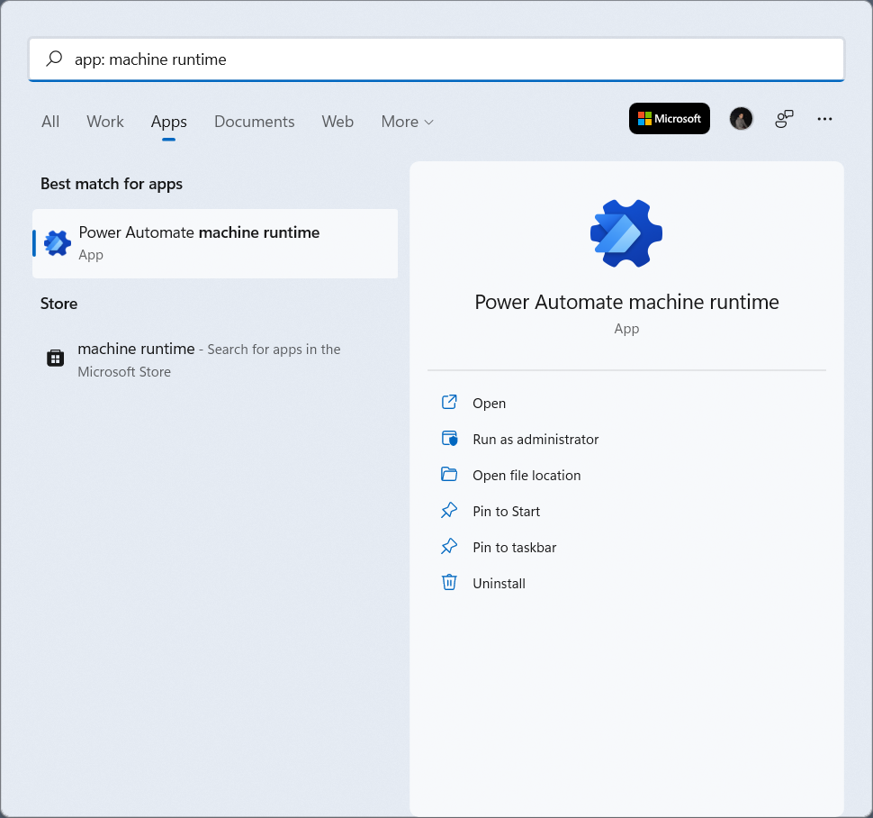
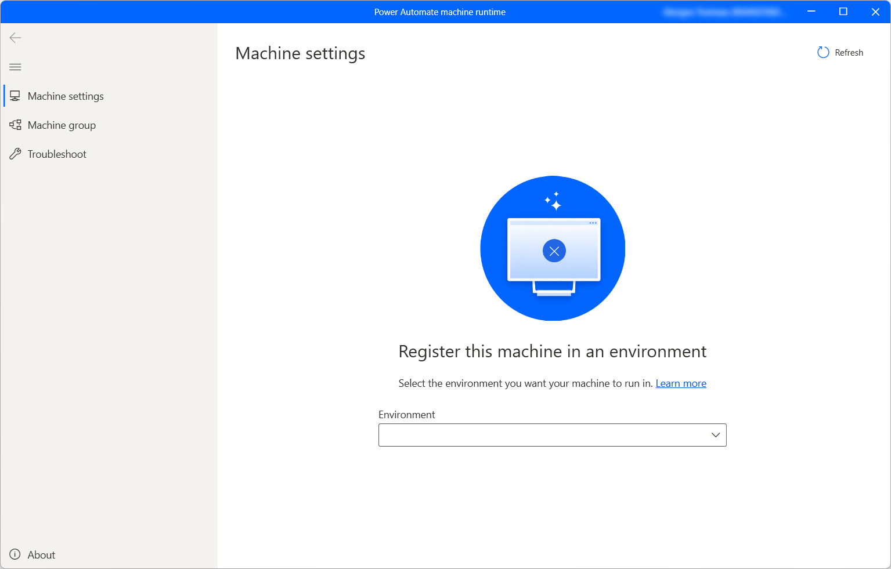
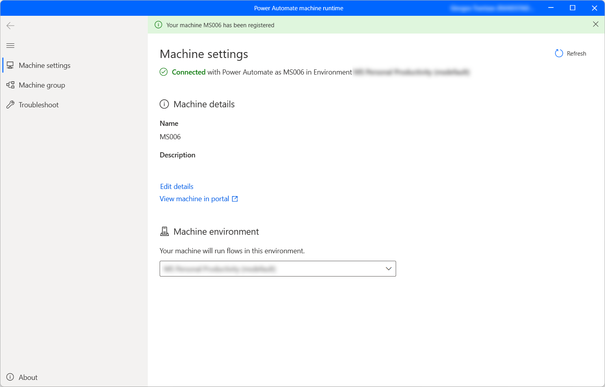

# Manage machines 

Machines are the physical or virtual devices that you use to automate desktop processes. When you connect your machine to Power Automate, you can instantly start your desktop automation using any of the [available triggers](../triggers-introduction.md), such as pre-defined schedules. 

Connecting your machine directly to Power Automate and the cloud allows you to harness the full power of your robotic process automation (RPA). 

The easiest way to connect your machine to the cloud is with our direct connectivity. Sign in to the latest version of Power Automate for desktop, and your machine will be registered automatically. Once registered, you can create a connection right away in your cloud flows. 

> [!IMPORTANT]
> - Direct connectivity is only available for Power Automate 2.8.73.21119 or newer. If you currently use an older version, [update to the latest](https://go.microsoft.com/fwlink/?linkid=2102613).
> - To register your machine and use the machine management features, your Power Platform environment must have a version of the MicrosoftFlowExtensionsCore solution that is greater than or equal to 1.2.4.1.

## Register a new machine 

Your machine is automatically registered on the currently selected environment in the application. If you don't have permission to register your machine in that environment or want to use another environment, update the environment.

1. [Install the latest version](install.md) of Power Automate on your device. If you already have the latest version, skip to step 3. 

1. Make sure you've checked the **Install the machine-runtime app to connect to the Power Automate cloud portal** option in the installer.

    

1. When the installation completes, launch the **Power Automate machine runtime** application.

    

1.	Sign in to the **Power Automate machine runtime** application. Your machine should be automatically registered in the currently selected environment.

1.	If the machine hasn't been registered yet, a message will prompt you to select a machine running environment. Power Automate will use this environment to run all the triggered desktop flows.

     

When the connection is established successfully, the machine settings section will display the following fields regarding the machine:

- **Machine name:** A unique name to identify the machine.
- **Machine description:** An optional description of the machine.
- **Machine environment:** The running environment of the machine.

 
> [!NOTE]
> - Users need either an Environment Maker or Desktop Flow Machine Owner role to register machines. Before registering a machine, make sure that you have the required permissions and that there is an available environment to register the new machine.
> - In the case of a virtual machine, make sure not to clone the virtual machine after installing the **Power Automate machine runtime** application.
> - Machines aren't affected by changes in the Power Automate for desktop organization.

> [!IMPORTANT]
> To successfully register a machine, make sure that the services specified in [IP address configuration](../ip-address-configuration.md#desktop-flows-services-required-for-runtime) are accessible.

## Update running environment for your machine 

Your machine can only run desktop flows from the cloud in one environment at a time. 

You can update the running environment in which your machine can run desktop flows at any time from within Power Automate.

1. In the **Power Automate machine runtime** application, select **Machine settings**. 

1. Under **Machine environment**, select an environment in the dropdown list. 

> [!NOTE]
> Keep in mind that changing the running environment of a machine removes all its current connections.

## Trigger a desktop flow to run on your machine 

1. Edit your cloud flow or [create a new cloud flow](../overview-cloud.md). 

1. Select **+ New step**. 

1. Select the **Run a flow built with Power Automate for desktop** action. 

1. If you’ve already created a connection with desktop flows, select the three dots on the top right of the action, and under **My connections** select **+Add new connection**. 

1. Next to Connect, select **Directly to machine**. 

1. Select the name of your machine. 

1. Enter the username and password you would use to sign into your machine. 

1. Select **Create**. 

   

1. Select the desktop flow you want to run and the desired run mode. 

1. Save your cloud flow. 

1. You can now trigger your desktop flow to run on your machine from the cloud. 

Power Automate enables you to trigger desktop flows from cloud flows using events, schedules, and buttons. 

> [!NOTE]
> To apply this functionality, you have to own a [premium per-user plan with attended RPA](https://flow.microsoft.com/pricing/). 

> [!IMPORTANT]
> When you create a desktop flow connection, you allow Power Automate to create a Windows session on your machine to run your desktop flows. Make sure you trust co-owners of your flows before using your connection in a flow.

## View list of machines 

Once a machine is registered to an environment, you can view its details at any time in the Power Automate portal. You can also view all other machines that you have access to. 

1. Sign in to the Power Automate portal. 

1. Select **Monitor > Machines**. 

Within the list, for each machine you can view: 

- The name of the machine. 
- The description of the machine. 
- The version of the machine
- The group that the machine is a part of, if applicable. 
- The status of the machine. 
- The number of flows running on the machine. 
- The number of flows queued on the machine, if applicable. 
- The type of access you have to the machine. 
- The owner of the machine. 

> [!NOTE]
> The version of the machine is updated with the first registration and after each desktop flow run. 

## Share a machine 

You can share a machine with other users in your organization, giving those users specific permissions to access your machine. 

1. Sign in to the Power Automate portal. 

1. Select **Monitor**, and then **Machines**. 

1. Select your machine from the list. 

1. Select **Manage access**. 

1. Select the **Add people** field, then enter the name of the person in your organization with whom you’d like to share the machine. 

1. Select the name of the person to choose with which permissions they can access the machine. 

1. Select **Save**. 

  

There are two levels of permissions that you can use when managing access to your machine: 

1. **Co-owner**. This access level gives full permissions to that machine. Co-owners can run desktop flows on the machine, share it with others, edit its details, and delete it. 

1. **User**. This access level only gives permission to run desktop flows on the machine. No edit, share, or delete permissions are possible with this access. 

|Actions|Co-owner|User|
|---|---|---|
|Run a desktop flow on the machine|X|X|
|Share the machine|X|| 
|Add machine to group|X|| 
|Edit details|X|| 
|Delete machine|X|| 

## Delete a machine

You can't delete a machine from the machine runtime application.

Follow these steps to delete a machine:

1. Sign in to the Power Automate portal.

1. Select **Monitor**, and then  **Machines**. 

1. Select the machine you want to delete from the list. 

1. Select **Delete machine** from the command bar.

## Switch from gateways to direct connectivity 

> [!IMPORTANT]
> Gateways for desktop flows will be deprecated soon (June 30th) except for China region. Start to switch to our machine-management capabilities.

You can easily switch to using direct connectivity by changing the desktop flow connection and using one with the **directly to machine** option.   

You can edit the connection or create a new one for each of the desktop flow actions in your cloud flow: 

1. If you haven't done it yet, [update Power Automate to version 2.8.73.21119](https://go.microsoft.com/fwlink/?linkid=2102613) or newer.

1. If you’ve already created a connection with desktop flows, select the three dots on the top right of the action, and under **My connections** select **+Add new connection**. 

1. Select **Directly to machine** in the **Connect** field.

1. Select the name of your machine. 

1. Enter the username and password you would use to sign in to your machines. 

1. Select **Create**. 

You can also change the connections used by a cloud flow in its details page when you select **Run**.

## Update permissions based on security role 

By default, all users with an Environment Maker role can register their machines in an environment. You can restrict actions on machines and machine groups by modifying the **Flow Machine** and **Flow Machine Group** permissions for a particular security role. 

  

Environment admins can also restrict machine registration to a specific set of users by using the three security roles that come with machine management. 

|Actions|Desktop Flows Machine Owner|Desktop Flows Machine User|Desktop Flows Machine User Can Share|
|---|---|---|---|
|Register a machine|X|||
|Run a desktop flow|X|X|X|
|Share a machine|X||X|
|Share a machine group|X||X|
|Add machine to group|X|||
|Edit machine details|X|||
|Edit machine group details|X|||
|Delete machine|X|||
|Delete machine group|X|||

## Machine and machine group limitations 

|Name|Limit|
|---|---| 
|Maximum number of machines in a group |50| 
|Maximum amount of time a desktop flow can run |24 hours| 
|Maximum amount of time a desktop flow can be queued |3 hours| 

## Other known limitations 

- Machines and machine groups aren't available in China regions (Mooncake). You can still run desktop flows from the cloud using an on-premises data gateway.
