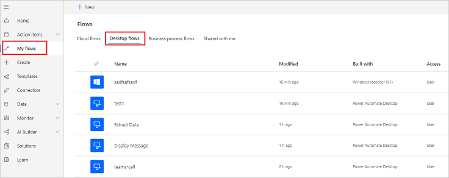
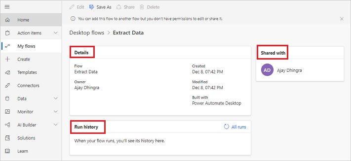

# Manage UI flows

After you've created UI flows, you might need to view, edit, or just check on their status. To do this, go to the **UI flows** tab.

## List of UI flows

1. Sign into Power Automate.
1. Select **My flows** > **UI flows**.

   

From this section, you can create a new UI flow and edit or delete your existing UI flows.

## Details page

For each of your UI flows, you can see its details by selecting its name from the list of UI flows. You then see details including:

-   The run history with details of each run.
-   The applications or Websites used in the UI flow.

Follow these steps to see the details for a UI flow:

1. Sign into Power Automate.
1. Select **My flows** > **UI flows**.
1. Select any of your UI flows.

   

## Learn more

- Learn to [create Windows recorder (V1) flows](create-desktop.md).
- Learn to [create Selenium IDE flows](create-web.md).
- Learn how to run [UI flows](run-desktop-flow.md).
