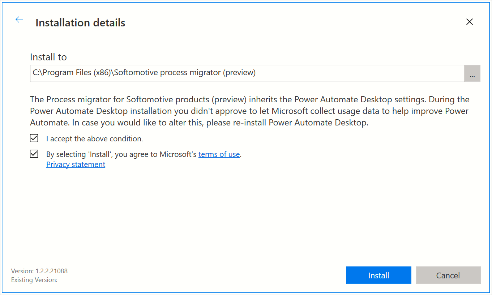
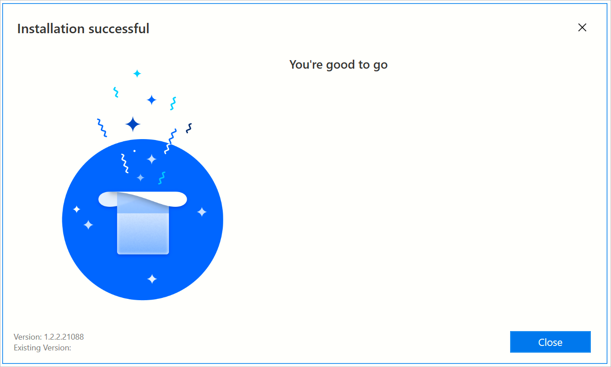
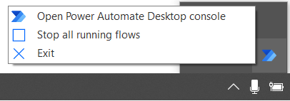
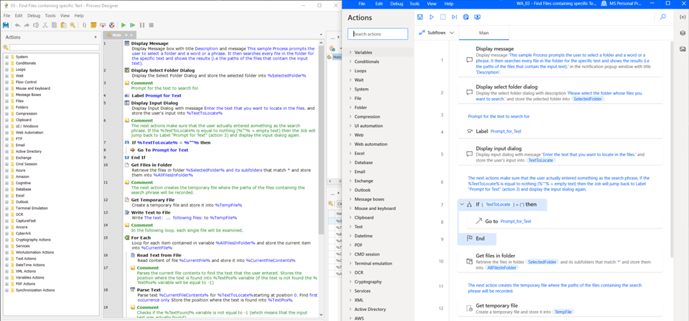

# Process migrator for Softomotive products (preview)
[!INCLUDE [cc-beta-prerelease-disclaimer](../includes/cc-beta-prerelease-disclaimer.md)]

<!-- ProcessRobot users are now able to export .prp files into folders and --> 

Process migrator for Softomotive products (preview) enables users to convert automations into desktop flows for use in Power Automate Desktop.

This migration utility redefines automations to their equivalent Power Automate Desktop action definitions where such parity exists. 

Some actions have been deprecated because they don't fit into the Power Platform ecosystem. However, workarounds should be applicable to overcome what appears to be missing functionality. 

> [!NOTE]
> You can find the full list of migration coverage regarding action groups in the release notes [here](#non-migratable-actions).
 
## Prerequisites

For Process migrator for Softomotive products (preview) to be able to install and function as expected the following Prerequisites are needed: 

WinAutomation users: 

 - The latest publicly available version of Power Automate Desktop installed
 - WinAutomation installed (v6 and later) 
 - Access to a Power Automate environment 

ProcessRobot users: 

 - The latest publicly available version of Power Automate Desktop installed 
 - Access to a Power Automate environment. Follow the get started documentation if you have not already provisioned an environment 
 - ProcessRobot process files (.prp) exported from your installation into a folder on the machine with the migration utility and Power Automate Desktop installed 

## Installing Process migrator for Softomotive products (preview) 

After successfully [downloading the setup file](https://go.microsoft.com/fwlink/?linkid=2151571) of the Process migrator for Softomotive products (preview), run it.  

> [!NOTE]
> - Make sure you are performing a clean installation of Process migrator for Softomotive products (preview).  
> - Uninstall any previous installations of the application. 
> - Remove any previous installation residue (empty installation folders etc.) 
> - Install the latest version of the application. 
 

In the displayed dialog, select an installation path and accept Microsoft's terms of use.

Now, you can run the Process migrator for Softomotive products (preview).

## Running the Process migrator for Softomotive products (preview) 

1. After launching the Process migrator for Softomotive products (preview), you'll be prompted to populate your Power Automate account.

    

    The application might prompt you to connect to the account you use to access your environments in order to save the migrated processes as desktop flows.

    

1. Select the Softomotive product from which you want to migrate processes. 

    

### Migrating WinAutomation processes to Power Automate Desktop

1. If you use a WinAutomation version later than 9, you'll be prompted to enter your WinAutomation master key. This key is required for the migration of passwords inside encrypted processes. 
    
    If you omit to enter your WinAutomation master key, the migration of the processes will proceed, but the password values won’t be migrated.

   

1. After entering your master key, the application will retrieve all the processes located on your machine. 

    > [!NOTE]
    > Some delay might be expected after this step, but the application is successfully operating in the background. 

1. Next, you can choose the processes to migrate, as well as the Power Automate environment that will store them. The default environment is pre-selected. 
 
       

1. If you choose to migrate a password-protected process, you'll be prompted to enter the password you used to encrypt it. 

    If you choose to skip entering the requisite password, the migration of the said process will be omitted.

        

### Migrating PorcessRobot processes to Power Automate Desktop

1. If you chose to migrate ProcessRobot processes, you'll be prompted to select the folder containing the exported .prp (ProcessRobot Process) files. 

    

1. After selecting the folder, you'll be able to select the processes you want to convert.  

    

1. If you've exported the .prp files from the **History** tab in Process Designer and have chosen **Selected versions only**, the migrator will convert one version of the process. 

    Exporting the .prp files without limiting to a single version will result in all previous versions being migrated.

    

### Completing migration and accessing the migrated processes

1. Once the migration starts, a dialog will display information about the current state of the migration and a progress bar.

    

1. When the migration is completed, an autogenerated log file will be displayd showing the migrated processes.

    
 
1. You can access the exported logs at C:\Users\{username}\AppData\Local\Microsoft\Process migrator for Softomotive products\Logs

    

    > [!NOTE]
    > For the migrated desktop flows to be visible, some time is required. To instantly view the migrated desktop flows in Power Automate Desktop:
    >- Sign out and sign in again in Power Automate Desktop, or
    >- Restart the Power Automate Desktop service by exiting the service and re-running Power Automate Desktop.  

   

1. Now, you can modify the migrated processes (now desktop flows) through Power Automate Desktop.

    

    > [!TIP]
    > Running the Process migrator for Softomotive products (preview) will be paused once an encrypted process has been encountered, waiting for the password to be inserted by the user. It's advised to group processes based on whether they are encrypted or not. This way, unencrypted processes will be migrated without supervision and the encrypted ones will have the required user attendance.  

    > [!NOTE]
    > - Migrated WinAutomation or ProcessRobot processes will have the following format when uploaded as desktop flows (ProcessRobot users can substitute use of WA and WinAutomation to PR and ProcessRobot respectively): WA_{Name of WinAutomation}, ,  process (folder path inside WinAutomation). For example, if you migrate the 05 - Copy File WinAutomation process that resides under the path “MyProcesses/Examples/01 - Beginner”, the resulting desktop flow will be named WA_05 Copy File (Examples/01 - Beginner). 
    > - If you try to migrate a process and the resulting desktop flow name duplicates the name of an already existing desktop flow in the environment you chose, the later desktop flow will be saved with a name following the format WA_{Name of WinAutomation} (X) process (folder path inside WinAutomation), where X is an increasing number. For example, if you migrate the 05 - Copy File WinAutomation process that resides under the path “MyProcesses/Examples/01 - Beginner” and there happens to be a desktop flow in your environment of choice, having the same name, the resulting desktop flow will be named WA_05 Copy File (1) (Examples/01 - Beginner). 

## Reconfiguring ProcessRobot console features in Power Automate 

### ProcessRobot Control Desk – Redeploying in Power Automate 

Power Automate and ProcessRobot behave differently at their core, so there will be a requirement to reconfigure administrative and orchestration features.  Some of your converted desktop flows may also require modification depending on the actions used within the processes.  The [Power Automate Learning Resources Blog](https://flow.microsoft.com/blog/power-automate-learning-resources/) is a repository of useful links for a good overview as well as detailed explanations on how to use the Power Platform for your needs. 

The Power Platform Admin Center (PPAC) by default contains information related to your RPA environment that admins are accustomed to seeing in Control Desk, including cloud flow activity, desktop flow run activity, desktop flow queue monitoring and more.  PPAC also enables users to create Cloud Flows which can incorporate schedules, triggers, run desktop flows and reach all other Power Automate components you have access to. 

If you are new to the Power Platform, it is recommended that administrators complete the [Admin In A Day](https://github.com/microsoft/powerapps-tools/tree/master/Administration/AdminInADay) workshop to better understand PPAC in addition to the [ALM hands on lab](https://docs.microsoft.com/powerapps/developer/common-data-service/build-tools-tutorial-faq%20%20) since this is the current recommended approach to manage desktop flow versions and application lifecycle management.  Citizen Devs are encouraged to participate in the [RPA In a Day](https://flow.microsoft.com/blog/announcing-microsoft-rpa-in-a-day-version-2/) tutorials which help build a solid foundation across the entire stack. 

Apart from the extensive set of features preconfigured into PPAC – the [CoE Power BI Dashboard](https://docs.microsoft.com/power-platform/guidance/coe/power-bi) far exceeds the capability of ProcessRobot Dashboards and the [core components of the CoE](https://docs.microsoft.com/power-platform/guidance/coe/setup-core-components) are available for all Power Automate users.  The CoE starter kit provides a solid foundation to build insightful dashboards which can be modified to your organizations needs throughout their RPA journey.  

### Workarounds for unsupported ProcessRobot Process Studio features 

#### User Libraries: 

User Libraries are not supported in Power Automate Desktop.  If your process contains a call to a user library, it is recommended the associated user library actions are copied into your desktop flow otherwise they will not be migrated using the Process Migrator for Softomotive Products.  The ‘Start Process’ action from ProcessRobot is on the roadmap to be reintroduced as ‘Run Flow’ in a future release.  This will simplify management of former User Libraries since the parent flow can call the child, wait for the child to complete its task, and send back supported variable types to the parent flow. 

#### Process Robot Actions: 

**Start Process**

Not supported but is currently on the roadmap to be modified and reintroduced.  In some instances, for the meanwhile you may be able to work around this by setting up a Cloud Flow to execute process B once process A has stopped running and pass input variables to process B from process A. 

**Get Process Path** 

Not supported, not on the roadmap. 

**Log Message** 

Not supported by the migration tool but is currently on the roadmap to be modified and reintroduced. 

**Update KPI** 

Not supported by the migration tool.  Administrators can apply a workaround in the CoE to calculate KPIs 

**Get Global Variable / Set Global Variable** 

Not supported by the migration tool.  Possible workarounds include the ability to [create and manage tables in Dataverse](https://docs.microsoft.com/learn/modules/create-manage-entities/) create a Cloud Flow that calls for a global variable (Get Global Variable), passes it to a desktop flow for consumption, then have a an output variable from the desktop flow passed back to the Dataverse table if needed (Set Global Variable). 

**Enter Locked Region** 

Not supported by the migration tool.  

**Exit Locked Region** 

Not supported by the migration tool. 

**Add Queue Item in Queue** 

Not supported by migration tool. Review [Monitor desktop flow queues](monitor-desktop-flow-queues.md) for information on queue functionality in Power Automate.  Other possible workarounds include the ability to [create and manage tables in Dataverse](https://docs.microsoft.com/learn/modules/create-manage-entities/) where Cloud Flow monitors, schedules, or triggers can be used to load data. 

**Get Queue Item in Queue** 

Not supported in migration.  Possible workarounds include creating a Cloud Flow to trigger an event [when a row is added, modified or deleted](https://docs.microsoft.com/connectors/commondataserviceforapps/#when-a-row-is-added%2c-modified-or-deleted)  in a Dataverse table. 

**Get Credential** 

Not supported in migration.  Workarounds include [using sensitive text in power automate desktop with Azure Key Vault](https://powerusers.microsoft.com/t5/Webinars-and-Video-Gallery/Using-Sensitive-Text-In-Power-Automate-Desktop-Azure-Key-Vault/td-p/790556). 

**Update Credential** 

Not supported in migration.  Workarounds include [updating a secret using an API](https://docs.microsoft.com/rest/api/keyvault/UpdateSecret/UpdateSecret). 

**Display Notification** 

Not supported.  Not on roadmap. 

### Non-migratable actions 

The following WinAutomation and ProcessRobot actions will not be migrated from the processes to the respective UI Flows.  

- All Ancora actions 
- All CaptureFast actions 
- Cognitive > Google > Vision > Face Detection 
- Cognitive > IBM > Visual Recognition > Detect Faces 
- Cognitive > Microsoft > Face > Detect Face 
- Cognitive > Microsoft > Face > Find Similar Face 
- Message Boxes > Display Notification 
- Message Boxes > Display Custom Dialog 
- PDF Actions > Extract Text From PDF With OCR 
- All Synchronization Actions (group of actions) 
- All WinAutomation Actions (group of actions) 

### Partially migratable actions 

The following actions will be migrated from the processes to the respective desktop flows. However, one or more of their parameters will not be transferred at all or with the same value. Some cases might be handled by applying manual rework in the designer. 

- Azure: Create Azure Session 
    - Non-migratable Properties: Username, Password (for option Authentication Type: With Service Principal) 
    - Missing properties: Client Secret (for option Authentication Type: With User) 
- Azure: Create Azure Managed Disk 
    - Missing properties: Storage Account Name 
- Compression: Unzip Files 
    - Non-migratable Properties: Include Mask, Exclude Mask, Include Subfolders 
- Cognitive: Classify Image IBM 
    - Missing properties: Location, Instance ID 
- Cognitive: Analyze Tone IBM 
    - Non-migratable Properties: Username, Password 
    - Missing properties: API key, Location, Instance ID 
- Cognitive: Translate IBM 
    - Non-migratable Properties: Username, Password 
    - Missing properties: API key, Location, Instance ID, Version Date 
- Cognitive: Identify Language IBM
    - Non-migratable Properties: Username, Password 
    - Missing properties: API key, Location, Instance ID, Version Date 
- Cognitive: Detect Language Microsoft 
    - Non-migratable Properties: Number Of Languages To Detect 
- Cryptography: Encrypt Text  
    - Non-migratable if Encryption Algorithm is NOT EQUAL to AES & Cipher Mode is NOT EQUAL to CBC 
- Cryptography: Decrypt Text  
    - Non-migratable if Encryption Algorithm is NOT EQUAL to AES & Cipher Mode is NOT EQUAL to CBC 
- Cryptography: Encrypt From File  
    - Non-migratable if Encryption Algorithm is NOT EQUAL to AES & Cipher Mode is NOT EQUAL to CBC 
- Cryptography: Decrypt To File  
    - Non-migratable if Encryption Algorithm is NOT EQUAL to AES & Cipher Mode is NOT EQUAL to CBC 
- Cryptography: Hash Text  
    - Non-migratable if Encryption Algorithm is NOT EQUAL to AES & Cipher Mode is NOT EQUAL to CBC 
- Cryptography: Hash From File  
    - Non-migratable if Encryption Algorithm is NOT EQUAL to AES & Cipher Mode is NOT EQUAL to CBC 
- Cryptography: Hash Text With Key  
    - Non-migratable if Encryption Algorithm is NOT EQUAL to AES & Cipher Mode is NOT EQUAL to CBC 
- Cryptography: Hash From File  With Key 
    - Non-migratable if Encryption Algorithm is NOT EQUAL to AES & Cipher Mode is NOT EQUAL to CBC 
- Mouse and Keyboard: Move Mouse 
    - Non-migratable for option 'Move mouse to recorded positions' 
--->
[!INCLUDE[footer-include](../includes/footer-banner.md)]