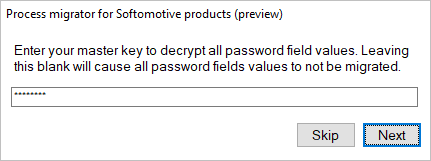
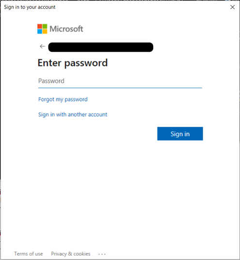
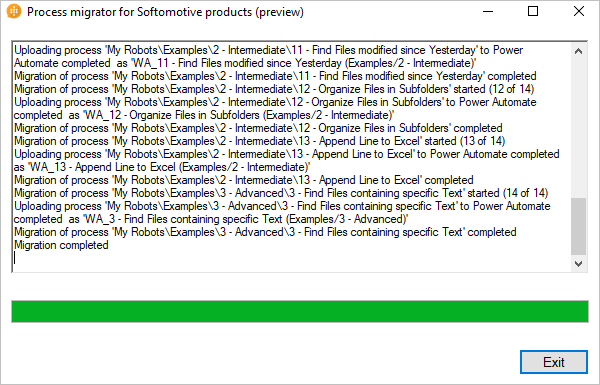
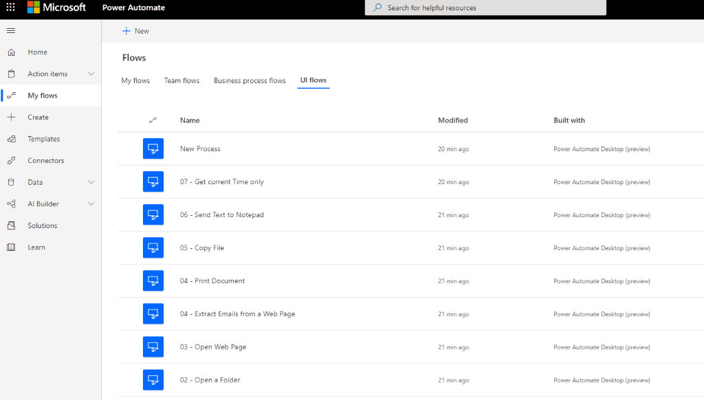

# Process migrator for Softomotive products (preview)
[This topic is pre-release documentation and is subject to change.]

The Process migrator for Softomotive products (preview) is an application that assists in the migration of automation processes created in WinAutomation to Power Automate desktop flows. 

> [!NOTE]
> To see the full list of migration coverage regarding action groups, please check the release notes [here](#release-notes).
 
## Pre-requisites 
For Process migrator for Softomotive products (preview) to be able to install and function as expected the following are needed: 
-	The latest publicly available version of Power Automate Desktop installed. 
-	WinAutomation installed (v6 and later) 
-	Access to an active Power Automate environment.  
 
 
## Installing Process migrator for Softomotive products (preview) 
After successfully downloading the setup file of Process migrator for Softomotive products (preview), run it.  

> [!NOTE]
> - Make sure you are performing a clean installation of Process migrator for Softomotive products (preview).  
> - Uninstall any previous installations of the application. 
> - Remove any previous installation residue (empty installation folders etc.) 
> - Install the latest version of the application. 
 
  

   

   

Now you can run the Process migrator for Softomotive products (preview)
 
## Running the Process migrator for Softomotive products (preview) 
When you run the Process migrator for Softomotive products (preview) you will be prompted to enter your Power Automate account

   

> [!NOTE]
> You might be prompted to connect to the account you use to access your Environments in order for the migrated processes to be saved as desktop flows. 

   
  
For WinAutomation versions later than 9, you will be prompted to enter your WinAutomation master key. This is required for the migration of passwords inside encrypted processes. If you omit to enter your WinAutomation master key, the migration of said processes will proceed but password values won’t be migrated.

   

> [!NOTE]
> After entering your master key, the application will retrieve all the WinAutomation processes on your PC for you to choose the ones you are willing to migrate.  
Some delay might be expected after this step but the application is successfully operating in the background. 

Then you can choose which WinAutomation processes you want to migrate to Power Automate as desktop flows and the Power Automate environment you want to store them into 
(the default environment is pre-selected). Then select to start the migration
 
 

If you choose to migrate an password-protected encrypted process, you will be prompted to enter the password you used in WinAutomation to encrypt it. If you omit to enter the requisite password, the migration of the said process will be omitted.

 

Once the migration starts you will be presented with a text box containing information for the current state (of the migration) and the progress bar.

 

When the migration is completed an auto-generated log file will be presented to you showing the migrated processes

 
 
You can access the exported logs at C:\Users\{username}\AppData\Local\Microsoft\Process migrator for Softomotive products\Logs

Once the migration completes, visit Power Automate, select My flows and the Desktop flows option. You can now see the process that were migrated
  
> [!NOTE]
> For the migrated desktop flows to be visible some time is required. To instantly view the migrated desktop flows inside Power Automate Desktop either sign-out and sign-in your Power Automate account again from the Power Automate Desktop or restart the Power Automate Desktop service by exiting the service and re-running the Power Automate Desktop.  

 

 

> [!TIP]
> Running the Process migrator for Softomotive products (preview) will be paused once an encrypted process has been encountered, waiting for the password to be inserted by the user. 
It is advised to group processes based on whether they are encrypted or not.  
This way, unencrypted processes will be migrated without supervision and the encrypted ones will have the required user attendance.  

> [!NOTE]
> - Migrated WinAutomation processes will have the following format when uploaded as desktop flows:  
**WA_{Name of WinAutomation} process (folder path inside WinAutomation)**. 
For example, if you migrate the **05 - Copy File** WinAutomation process that resides under the path **“MyProcesses/Examples/01 - Beginner”**, the resulting desktop flow will be named **WA_05 Copy File (Examples/01 - Beginner)**.
> - If you try to migrate a WinAutomation process and the resulting desktop flow name duplicates the name of an already existing desktop flow in the environment you chose, the later desktop flow will be saved with a name following the format WA_{Name of WinAutomation} (X) process (folder path inside WinAutomation), where X is an increasing number.
For example, if you migrate the **05 - Copy File** WinAutomation process that resides under the path **“MyProcesses/Examples/01 - Beginner”** and there happens to be a desktop flow in your environment of choice, having the same name, the resulting desktop flow will be named  
**WA_05 Copy File (1) (Examples/01 - Beginner)**.

## Release notes

### Non-migratable actions 

The following WinAutomation actions will not be migrated from the WA processes to the respective UI Flows.  

- All Ancora actions 
- CyberArk action 
- All CaptureFast actions 
- Cognitive > Google > Vision > Face Detection 
- Cognitive > IBM > Visual Recognition > Detect Faces 
- Cognitive > Microsoft > Face > Detect Face 
- Cognitive > Microsoft > Face > Find Similar Face 
- Message Boxes > Display Notification 
- Message Boxes > Display Custom Dialog 
- PDF Actions > Extract Text From PDF With OCR 
- All Synchronization Actions (group of actions) 
- All WinAutomation Actions (group of actions) 

### Partially migrated actions 

The following actions will be migrated from the WA processes to the respective desktop flows. However, one or more of their parameters will not be transferred at all or with the same value. Some cases might be handled by applying manual rework in the designer. 

- Azure: Create Azure Session 
    - Non Migratable Properties: Username, Password (for option Authentication Type: With Service Principal) 
    - Missing properties: Client Secret (for option Authentication Type: With User) 
- Azure: Create Azure Managed Disk 
    - Missing properties: Storage Account Name 
- Compression: Unzip Files 
    - Non Migratable Properties: Include Mask, Exclude Mask, Include Subfolders 
- Cognitive: Classify Image IBM 
    - Missing properties: Location, Instance ID 
- Cognitive: Analyze Tone IBM 
    - Non Migratable Properties: Username, Password 
    - Missing properties: API key, Location, Instance ID 
- Cognitive: Translate IBM 
    - Non Migratable Properties: Username, Password 
    - Missing properties: API key, Location, Instance ID, Version Date 
- Cognitive: Identify Language IBM
    - Non Migratable Properties: Username, Password 
    - Missing properties: API key, Location, Instance ID, Version Date 
- Cognitive: Detect Language Microsoft 
    - Non Migratable Properties: Number Of Languages To Detect 
- Cryptography: Encrypt Text  
    - Non Migratable if Encryption Algorithm is NOT EQUAL to AES & Cipher Mode is NOT EQUAL to CBC 
- Cryptography: Decrypt Text  
    - Non Migratable if Encryption Algorithm is NOT EQUAL to AES & Cipher Mode is NOT EQUAL to CBC 
- Cryptography: Encrypt From File  
    - Non Migratable if Encryption Algorithm is NOT EQUAL to AES & Cipher Mode is NOT EQUAL to CBC 
- Cryptography: Decrypt To File  
    - Non Migratable if Encryption Algorithm is NOT EQUAL to AES & Cipher Mode is NOT EQUAL to CBC 
- Cryptography: Hash Text  
    - Non Migratable if Encryption Algorithm is NOT EQUAL to AES & Cipher Mode is NOT EQUAL to CBC 
- Cryptography: Hash From File  
    - Non Migratable if Encryption Algorithm is NOT EQUAL to AES & Cipher Mode is NOT EQUAL to CBC 
- Cryptography: Hash Text With Key  
    - Non Migratable if Encryption Algorithm is NOT EQUAL to AES & Cipher Mode is NOT EQUAL to CBC 
- Cryptography: Hash From File  With Key 
    - Non Migratable if Encryption Algorithm is NOT EQUAL to AES & Cipher Mode is NOT EQUAL to CBC 
- Mouse and Keyboard: Move Mouse 
    - Non Migratable for option 'Move mouse to recorded positions' 