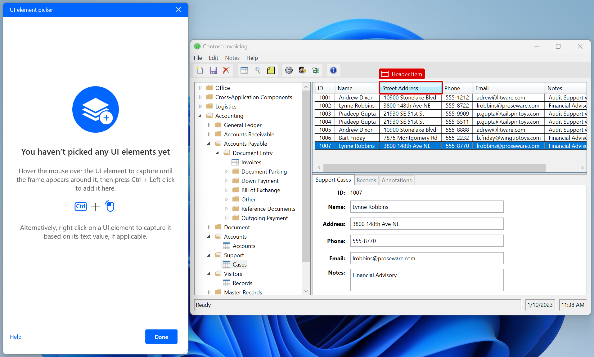
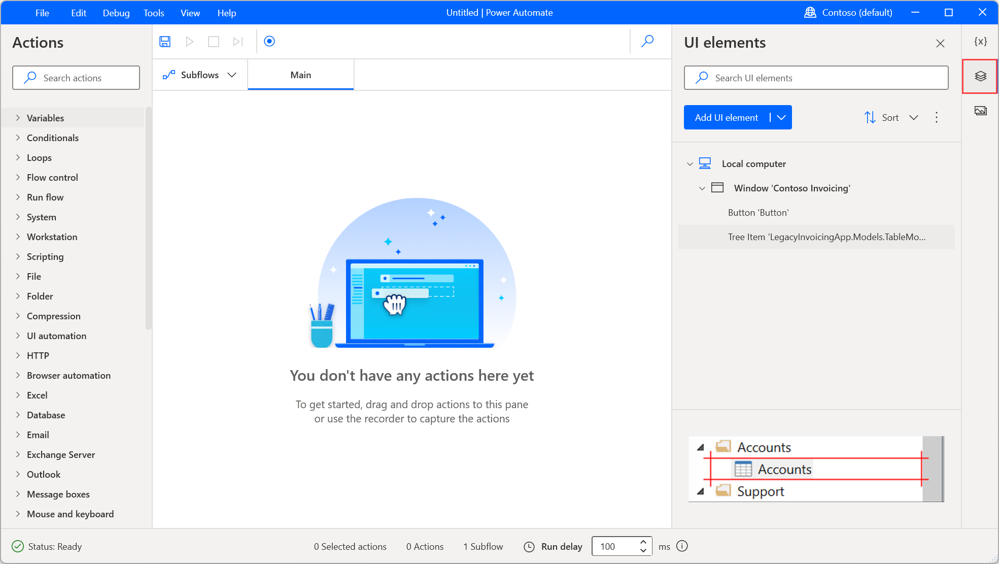
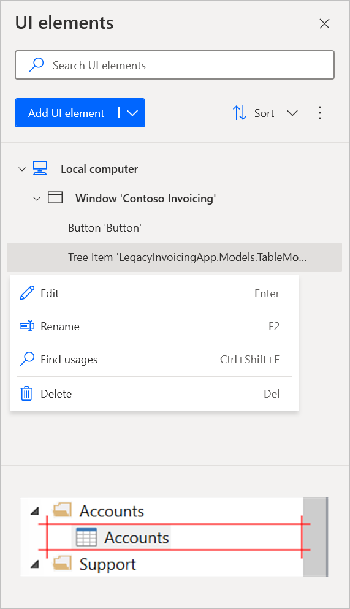
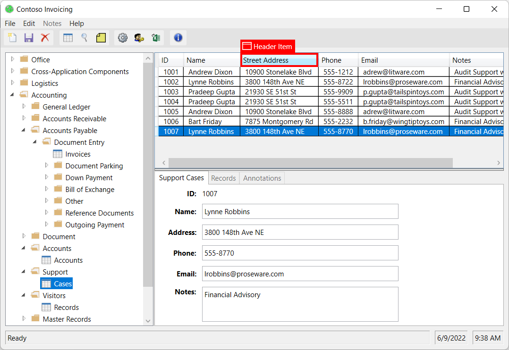
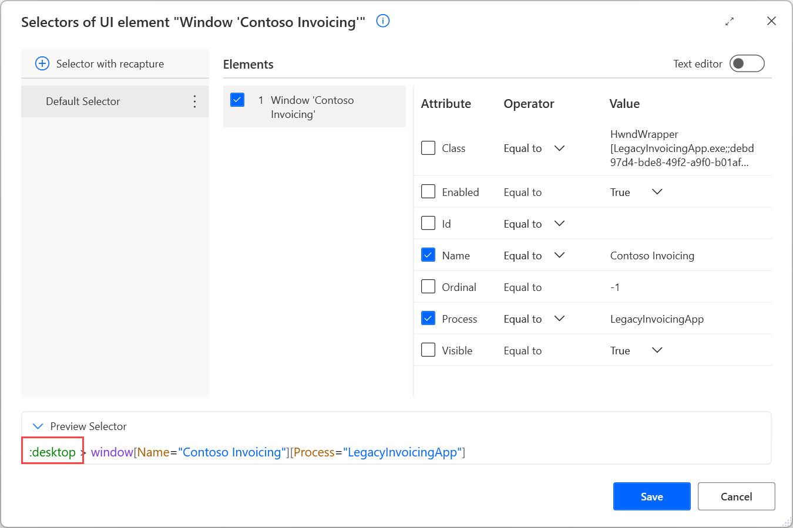

# Automate using UI elements

Desktop flows utilize UI elements to interact with applications and web pages without resorting to image recognition and absolute coordinates. UI elements are used as input in most UI automation and browser automation actions and identify specific elements on windows and web pages.

## UI elements

When deploying a UI automation or browser automation action, you may be required to provide a UI element as input. To add a new UI element, you can do it directly from the action properties or through the UI elements pane of the flow designer.

Each one of these action groups accepts a different type of UI elements. UI automation actions accept desktop UI elements, while browser automation actions accept web UI elements.

To add a new UI element to your flow, select to add a new UI element through an action or the UI elements pane, highlight the respective element, and press **Left Ctrl + Left click**. When the selection is finished, select **Done**. 

Any captured UI elements will be added to the UI elements pane. To access the UI elements pane, select the UI elements tab on the right-hand side of the flow designer.

Elements can be sorted alphabetically through the **Sort** option of the  UI elements tab. To remove all the UI elements that aren't used in any action, select the dots icon next to the **Sort** option and then **Remove unused UI elements**.

To rename or delete a UI element, right-click on the respective item and select the appropriate function.

To find where a specific UI element is being used in the flow, right-click on it and select **Find usages**. The results will display all the actions that use this UI element. Double-click on a result to highlight the action on the workspace.

## UI elements types

Desktop flows support two types of UI elements based on their source: desktop UI elements and web UI elements.

Desktop UI elements can be captured from any Windows application, including the non-web page part of browsers, such as the address bar.

You can use these UI elements as input in UI automation actions to indicate the component you want to interact with. The UI element picker of UI automation actions displays and allows you to capture only desktop UI elements.

>[!IMPORTANT]
> Users can capture elements from web pages through the UI element picker of UI automation actions. However, their selectors will represent desktop elements, not web elements.

Web UI elements can be captured from web pages and used only in browser automation actions.

Browser automation actions accept exclusively UI elements captured from web pages. Therefore, existing UI elements captured from desktop applications aren't displayed in the UI elements picker of these actions.

To find more information regarding desktop and web automation, refer to [Automate desktop flows](desktop-automation.md) and [Automate web flows](automation-web.md). 

### UI elements for web pages

To capture a UI element from a webpage, you need to install the appropriate browser extension. You can find more information about the supported browsers and the required extension in [Use browsers and manage extensions](using-browsers.md).

### Distinguish desktop from web UI elements 

The UI elements pane displays distinctive visual indications to help users quickly recognize desktop and web UI elements.

The same icons are also displayed during capturing, so you can confirm the type of an element before even saving it.

Another method to check the type of a UI element is to review its selectors. Desktop UI elements usually have the desktop as their parent element, while web UI elements have a web page as their root element.

### UI elements in browser windows

The application part of a browser (1) should be automated using desktop UI elements. For example, you can use UI automation actions to interact with the address bar or the tabs. 

On the other hand, the loaded web pages inside the browser (2) should be automated using web UI elements and browser automation actions.

When recording desktop flows, the recorder will automatically distinguish the browser application area from the web pages and generate the appropriate UI elements and actions.

## UI elements properties

All UI elements consist of one or more selectors that pinpoint the UI or web component that Power Automate interacts with.

>[!NOTE]
> Users can create multiple selectors for a UI element. Whenever a selector fails, Power Automate uses the following selector in the defined order.

To manage the selectors of a UI element, right-click on it and select **Edit**. This option brings up the selector builder, where you can edit the selectors with a visual or a text editor.

>[!IMPORTANT]
> Web elements captured via the recorder produce selectors that can be presented only in the text editor. Switching to the visual editor will temporarily navigate to an empty visual builder  and should be avoided to prevent loss of work. Clicking on **Cancel** may restore any work lost.

Each selector consists of multiple elements representing the hierarchical structure of the UI element in the application or web page. The attributes describe each element uniquely and distinguish it from other elements.

All selectors are displayed with a default friendly name that makes them easily accessible. To rename a selector, right-click on its name and select **Rename**. 

When you edit a UI element with multiple selectors, you're able to disable a selector by right-clicking on it and selecting **Disable**. This functionality can be helpful during testing.

After editing the selectors, press **Save** to apply the implemented changes. Saving applies the changes in all the selectors in a single step.

You can find more information regarding selectors and how to build them manually in [Build a custom selector](build-custom-selectors.md).

[!INCLUDE[footer-include](../includes/footer-banner.md)]

