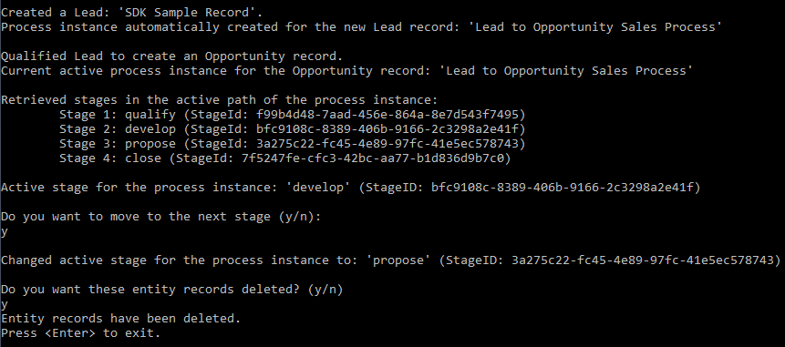

# Sample: Work with business process flows
[!INCLUDE [view-pending-approvals](../includes/cc-rebrand.md)]

This sample demonstrates how to programmatically work with business process flows such as retrieving the business process flow instances for a table row, retrieving active path for a business process flow instance and its process stages, and changing the active stage. For information about these concepts, see [Work with business process flows using code](business-process-flows-code.md)  

 This sample is available to download from [Sample: Work with business process flows](https://go.microsoft.com/fwlink/p/?LinkId=846108).  

   
## Prerequisites  
 Before you can run the sample:  

1. Have access to a Dataverse environment.  

2. Have appropriate privileges on the Lead, Opportunity, and Workflow tables and business process flow definition table rows used in this sample.  

3. Have Visual Studio 2015 or later to run the sample.  

4. Have Internet connection to download the sample project and to restore the NuGet packages used in the sample project.  

   
## What this sample does  

1.  Creates a sample Lead row. This automatically creates an instance of the "Lead To Opportunity Sales Process" business process flow for the Lead row.  

2.  Converts the Lead row to an Opportunity row.  

4.  Retrieves the business process flow instances associated with the "Opportunity" row using the `RetrieveProcessInstances` message. The first row in the returned collection is the active business process flow instance for the opportunity row, which is "Lead To Opportunity Sales Process" in this case.  

5.  Retrieves the active path and the process stages for the "Lead To Opportunity Sales Process" instance using the `RetrieveActivePath` message.  

6.  Retrieves the currently active stage for the "Lead To Opportunity Sales Process" instance, and prompts the user whether to move to the next stage. On confirmation to move, sets the next stage in the active path as the active stage for the "Lead To Opportunity Sales Process" instance.  

7.  Finally, prompts the user whether to delete the rows created during the sample run.  

     Here is the output of the sample:  

      

   
## Run the sample  

1. [Download](https://go.microsoft.com/fwlink/p/?LinkId=846108) the WorkWithBPF Visual Studio sample project, and extract it to a folder on your computer.  

2. Locate the `WorkWithBPF.sln` file in your extracted folder, and open it in Visual Studio.  

3. The sample project uses NuGet packages that must be restored before running the sample. Ensure that automatic restore of NuGet packages is enabled in Visual Studio. More information: [Enabling and disabling NuGet package restore](/nuget/consume-packages/package-restore)  

    Alternatively, select **Project** > **Manage NuGet Packages**, and select **Restore** to manually restore the packages used in the sample.  

4. Press F5 or select **Debug** > **Start Debugging**.  

5. If you have not previously run one of the  samples before, you’ll need to enter information to run the code, otherwise enter the number for one of the instances you have previously set up.  

   |                                 Prompt                                  |                                                                                             Description                                                                                             |
   |-------------------------------------------------------------------------|-----------------------------------------------------------------------------------------------------------------------------------------------------------------------------------------------------|
   |      Enter a Dynamics 365 server name and port [crm.dynamics.com]       | Type the name of your Dynamics 365 server. The default is Dynamics 365 (online)  (crm.dynamics.com) in North America.   Example:  crm5.dynamics.com |
   | Is this organization provisioned in Microsoft online services (y/n) [n] |                                                 Type **y** if this is a Microsoft online services provisioned organization. Otherwise, type **n**.                                                  |
   |                          Enter domain\username                          |                                                                                    Type your Microsoft account.                                                                                     |
   |                             Enter password                              |                      Type your password. The characters will show as “\*” in the window. Your password is securely saved in the Microsoft Credential Manager for later reuse.                       |
   |                Specify an organization number (1-n) [1]                 |                      From the list of organizations shown that you belong to, type the corresponding number. The default is 1, indicating the first organization in the list.                       |

6. The sample will perform the operations described in [What this sample does](#what-this-sample-does) and may prompt you with additional options.  

7. When the sample is complete, press ENTER to close the console window.  

[!INCLUDE[footer-include](../includes/footer-banner.md)]