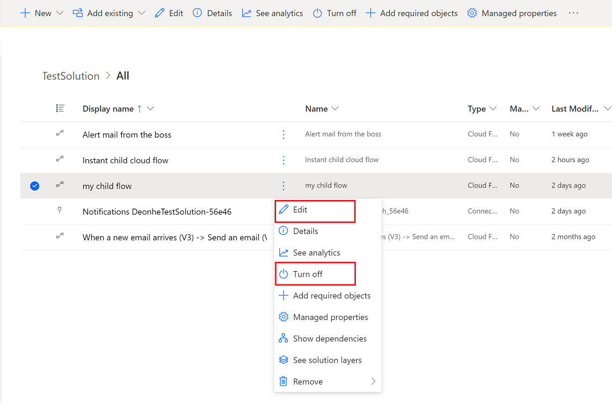

# Edit a solution-aware cloud flow

You can edit solution-aware cloud flows via [solutions](#edit-a-solution-aware-cloud-flow-via-solutions) or via [my flows](#edit-a-solution-aware-cloud-flow-via-my-flows).

> [!IMPORTANT]
> Stop your flow before you edit it so that you don't lose your changes.

## Edit a solution-aware cloud flow via Solutions

1. Sign into [Power Automate](https://powerautomate.com), and then select **Solutions** from the navigation bar on the left side.
1. Select the solution that contains the flow you want to edit.

   

1. Select **...** (Commands) for your flow, and then select **Turn off**.
1. Select **...** (Commands) for your flow, and then select **Edit**.

   

1. Make your edits in the Power Automate designer, test your changes, and then save your flow.
1. Turn on your flow if you'd like it to run.

## Edit a solution-aware cloud flow via My flows

1. In [Power Automate](https://powerautomate.com), select **My flows** from the navigation bar on the left side.
1. Find the flow you want to edit. Cloud flows you own will be in the **Cloud flows** tab and flows you have co-ownership of will be in the **Shared with me** tab.
1. Select **...** (Commands) for your flow, and then select **Turn off**.
1. Select **...** (Commands) for your flow, and then select **Edit**.
1. Make your edits in the Power Automate designer, test your changes, and then save your flow.
1. Turn on your flow if you'd like it to run.

>[!WARNING]
>When you edit solution-aware flows, it's possible for you to introduce unmanaged customization layers into your managed solution-aware flows. Unmanaged customization layers can impact your ability to update these flows in the future.

## Duplicate a solution-aware cloud flow using Save As
The Save As capability can be used to duplicate a solution cloud flow. If an unmanaged solution is in context when Save As occurs, then the flow will be added into that solution. Solution cloud flows will not be added into a solution if there is no context or if a managed solution has context, so those flows can be located in the **My flows **list or by looking in the **Default Solution**.

### Save As without solution context
1. In [Power Automate](https://powerautomate.com), select **My flows** from the navigation bar on the left side.
2. Open the cloud flow you want to duplicate.
3. The flow details page will show a **Solutions** card listing any custom solutions the flow is referenced by.
4. Click Save As
5. Inside the **Create a copy of this flow** dialog, provide a custom flow name if desired and click **Save**

6. The flow will now be visible in **My flows**. 
7. Note: If the save takes a few seconds, then it is possible to return to My flows before that is completed. If that happens, then refresh the browser window to view the flow.

### Save As with unmanaged solution context
1. In [Power Automate](https://powerautomate.com), select **Solutions** from the navigation bar on the left side.
2. Open an unmanaged solution. This solution is now providing solution context.
3. Inside that solution, find and open the cloud flow you want to duplicate.
4. The flow details page will show a **Solutions** card listing the current solution and any other custom solutions the flow is referenced by.
5. Click Save As
6. Inside the **Create a copy of this flow** dialog, provide a custom flow name if desired and click **Save**
7. The flow will now be visible in the solution and upon opening that flow it will have the solution in **Solutions** card in the flow details page. 

## Learn more

* [Manage and edit a cloud flow](/power-automate/get-started-logic-flow#manage-a-cloud-flow)
* [Create a solution](./overview-solution-flows.md)
* [Create a cloud flow in a solution](./create-flow-solution.md)
* [Export a solution](./export-flow-solution.md)
* [Import a solution](./import-flow-solution.md)
* [Remove a solution-aware flow](./remove-solution-aware-flow.md)

[!INCLUDE[footer-include](includes/footer-banner.md)]
