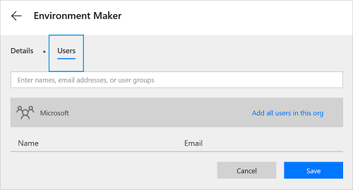

<properties
    pageTitle="Environment overview for Administrators | Microsoft Flow"
    description="Using, creating, and managing environments in Microsoft Flow"
    services=""
    suite="flow"
    documentationCenter="na"
    authors="sunaysv"
    manager="anneta"
    editor=""
    tags=""/>

<tags
   ms.service="flow"
   ms.devlang="na"
   ms.topic="article"
   ms.tgt_pltfrm="na"
   ms.workload="na"
   ms.date="10/13/2016"
   ms.author="sunayv"/>

# Using environments within Microsoft Flow

Environments are a new concept in Flow. Put simply, anything within an environment, lives and dies within that environment. Let's dig deeper. 

An environment is bound to a geographic location, like the United States. When you create a flow in an environment, that flow is routed to all datacenters in that geographic location (like the U.S.). If you delete the environment, then all flows within that environment are also deleted. This applies to any items you create in that environment, including connections, gateways, PowerApps, and more.

Now, let's say you want to create a flow that inserts data somewhere. Your options are:

- Insert data into an Excel file, and store the Excel file in a cloud storage account, such as OneDrive.
- Create your own SQL Database, and store your data in it.
- Use the common data model to store your data.

Every environment can have zero or one databases in the common data model, which is basically storage for your flows. Access to the common data model depends on the license you purchase; it is not included with the Free license.

## Use the default environment

The **Default** environment is available for every user, and is shared by all users. This environment has a *U.S. tenant*, and a *non-U.S. tenant*. Now that Flow is in general availability (GA), the following table lists what U.S. users and non-U.S. users can expect:

| User | What happens |
| --- | --- |
| Preview user in U.S. | Automatically uses the default environment. |
| Preview user not in U.S. | Choose to use an environment; or use the legacy experience, which is no environment. With the legacy experience, existing flows can be updated, but new flows cannot be created. |
| New user in the U.S. | Automatically uses the default environment. |
| New user not in the U.S. | Automatically uses the default environment. |

A *Preview user* is someone who was using Microsoft Flow before it's release to General Availability (GA). 

## Create an environment

1. In the [Flow admin center](https://admin.flow.microsoft.com), select **Environments**. Any existing environments are displayed:  

2. Select **New environment**. Enter the following info:

	| Property | Description |
|--- | --- |
| Name | Enter the name of your environment, such as `Dev/Test`, or `Sandbox`. |
| Region | Choose the location to host your environment. For the best performance, we recommend using a region closest to your users. For example, if your Flow app users are in London, then choose the Europe region. If your Flow app users are in New York, then choose the United States region. |
| Create database automatically | Check this setting to create the common data model database. The common data model is available with some licenses. So if you don't see this property, then it's not included with your license. |

3. Select **Create**. Your new environment is listed. 

Next, add users to the environment.

## Manage your existing environments

1. In the [Flow admin center](https://admin.flow.microsoft.com), select **Environments**:  
  
2. Select an environment to open its properties. **Details** show additional information about the environment, including who "owns" each environment, its geographic location, and when it was created. You can also upgrade your plan in these properties:  

3. Select **Security**. In **Environment roles**, there are two options: **Admin** and **Maker**:  

	

	A **Maker** can create new resources in an environment, such as flows, data connections, and gateways. 

	An **Admin** can create new sources in environment, and also complete administrative tasks, such as create environments, add users to an environment, and assign admin/maker privileges.  

	1. Select the **Environment Maker** role, and then select **Users**:  
	

	2. Enter a name, email address, or user group that you'd like to give the Maker role. As you start typing, intellisense starts listing the user/groups that match your text. 
	3. Select **Save** to complete adding users. 
4. Select **User Roles**.
5. Select **Permission Sets**.
6. In **Resources**, all the items within the environment are listed, including Flows, Connections, Custom APIs, Gateways, and PowerApps. 

## Commonly asked questions

##### Can I migrate a Flow in my U.S. environment, to a Europe environment?
No, flows cannot be moved between environments. Currently, recreate the flow in the new environment.

##### Which license includes the common data model?
Office 365 Business Premium (Plan P2)

##### Can the common data model be used outside of an environment?
No. The common data model requires an environment.

##### What regions include Microsoft Flow?
Microsoft Flow supports all the same regions that Office 365 supports. Microsoft does not publicly advertise all datacenters, but the [Office 365 datacenter map](http://o365datacentermap.azurewebsites.net/) provides more information.

##### How do I create my own custom environment?
Office 365 Business (Plan P1) and Office 365 Business Premium (Plan P2) license users can create their own environments, in addition to the default environment. Other Office 365 licenses, such as Free, cannot create their own environments. 
