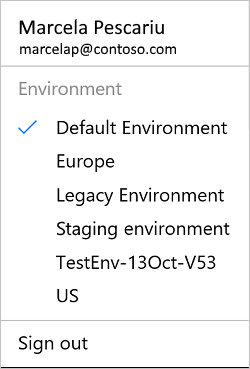
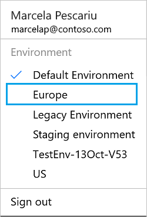

<properties
    pageTitle="Switching environments when creating a Flow | Microsoft Flow"
    description="How to use different environments when creating a Flow"
    services=""
    suite="flow"
    documentationCenter="na"
    authors="sunaysv"
    manager="anneta"
    editor=""
    tags=""/>

<tags
   ms.service="flow"
   ms.devlang="na"
   ms.topic="article"
   ms.tgt_pltfrm="na"
   ms.workload="na"
   ms.date="10/13/2016"
   ms.author="sunayv"/>

# Choosing an environment

When you create a Flow, you can choose which environment to host the flow. For example, you are creating a new Flow that will be tested in a non-production manner. In this scenario, you can create your flow in a *Dev/Test* environment.

When this new flow has been tested, and is ready to be used publicly, you can then create this flow in a different environment. 

Environments are created by Flow administrators. Flow administrators also control who has access to the different environments. 

This topic shows you how to navigate between different environments. 

## Switching environments

Flow makes it pretty easy to switch between environments. When you do switch, you are seeing all the items in that specific environment; you are not seeing items in any other environment. 

Here's an example. 

You create a flow named *NewMember* in the *Sandbox* environment. In [flow.microsoft.com](http://flow.microsoft.com), you open the *Dev/Test* environment. The *NewMember* flow is not listed. To see the *NewMember* flow, open the *Sandbox* environment.

This applies to any items you create in the environment, including connections, gateways, PowerApps, and more.

1. Open [flow.microsoft.com](http://flow.microsoft.com).
2. In the top right corner, you see your name, and the environment you're in:  

	In the image, notice the notifications. These notifications are specific to my flow in this default environment.

3. Select your name. In the drop-down list, all the environments available to you are listed. Your current environment is checked:  

4. To switch to another environment, select that environment in the list:  

5. Microsoft Flow automatically switches to the new environment:  

	In the image, notice there are no notifications. The new Europe environment has no notifications. 

Now, create your flow. 

## Next steps

[Create a flow from a template](get-started-logic-template.md)  
[Create a flow](get-started-logic-flow.md)  
[Environment overview for Administrators](environments-overview-admin.md)

